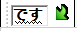

# Japanese typing

Operating systems today all support typing Japanese characters, and the system used to input Japanese characters on a computer is often referred to as an *IME* (Input Method Editor).  

## Windows

On Windows, you can enable the Japanese IME by having *Japanese* on your Windows language list. 

### Installing the IME
=== "Windows 11"

	On Windows 11, you can add the IME by going into:  

	- *Settings* → *Time & language* → *Language & region*.  
	- Then to add Japanese, click *Add a language* and find **Japanese** and click *Next*.  

=== "Windows 10"

	On Windows 10, you can add the IME by going into:

	- *Settings* → *Time & Language* → *Language* (on the left sidebar).  
	- Then to add Japanese, under *Preferred languages*, click *Add a language* and find **Japanese** and click *Next*.  

The default settings will install optional features such as the language pack, speech recognition and handwriting support, as well as the required features we need such as basic typing (the IME), but you do not need any of the optional checkboxes if you only need the IME. 

### Using the IME

After you have installed the IME, you can use it by switching to the "Japanese" keyboard layout.  

You can switch to it by either:

- Clicking the "ENG" text on the bottom right of the taskbar, and choosing "Japanese (Microsoft IME)"
- Using the ++win++++space++ keyboard shortcut to cycle through keyboard layouts.

To start using the IME, first click into a textbox such as the Windows Search box, your browser address bar or a Notepad window. 

#### Input Modes  
The Japanese keyboard layout has multiple input modes, but you will most likely only be using two of them. The two modes are as follows:  

<h4> Half-width Alphanumeric (Direct Input) and Hiragana (Romaji typing) </h4>
These are the "A" and "あ" icons respectively. There is an indicator on your taskbar to tell you what mode you are in.  
The Direct Input mode types letters directly as they are on your keyboard, just like an English keyboard.  
The Hiragana input mode will initiate the input method editor (IME) as you are typing characters, and attempt to interpret your input as Japanese. 

You can switch between these two by either:  

- Clicking the A or あ icon in the taskbar.  
- Using the ++alt++++grave++ keyboard shortcut. (Note: ++grave++ is the key to the left of ++1++.)  

Windows remembers what input mode you were in, **per-app**. It is not a system-wide setting.   
The default mode is Direct Input (*A* icon), so you will most likely be using ++alt++++grave++ whenever you want to type in Japanese.  
??? info "An infamous IME quirk"
	  
	Most modern applications will ignore the IME if a textbox is not in focus, but older Windows programs (such as Computer Management) and Java applications (such as Minecraft) can activate the IME in the "あ” mode, even if a textbox is not in focus.  
	You will see the IME appear in the top-left corner of your screen, like shown in the picture above. You can try this out by opening Computer Management, enabling the あ mode with ++alt++++grave++, and start typing.  
	For this reason, it is good practice to stay in the *A* mode, or ++win++++space++ to the English keyboard if it gets in your way.  

In the あ mode, you can try typing some words now:  

- こんにちは (type: `konnnitiha` and press ++enter++ to finish the edit)
- 案内 (type: `annnai`, press ++space++ to select the 案内 conversion candidate, and press ++enter++ to finish the edit)
- 私は日本語を勉強しています (type: `watasihanihonngowobennkyousiteimasu`, use ++tab++ to choose the autocompletion candidate,  use ++space++ to choose different conversions, then press ++enter++ to finish the edit)
- コレハカタカナニュウリョクテストデス (type: `korehakatakananyuuryokutesutodesu`, use ++f7++ to convert the entire input to katakana, then press ++enter++) to finish the edit
- 記号も入力できます←→ (type: `kigoumonyuuryokudekimasu` use ++tab++ to autocomplete the conversion, and press ++enter++ to finish this edit, then type `hidari` and then use ++space++ find the left-arrow in the conversion candidates, press ++enter++ to finish this edit, then type `migi` and use ++space++ to find the right-arrow, then finally press ++enter++ again to finish the edit.)
- かきくけこabc (type: `kakikukeko`, then while holding ++shift++, type `abc`, then press ++enter++. Holding ++shift++ and typing allows you quickly switch to Direct Input mode for the current edit.)
- `１２３123` (type: `123`, then press ++shift++++caps-lock++ to temporarily switch to Direct Input, then type `123` again. Finish by pressing ++enter++)
- `ＡＢＣ` (Hold ++shift++, then type `abc`, then press ++enter++ to finish the edit)

**What on earth is an "edit"?** In short, the IME must "edit" the text you typed in, so it can be displayed in the correct form you intended. Text that is currently being "edited" by the IME will be underlined. Having too much text in your edit buffer can overcomplicate things, so it is generally good practice to "finish" or "commit" edits with ++enter++ after you got the form you wanted. 

You may have noticed how I use `ti` for typing ち. This is the Kunrei-shiki standard of romanization. I do it this way because it is faster than typing `chi`. Kunrei-shiki is not a requirement for using the IME, you can also use Hepburn romaji in the IME and it will work fine, except for は/わ (must always be `ha` and `wa` respectively). (Try typing: `chikurin`, `an'nai`, `on'na`)  

You also may have noticed the weird big numbers and letters that you can type with the IME. These are known as full-width characters. As the name suggests, they are wide and are designed to accomodate the width of Japanese characters, which are wider than Latin characters. This allows for a cleaner look consistent with Japanese standards. You can see this clearly demonstrated here: `あいうえおＡＢＣＤＥＦABCDEF`  
Full width characters can be only be typed in the あ mode, and you can type them holding ++shift++ then typing before an edit, or press ++f9++ during an edit.  

Feel free to experiment with the IME yourself in Copilot or Notepad!  

<h2> Microsoft IME Cheatsheet </h2>

A basic cheatsheet for the Microsoft IME on a non-JIS keyboard is as follows:  

Finish and commit edit: ++enter++  
Discard current edit: ++esc++  
Convert, or press again to select a different candidate: ++space++  
Autocomplete, or cycle through candidates: ++tab++  
Navigate candidates: ++arrow-up++ and ++arrow-down++ or number keys for quick selection  
Switch between hiragana and Direct Input: ++alt++++grave++  
Convert to hiragana: ++f6++  
Convert to katakana: ++f7++  
Convert to half-width katakana: ++f8++  
Convert to full-width romaji: ++f9++  
Convert to romaji: ++f10++  
Redo conversion: ++win++++slash++  
Undo last edit: ++ctrl++++z++  
Change back to hiragana (not applicable if edits are committed): ++ctrl++++backspace++  
Search candidate with Bing: ++ctrl++++b++  
Type Yen symbol: Type `えん` and find `¥` in the conversion candidates.  
Type any symbol: Type Japanese reading and find it in the conversion candidates. E.g. `らむだ` can give you the greek symbol `λ`, `ぽんど` can give you the British pound symbol `£`. `みぎ` can give you `→`. etc.  

By default, the Japanese IME  will use the English US keyboard layout (++shift++++num2++ = `@`).  
The only other officially supported option is the JIS keyboard layout, which you can switch to by changing your hardware keyboard layout for the IME to *Japanese keyboard (106/109 key)* and restarting your PC. You should not do this if you don't own a physical JIS keyboard with 無変換 keys and such.  

## macOS

## GNU/Linux distributions

## iOS

## Android

