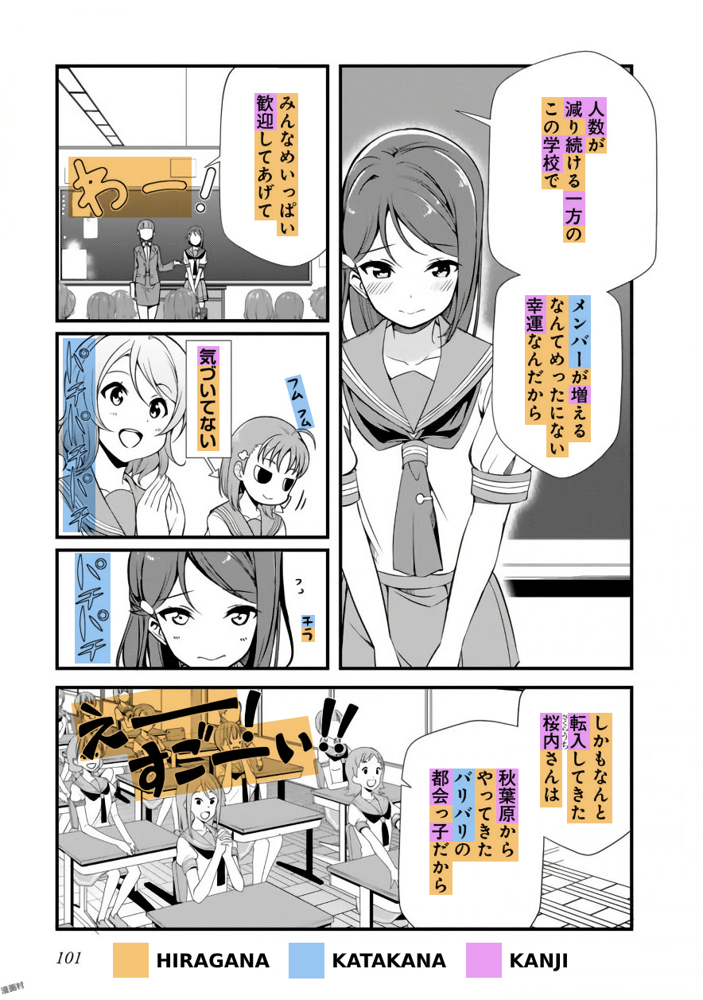

ここでスタート ↓
*新日本語ガイド*
# New Japanese Guide
I know that the following guide is long. But language learning is something you do in the long term, so please take time to read this guide in its entirety.
I apologise if this guide may get a little scientific, and I **will not write a simplified version** of this guide. Everything stated below is what you need to know. Sorry about that.
## Why many people “fail” to learn Japanese
Before I talk about this, I would like to clarify what I mean by “fail”. What I mean is, not being able to achieve their goals. Many people love the idea of being fluent, and being able to watch Japanese media without subtitles, in their raw form. However, many people also don’t ever reach this goal, or even get close. I believe it mostly isn’t *their* fault, but rather, the *method*’s fault.

Whether you’re a “visual learner” or an “auditory learner” does not mean anything when it comes to learning a language, you have a big problem if you acquired your first language by hearing it (like we all did) but apparently you’re more of a “visual learner.” It mostly comes down to the *method* used to study Japanese. There are other factors too, such as motivation, or hours spent each day/consistency. But I believe the *method* in the first place is very important.

For example, if someone told you that you could lose weight by pedaling on an exercise bike while watching TV, and you did this for 2 hours everyday, would you lose weight? No. That is because this is a fundamentally flawed method - it does not work.

What this guide aims to do is educate you on effective methods to study Japanese, so that you don’t end up like the others that failed and instead succeed, all while having fun in your target language, and in this case, your target language is most likely Japanese.
Back to the “visual learner” and “auditory learner” thing, while it may be true for other fields of study, it is not valid for acquiring a language. We all acquire language in the same exact way, and that is through *comprehensible input*. I often come across people saying, “everyone learns differently” and again, this may be true for other fields of study but not for language *acquisition*.
Key word: acquisition.
### Learning vs. Acquisition
*Learning* a language properly refers to a conscious process, similar to what one experiences in school. The individual is given “grammar rules” and/or a “vocabulary list” to remember. When it comes to communicating in the language, they recall these rules and vocab they have *learned* and try to use that to speak the language. According to Krashen, this is less effective than *acquisition.*

Acquisition of language is a natural, intuitive, and subconscious process of which individuals need not be aware.

What this actually means is, this process is fundamentally same for everyone, hence *natural* and acquired pieces of language can be utilized *intuitively*, where the individual, in opposition to learning, does not need time to think and form sentences using *learned* grammar and vocabulary. And finally, subconscious means that the individual is unaware that the process is happening; the acquisition process may not feel like “language learning” and when new knowledge is acquired, the acquirer does not feel like they have learned anything.

Acquisition requires *meaningful* interaction with the target language, during which the acquirer is focused on *meaning* rather than form. What this means is, one is not concerned with the *form* of the language they are hearing and/or their utterances but with the messages they are conveying and understanding.

***※ “Learning Japanese” may improperly refer to both acquiring and learning. So please keep that in mind.***

### i+1
In simple terms, i+1 means “one [and no more than one] thing [piece of language] you do not yet know in the sentence"
Say if you were learning English and you heard the sentence, "I'm playing the guitar", but you didn't know the word "playing" . This sentence would be i+1 because you know all the words and grammar structures apart from "playing". This is also comprehensible input IF you understood the message it was conveying.

### Input & Comprehensible Input
*Input* itself refers to listening and reading to native content in the target language. *Mass input* can be referred to as *immersion*. Native content means content made by natives, for natives. (raw) Anime is made by natives, for natives, therefore it is native content.
*Comprehensible input* refers to input where messages are conveyed and understood. It is the most crucial ingredient in the acquisition of language. Any input is not sufficient for acquisition, the input must be *comprehensible*.

However, as a beginner, it may seem difficult to find comprehensible input, and that is true. I will touch later on how you can benefit from *incomprehensible input*,  too, but not in the same way. Language is not acquired from incomprehensible input but from comprehensible input. So please keep that in mind.

It is also important to keep in mind that talking (output) is not practicing a language. When people give anecdotes of how they got better at a language by speaking a lot, they do not realise that it was the input (from the partner) which improved their skill at the language.

Speaking (output) is just the icing on the cake, and input is where you are actually acquiring language.

### Knowing who’s advice to trust
It may seem natural to take as much people’s advice as you can, after all, they have experience right? Maybe you can learn something valuable? Well, not quite.
If the person you are taking advice from has not achieved what you want to achieve, then you have no reason to trust their advice. If you do, then you will get no better than the low level they are at right now.

As a beginner, you have no way to properly judge someone’s language ability, as your linguistic competence of the language is very low, or virtually non existent, therefore you are no one to judge if your friend is really good at Japanese or not.

Why is this important? Because I often come across people that say things like “But my friend that learns Japanese told me that…” and the thing that the friend told the other friend is usually pretty misguided and blatantly false.

Has your friend achieved something close to what you want to achieve? If not, you do not have much luck getting past the low level they are at if you follow their advice. It would be like taking dieting advice from someone that's fat.

## ”Learning” Japanese Effectively
Now that you know the basics of language acquisition, let’s dive into how to learn Japanese.
### Kana
Kana refers to *hiragana* and *katakana*, they are the two scripts of the Japanese language. Hiragana and Katakana are two versions of the same sounds in the language.

Hiragana is used for words and names not written in kanji and for grammatical purposes. The writer can choose whether or not to use the kanji form.
Katakana is used for words borrowed from other languages and foreign names, it can also be used for emphasis, however, the usages of hiragana and katakana are not always consistent, so take note of that.
The kana is not hard to master and therefore I’d say, learn it however you want. It’s better if you have audio with it, too.
Mnemonics may seem like a good idea, but I’ve seen people complain that it makes the process of recalling the kana slower, so I’d say just brute force it.


***You need to learn this first.***

I recommend you read Tae Kim (linked in #resources ) and pause after *The Writing System*.


After that copy out the kana chart below and then test yourself with the @Kotoba bot in the #quiz channel or in @Kotoba#3829 bot's DMs using this command:

```
k!quiz-conquest hiragana+katakana nodelay
```

The Chart:


Steps if you got confused:
> 1. Read Tae Kim (linked in #resources ) until you complete *The Writing System*
> 2. Copy out the chart above into a notebook or something similar.
> 3. Test yourself by using the command **`k!quiz-conquest hiragana+katakana nodelay**`** in the #quiz channel or by DMing @Kotoba#3829 bot.

After a week or so, you should have all the kana nailed down.

### Kanji
Kanji, literally meaning "Chinese Characters" is the third part of the Japanese writing system. They are logographic and therefore much more complex than kana. There are 2136 kanji taught in the Japanese school system, however don’t let this fool you.

Around 3000 or more are used in daily life. Kanji are used when they are used. You will eventually understand what this means when you get a little more advanced in Japanese.


<!-- https://media.discordapp.net/attachments/732715294459691044/733033853127622696/02.jpg?width=471&height=670 -->

*Image Credit:* @Luck#0977

Above is a page from the *Love Live! Sunshine!!* manga, showing hiragana, katakana and kanji.
#### Approaching Kanji - Kanji With Vocab vs. Isolated Kanji Study
There’s two ways to approach kanji. One is **kanji with vocab** which is to learn words from reading without studying the individual kanji. You can fully comprehend "守銭奴" without knowing what the individual kanji mean just by looking it up in a dictionary.

The other is **isolated kanji study** which is studying the meaning and composition of the individual kanji. Example: "守" “guard” "銭" “coin” "奴" “guy” = cheapskate. Huh? It’s pretty smart. Isolated kanji study can make remembering vocab easier, but it can put you behind due to the amount of time it takes, so it is up to you to decide whether it is worth it.

If you really struggle with reading words, then you should do isolated kanji study.
※ Another interesting thing about kanji with vocab, is that if you know other words that also use the kanji of said word, it can become easier to remember. (Example: If you can comprehend "**守**護", "**銭**湯" and "売国**奴**" then "**守銭奴**" becomes easier)


#### How to: Kanji with Vocab
This is the most simplest approach to kanji, and it is the approach I took personally. Most people will be able to read kana just by referring to the kana chart, but you can’t do the same for kanji. So how do you learn to read kanji?

Look at the manga picture above. Look at the first panel. You see "人数"? That’s a word. Look it up in a dictionary such as <https://jisho.org/>. You get the reading: "にんずう" and the meaning: "number of people". Cool, move on. That’s it. But don’t expect to remember words just by looking it up once, that is why you should read a lot to build up and retain kanji skill. At the end of the guide I will go through how to make the process of looking up words easier.

#### How to: Isolated Kanji Study


*Image Credit: Daily Japanese Thread/Itazuraneko*
*If you can’t see the image properly, switch to Dark Theme*
When approaching kanji as a beginner, they can look like scribbles rather than familiar shapes. Kanji have common shapes and patterns and Isolated Kanji Study helps you see those common shapes and patterns. Instead of "草" looking like a random drawing, you can see that it’s composed from "艹", "日" and "十".


You can use RRTK (Recognition Remembering the Kanji) which is a shortened version of the original RTK (Remembering the Kanji). You can find more details about this over at [Mass Immersion Approach](https://massimmersionapproach.com/table-of-contents/stage-1/practice/recognition-rtk). You will not learn how to learn how to write with RRTK, that's why it's *Recognition*, it only helps with recognising kanji.

RRTK breaks up the kanji into "elements", like demonstrated with the kanji "草" earlier.

Being able to see kanji as familiar shapes is a primary benefit of RRTK, and memorising the meanings is a secondary benefit, I think knowing the meanings can be pretty handy, however overtime, these meanings fade away, and only act as a crutch.

RRTK is only recommended to people that struggle too much with just Kanji with Vocab.


With that said, to truly “learn” kanji, you still need to read Japanese for thousands of hours, so in the end, you’re going to be doing kanji with vocab anyway. Think of isolated kanji study as your training wheels for kanji with vocab.

### Vocabulary
The bulk of your language learning journey is learning vocabulary, so you will be doing a lot of it.


I recommend you start learning vocabulary using Anki after you have learned the kana and know extremely basic grammar. How basic is extremely basic is up to you to decide. I will go through how to study grammar after this section, so don't panic.


Anki is a spaced repetition (SRS) flashcard program. You can get it here: <https://apps.ankiweb.net/>


I recommend you use Anki to build up a vocabulary of basic words to assist your immersion, after that learning vocabulary from immersion becomes easier. Usually people use the *Core 2K* deck to build up a vocabulary of 2000 words, however, I advise against using Core 2K, and suggest you do *Tango N5+N4* instead. Here’s why:

Core 2K is significantly harder than Tango N5+N4 because Tango has the sentence on the front, Core 2K has only the word on the front.

Sentences make recalling vocabulary easier, after all, it is much more close to how we use language in real life as opposed to isolated words.

**However, it is important to note that Tango's translations are not literal, and do not represent Japanese structure well, so I guess that's a flaw of Tango. In other cases, it might be utterly wrong.**

People have always struggled with Core 2K, and to make the process smoother, I recommend Tango N5+N4 over Core 2K. Especially if you don’t want to do isolated kanji study!

### Mining
Mining means when you add vocabulary (often along with the sentence they were found in) into your Anki deck. You can then review these flashcards overtime to make sure you don’t forget them.


Mining is something you will be doing for a long time, so this is pretty darn important.
There’s a lot of disagreement when it comes to “formats” of mining, I think you should just experiment and see what works best for you.

There are two main *formats* of mining:

*i+1 Sentence Cards* and *High Quality Vocab Cards* (known as Anime Cards)
There has been no settlement to which one is the “best”, they each have their own benefits and drawbacks.


**i+1 Sentence Cards**

I+1 Sentence Cards are cards with an i+1 sentence with all its kanji :wink: on the front, and the piece of information needed to understand the sentence on the back. Let’s go through the benefits and drawbacks.

__Benefits:__  
+ Easier to judge whether or not you should pass (as opposed to fail) the card, as the task is simple: understand the sentence without revealing the back.  
+ Less likely to mix up similar words, as their sentences are different.  
+ Easier overall, as sentences are closer to how we use language in real life.  
+ I+1 format so inherently easier than the alternative.  
__Drawbacks:__  
- Long to review as you need to read the full sentence every time.  
- As it is i+1, this may restrict what words you can put in your Anki deck. As you can only add sentences where there is one piece of language you do not yet know.  

**High Quality Vocab Cards**
*High Quality* vocab cards are different to standard vocab cards. Standard vocab cards simply have the word in kanji form on the front, and the reading and meaning of that word at the back. High quality vocab cards, as opposed to standard vocab cards, have the audio of the sentence (from an anime or voiced Visual Novel), also a picture (from an anime or Visual Novel) and the sentence it came from at the back. Making them much more superior to standard vocab cards.

※ They are known as “Anime Cards” because of the tutorial/site <https://animecards.site>

__Benefits__  
+ Quick to review. I average 500 cards in 30 minutes with these.  
+ Able to mine everything and anything (does not follow i+1)  
+ Animecards.site: “has the same benefits as sentence cards” this can be disputed though.  
__Drawbacks__  
- Significantly harder than i+1 sentence cards. For the same reason Core 2K is harder than Tango N5+N4.  
- Much more likely to mix up similar words.  
- Not beginner friendly. I do not recommend a beginner does this until they have at least 1000 i+1 sentence cards.  
- Words *may* not be learned as well as with i+1 sentence cards  

### Grammar
When approaching grammar, it is important to know that the purpose of a grammar guide is not to make you a master at the language, but to give you only a basic understanding of how things work in the language, and then a true understanding of grammar can only be achieved through immersion. Therefore, I recommend you choose a grammar guide, read/watch it **and** do immersion.

#### Choosing a grammar guide
There are many grammar guides out there, some are good, but some are bad. To prevent confuse amongst learners, i will only mention 2 grammar guides. Tae Kim and Cure Dolly. No grammar guide is perfect, they each have their ups and downs. Tae Kim is written pretty well, and very beginner friendly, however some of his explanations may be a little off and it can get boring to read. Cure Dolly takes an unorthodox approach to Japanese grammar, trying to teach Japanese grammar in a more Japanese “organic” way. However, Cure Dolly is not the most absolute beginner friendly, you need at least *some* background knowledge before using. Also, the audio is very poor.
You can find the 2 grammar guides below:

[Tae Kim](https://itazuraneko.neocities.org/grammar/taekim.html): *There is also an Android and iOS app for offline viewing!, note that everything in this guide is considered to be "basic Japanese", even the “advanced” section*  
[Cure Dolly](https://www.youtube.com/playlist?list=PLg9uYxuZf8x_A-vcqqyOFZu06WlhnypWj): *I recommend turning on subtitles and setting the speed to 1.25x!*

With that said, I suggest doing grammar study in conjunction with your immersion and vocabulary study.

### How to Immerse
What you need to do when immersing is different depending on what stage you are on. This is why making a one size fits all Japanese guide is difficult. I will only go through what you need to do as a beginner.

#### Listening
When you are a beginner, I recommend doing listening immersion over reading immersion. This is because when you first approach a foreign language, you are not yet used to the phonemes (sounds) of the language, so reading may give you a poor accent, this is when you associate similar, yet wrong phonemes from your native language to Japanese, it is impossible to read without mapping some phonetic component, so you can only avoid this by first getting used to the phonemes. You can do this by doing raw listening.

Secondly, listening just flows without stopping, so you feel more comfortable when immersing. On the other hand, reading as a beginner is very frustrating as you need to constantly look up words probably every second.

Surprisingly, there are many i+1 opportunities in listening immersion as a beginner, so it still passes as comprehensible input, even if you don’t understand other parts. But language is not acquired through incomprehensible input remember? That is true, however, you are still benefiting from incomprehensible input but in a different way; it is improving your ability to distinguish phonemes, in other words giving you a better accent. Immersing even if you don’t understand much is also a great way to build up a habit of interacting with your target language.

With that said though, immersion (input) at this stage will still be largely incomprehensible, however you can change that by working through the Tango Anki decks.

Please note that you need to pay attention to your immersion. (Active Immersion).
Just putting it on in the background (Passive Immersion) is not going to help you.


#### Choosing what to immerse with
It’s usually best to immerse with something with a visual and audio component, such as anime and j-drama (TV Show). TV shows have a visual component, and also a plot, so this brings more i+1 opportunities. It is not recommended to immerse with say, a podcast or an audiobook as a beginner, as you will have no idea what’s going on (incomprehensible input). If you’re in this server, then chances are you are a fan of anime, cool. You can use that to immerse, and even anime you have seen in the past.


What is also pretty helpful is reading an episode summary of the episode on Wikipedia before watching it, this can help you understand the plot more, so you can make more acquisition gains.

#### What do I need to be “doing” while actively immersing? (As a beginner)
Try to understand messages. There is a lot you can infer from a TV show. Like Krashen says, you need to have “meaningful” (meaning focused) interaction with the language, rather than focusing on form (such as grammar). I suggest trying to hear the sounds more clearly, too?

#### Reading
Reading, no matter what stage you are at, can benefit you greatly. However, as a newbie to the language, there are a few problems when it comes to reading early on in the process.
Reading early can have a bad effect on your accent. And your reading ability may not always transfer (being able to hear the new words you learned) to your listening ability, especially if your listening ability is considerably low.

When you’re a beginner, I recommend watching Japanese subtitled anime for reading practice. Japanese subtitles are reading immersion at best, similar to a voiced visual novel. Having the voices in the background isn’t going to save your accent nor improve your listening skill, you need to do raw listening. Sorry DJT.

Anyway, I think it is good to start out with Japanese subtitles for reading. And transition to manga, and then light novels and so on. I think it is important you pace yourself when reading and don’t burn out trying to read hard novels as a beginner, it is usually better reading books that are not too far off from your level.
In our resources channel you can find links to sites that let you read a lot of Japanese manga and novels, for free. And Japanese subtitles too, so make sure you check that out!
#### Finding the balance between listening and reading
Balance is important. It may be obvious just to split your time up in half, and if you are able to do that, then that is great. However, not everyone has the time, and when it comes to reading, depending on your current level, it may be considerably difficult to read for extended hours. For example people that have gotten further in the Tango Anki deck may be able to read longer than those who are a little behind.

So what is the perfect balance?
I cannot answer that, that is up to you to experiment and decide. It all depends on your schedule and current level. You don’t need to do reading from day 1, give it a few weeks until you can read basic words from the Tango N5 Anki deck.


## Now what?
① Learn the kana by copying out the entire chart posted in the **Kana** section into a notebook, or something similar.
② Use the @Kotoba bot in the #quiz channel to test your knowledge, there is a specific command you need to use, so it doesn’t stop until you get them all right (brute forcing)

The command is as below:  
```
k!quiz-conquest hiragana+katakana nodelay
```

③ After you have passed the @Kotoba quiz, then you should move on to learning vocabulary alongside grammar. It is important that you pace yourself and don’t try to punch above your own weight, this is not a race.

④ Download and set up Anki, you can find the link above or in #resources  then download the Tango N5 deck. You can find the download links for this in #resources  in the **Anki** section.
You can import the Tango N5 deck by clicking on it. It should open in Anki, wait a while for it to import.
⑤ Click the cog icon next to the deck > Options. The default limit of new cards per day is set at 20. Try to stick with this number for a few days and see how it goes for you, if you feel like it is too much, then you can lower the limit to 15 or even 10. Check in the “Reviews” tab, set the Maximum reviews/day to 9999. Don’t be startled by this number. It will likely not go over 150 with okay retention rate. If you fail to keep up with the reviews you are getting, lower your new cards/day instead of lowering the maximum reviews. This is because not doing your due reviews interferes with Anki’s spaced repetition system. Anki requires consistency in the long term for it to be effective, try creating a schedule for it. Personally I do my Anki when I wake up in the morning.
⑥ Work on the Tango N5 Anki deck **while** reading/watching your chosen grammar guide.
After you have finished Tango N5, do Tango N4, too. The download link for it is also in the #resources  channel. You should also be nearing the end of your grammar guide at this point. I also suggest starting to read manga at this point.
⑦ After you finished Tango N4. You should set up a mining deck. It doesn’t matter that much which one you pick.

*Choose one below.*  
[High Quality Vocab Cards (“anime cards”)](https://animecards.site/)  
[I+1 Sentence Cards](https://refold.la/roadmap/stage-2/a/basic-sentence-mining)  

**The process of learning Japanese is as follows:**

> **∞. Immersion is ongoing throughout this entire process. Keep this in mind.**  
> 0. [Tolerate the ambiguity](https://refold.la/roadmap/stage-0/b/tolerate-ambiguity).  
> 1. Learn the hiragana and katakana using the method as described above.  
> 2. Learn grammar using the method as described above.  
> 3. Download Anki and use the Tango N5 deck to learn basic words.  
> 4. After you finish the Tango N5 deck, move on to Tango N4.  
> 5. After you finish Tango N4, use [Quizmaster's Anki Guide](https://animecards.site/ankisetup/) to learn how to mine.  
> 6. Once you are mining, the process of learning Japanese becomes as simple as reading Japanese and listening to Japanese everyday, and adding unknown words to your Anki flashcard deck.  


**Final Notes**
That’s it. You can get fluent in Japanese just like that. But don’t forget that the most important part is immersion, Anki and grammar only assist your immersion.

**Music is not immersion.**
However, you can use the lyric sheet as reading practice.
This guide would have not been possible if it was not for Stephen Krashen, Mass Immersion Approach, All Japanese All The Time, AntiMoon, Daily Japanese Thread/Itazuraneko, and my brothers and sisters here in TheMoeWay:tm:. Thank you all!


**Further Reading:**  
[Input Hypothesis](https://en.wikipedia.org/wiki/Input_hypothesis)  
[Spaced Repetition](https://en.wikipedia.org/wiki/Spaced_repetition)  
[Mass Immersion Approach](https://massimmersionapproach.com/)  
[All Japanese All The Time](http://www.alljapaneseallthetime.com/blog/all-japanese-all-the-time-ajatt-how-to-learn-japanese-on-your-own-having-fun-and-to-fluency/)  
[AntiMoon](http://www.antimoon.com/)  
[Itazuraneko](https://itazuraneko.neocities.org/)

***※ - Check out Refold Languages, it honestly has one of the best guides and articles on immersion. Ever. → https://refold.la/***

## Additional Tools (optional read)
Get Yomichan. It is a browser extension. You can find it in #resources , and the dictionaries you need to load into it too. Download my dictionary pack (#resources), extract it (you can use 7zip). Do not touch the .zip files inside. These need to be kept intact. Click the :yomichan: icon, then click the monkey wrench icon scroll down until you see “Import Dictionary”, over here you need import the ones with the [Bilingual] tag and (optionally) the [Kanji] tag at the stage you are at. You can only import one dictionary at a time, so wait until one dictionary is imported before importing the next.  
Now you can look up words on a webpage by just holding Shift and hovering over it. Try it!  
For manga, I recommend KanjiTomo, it’s like Yomichan but for situations where you can’t select the text, e.g. in manga. It uses an OCR, so a little less reliable than Yomichan. To use, hover your mouse over whatever you want to look up.  


### Android tools
If you have an Android device, you can use Yomichan on Firefox.  
You can get the app "JP-Dictionary" which adds the iOS “Look Up” feature to your select menu, you can find this in #resources  too.  
There is also OCR Manga Reader (get it in #resources ), which works like KanjiTomo.  
Typhon Reader, which works more like Yomichan. You can load .epub files into it, so it is the best way to read Japanese novels on your phone. Individual EPWING dictionaries can be loaded into Typhon Reader. I find this very useful. You can find EPWING dictionaries in #resources .  
There’s also Kaku, it’s a system wide OCR. Pretty useful too.  


### iOS tools
If you use an iOS device, you can use Books. You can use the “Look Up” feature. Make sure you have Japanese dictionaries enabled in Settings > General > Dictionary.
Kantan Manga Reader is the iOS equivalent of OCR Manga Reader.

### Visual Novels
If you intend on playing Visual Novels, then make sure you setup texthooking, you can find out how to do that here: #visual-novel-guide
Visual Novels can be found in #resources for almost any platform. Ask the server if you can't find a Visual Novel you want using the resources.

!!! note
    You should not expect to comprehend this guide the first time you read it. Take your time and read it as much times as you can until you finally get it.

## Discord
[Join us on Discord :fontawesome-brands-discord:](https://discord.gg/AqBd4KXktM){: .md-button .md-button--primary }  
About output (talking): #speaking-japanese  
You CAN learn Japanese from anime: #anime-japanese  
"Learning" kanji: #learning-kanji  
How to use Japanese subtitles: #japanese-subtitles-guide  
How to comfortably get into reading: #getting-into-reading  
The Monolingual Transition: #monolingual-guide  
Massive Japanese FAQ, whatever stupid question you have WILL be answered here: #japanese-faq  
The Best Resources Channel on Discord: #resources  
Ask any questions you may have about this guide!: #immersion-questions  


## Sources
1. [YouTube - Stephen Krashen on Language Acquisition](https://youtu.be/NiTsduRreug)
2. [Stephen Krashen’s Theory of Second Language Acquisition](https://www.sk.com.br/sk-krash.html)
3. [Mass Immersion Approach - Japanese Quickstart Guide](https://massimmersionapproach.com/table-of-contents/stage-1/jp-quickstart-guide)
4. [Tae Kim - Japanese Grammar Guide](http://www.guidetojapanese.org/grammar_guide.pdf)
5. [Itazuraneko - main guide](https://itazuraneko.neocities.org/learn/guide.html)
6. [Input Hypothesis - Wikipedia](https://en.wikipedia.org/wiki/Input_hypothesis)
