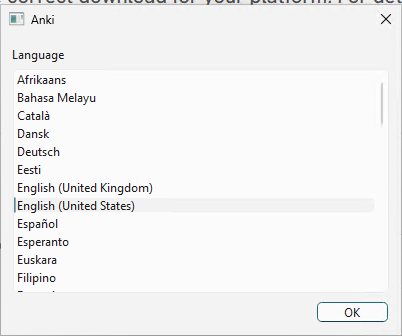
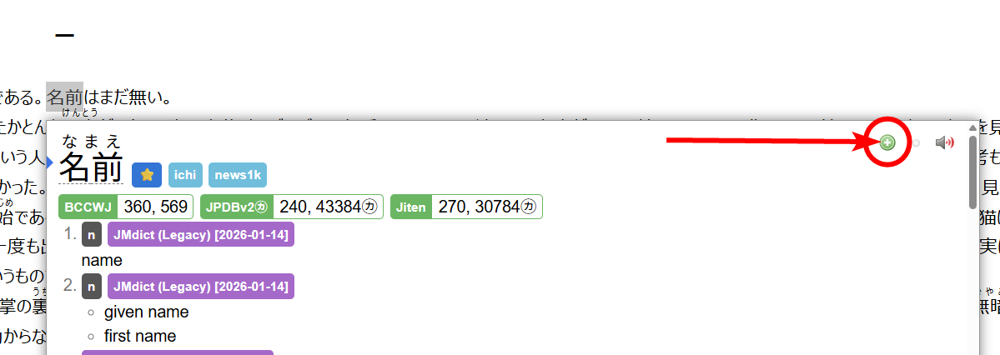

# Anki & Mining Setup

Here's how to set up a "mining deck": where you add words from your immersion to your Anki so you can remember them.  

You can do this after you [set up Yomitan](/yomichan).   

It's surprisingly easy and simple, here's how to do it.  

First, you'll need to install Anki, I'll tell you how to do that below.   

[Press here to skip if you already have Anki installed.](#mining-setup)

## Anki setup
### Installation  

Download Anki [here](https://apps.ankiweb.net/). Install the version for your operating system.   
 
Upon installation, you will see this:

Press ++enter++, and the actual Anki program will now be installed.  

When complete, it should say "Anki will start shortly. You can now close this window." Close the black terminal window.  
Then, you should see a new window pop up like this:

  

This sets the **display language**, for the user interface of Anki. Any language you can read is fine.  

Now you will see the main Anki screen.
Before you do anything, I recommend you install essential addons.
Do that by:

- Click on "Tools" to open the tools menu.  
- Click on "Add-ons"  
- Click "Get Add-ons.."
- Paste the *add-on code* for the desired addon, and click OK. 

Here are the add-on codes for the essential add-ons you *must* have.  

- AnkiConnect: `2055492159`
- PassFail2: `876946123`

  
 
 

After you have added all the add-ons, restart Anki by closing it out completely and reloading it.  

The basic setup for Anki is now complete. 

### Importing a deck (Kaishi 1.5k)

Download the [Kaishi 1.5k deck](https://github.com/donkuri/kaishi/releases). The `.apkg` file.  

Load the deck into Anki by double clicking on the `.apkg` file. Alternatively you can load it using "Import File" in Anki and selecting the file manually.  

Then, you should see this, import it by clicking **Import**:

After that, you can close the import window.  

The deck is now imported. Now you need to adjust the *deck settings*.   

Once you have a deck imported, click on the cog/gear icon then click "Options"
 

Adjust the settings as follows:

- Maximum reviews/day: `9999`

Click "Save" in the top-right.  

You are now ready to learn with Kaishi, or any other deck.  

## Mining setup

PREREQUISITES:

- Yomitan. Setup guide [here](/yomichan)  
- AnkiConnect addon installed in Anki.  

Then:

1. Download Lapis [here](https://github.com/donkuri/lapis/releases/download/v1.6.0/Lapis.apkg). You should get a .apkg file.  
2. Import it into Anki, then after you import that apkg, delete the "Lapis" deck it leaves behind. We only need the note type.  
3. In Anki, click "Create Deck" on the bottom. Give your deck a name (e.g. `Mining` and press OK)  
3. Open the Yomitan settings by clicking the Yomitan icon  in your browser toolbar, then the  cog icon.  
4. Click on "**Anki**" in the sidebar, then ENABLE **Enable Anki integration**.  
5. Then click **Configure Anki flashcards…**
6. Change "Deck" to the name of your deck you just created (e.g. `Mining`). Change the "Model" to `Lapis`.  

Now configure the card fields. Yomitan pre-fills most of these fields, but they aren't all correct, so make sure you check them carefully!:

| Field | Value |
| --- | --- |
| Expression | `{expression}` |
| ExpressionFurigana | `{furigana-plain}` |
| ExpressionReading | `{reading}` |
| ExpressionAudio | `{audio}` |
| SelectionText | `{popup-selection-text}` |
| MainDefinition [1] | **read info below!!** |
| DefinitionPicture |  |
| Sentence | `{cloze-prefix}<b>{cloze-body}</b>{cloze-suffix}` |
| SentenceFurigana |  |
| SentenceAudio |  |
| Picture |  |
| Glossary | `{glossary}` |
| Hint |  |
| IsWordAndSentenceCard |  |
| IsClickCard |  |
| IsSentenceCard |  |
| IsAudioCard |  |
| PitchPosition | `{pitch-accent-positions}` |
| PitchCategories | `{pitch-accent-categories}` |
| Frequency | `{frequencies}` |
| FreqSort | `{frequency-harmonic-rank}` |
| MiscInfo |   |

**Read this carefully:**   
[1] - In MainDefinition, you need to use the drop down menu to select your favourite dictionary. e.g. if it's JMdict, then it would be "single-glossary-jmdict". Select whatever single-glossary you want of your favourite dictionary.  e.g. `{single-glossary-新和英}`

Setup complete!  

## Adding a card

This is easy!  

All you need to do is hold ++shift++ over a word to show Yomitan, then press the green + button to add the card.  

  

Here's the end result:

  

That card is now in my Anki deck, ready to be learned.  

It will also have audio for the *word* from Yomitan's audio sources.  

When a card is added, it will have a book icon. If you click this book icon, it will open Anki and show you the card in the browser.  

### Tips

- Highlight text in the dictionary before adding a card. This makes your cards cleaner. If your dictionary showed a lot of words, but you only wanted a part of that on your Anki card, then highlight the text you want with your mouse, *then* press the green button.  
- Add pictures for nouns. If it's a noun, then I recommend you search a picture for it on Google and copy and paste that onto the "Picture" or "DefinitionPicture" field of your card.  

## Frequency sorting

"Frequency sorting" is where you sort your mined words by how common they are, so you see the most common (and so, the most important) words first. 

You can learn how to set this up by following the instructions [here](/shouimethod/#frequency-sorting-easy)  