# Monolingual Guide

This guide will go through what the monolingual transition is and why you should do it, different mediums to access monolingual dictionaries and also ways to approach getting used to monolingual dictionaries. 
This guide is **long.** But it is still simple, it’s just the initial setup that just feels long.

### What is the monolingual transition

The monolingual transition is when you “transition” to using a monolingual dictionary. A monolingual dictionary is a dictionary that defines words of the language in that language. For example, the Oxford Dictionary is a monolingual English dictionary. The Kōjien (広辞苑) is a monolingual Japanese dictionary.
Sites such as Jisho.org use the Japanese-English *bilingual* dictionary known as “JMdict (English)”. Jisho.org is not its own dictionary, it is only a portal that accesses JMdict. So keep that in mind.

### Why you should use a monolingual dictionary
Monolingual dictionaries help you avoid making false associations with words from your native language (probably English) to Japanese. You may think, oh, what if I’m not even English? If you don’t use a monolingual dictionary, then you will make false associations anyway, no matter what your native language is. What if I’m German and I use the Wadoku (Japanese-German bilingual dictionary)? Same thing. You will still have this problem. There is no language that can express Japanese better than Japanese itself.

### What exactly do you mean by “false associations”?
Bilingual definitions, 90% of the time are very vague, and do not capture the true feeling of the word. You may not think so, but I’ve been using monolingual dictionaries for a long time now and I can confirm bilingual definitions (especially those from the JMdict) do not capture the true feel of the word.
Here’s an example: 
> 悔しい [くやしい]
If you have been learning Japanese for a few months, you would know this word. And chances are you learned it using a bilingual dictionary. Let’s look at the bilingual definition.

> vexing; annoying
You may think, “what’s wrong with it?” I’ll tell you what’s wrong with it. It’s so vague to the point that it is literally wrong. Now let’s look at the monolingual definition.

*Taken from the Hybrid Shinjirin (ハイブリッド新辞林)*

> 失敗や恥辱を経験して，あきらめたり忘れたりできないさま。

My amazing translation of the definition:

> Go through failure and dishonour and not being able to give up nor forget (about it).

*And this gets less accurate when you put it into English lmao.*

Did you get that from “vexing, annoying”? No. Probably not.

Not convinced? Let’s go through another example.
> 悪い [わるい]

Let me ask you one thing. What do you think this word means? If you answered, “bad”. Then you’re only half wrong. This word is not equal to the English word “bad”.

You can’t use 悪い to say that your skill at something is inferior/poor, like you can in English. You use a completely different word in Japanese, and that’s 下手 [へた]. See? And this is only scratching the surface of this problem.

The other reason why you should use monolingual definitions is because they help you think in Japanese. Like I said before, there is no language that can express Japanese as well as Japanese itself can. Dictionary definitions are a way of thinking about words. I’m sure dictionary authors (who are native speakers) put thought into each of their definitions when they wrote their definition, so by reading the definition and memorising it, you will have something *at least close* to what a native speaker may think of the word. If you learn words using a Japanese-English bilingual dictionary (such as JMdict) then you will have a GAIJIN way of thinking about things, and not even close to what a native may think about the word. This will set you back in getting a true understanding of the word. Don’t get me wrong, you can still get a true understanding with immersion, it just takes a lot longer than if you learned those words monolingually.

Monolingual dictionaries are very powerful, and you will only realise this once they become second nature to you.

### Why people find it hard to go monolingual.
Two reasons: 
They don’t know the words.
Nihonjin way of thinking (only applies to very few dictionary definitions such as 呆れる)

### Monolingual transition myths
A profound belief that "dictionary vocabulary" exist. Primarily due to poor wording by Matt.

**The truth:** “Dictionary vocabulary” = words you don’t know because you don’t read enough.

Hey shoui, are you also going to say that 体言 and 終止形 are also “common words”? Yes. You are only asking me this because you looked up “を” and other particles in the monolingual dictionary. They appeared because you asked them to. They are linguistic words so they need to be used to explain grammar, that’s it. Where else do you hear stuff like “passive form” and “nominalization” outside of language learning websites? Exactly. 99% of dictionary definitions don’t use that linguistic jargon, except for maybe 打ち消し (I’ve heard this in anime by the way so you need to know it). I’ve seen 終止形 used in a Twitter account that posts about Japanese grammar/linguistics by the way, so it is common when you look at Japanese grammar in Japanese :wink:

### Using Morphman to assist the monolingual transition
No.

Morphman is an Anki addon (?) which automatically decides what words to add to Anki for you. And for that reason it is a failure. Don’t leave it up to a silly computer program to help you decide what to add to Anki. Also most of what Morphman decides what to add for you is like “フゥ...”, “(♪～)”, “あっ...” so unless you’re into that I advise you to avoid using Morphman.
If you want guidelines on what to mine, then mine every word that comes up in your immersion after you’ve read/watched it. You may think, “I probably don’t need those words though”. Wrong. Yes you do. You need every word. I am listening to a Love Live! podcast as I write this and I have heard a word I have mined half a year ago but didn’t hear anywhere else until now. So don't try to trust your intuition when it comes to mining.
This went a little off-topic, sorry about that.

## Yomichan - the better way to go monolingual.
**I recommend doing the monolingual transition with Yomichan.**

Yomichan is a browser extension that allows you to look up Japanese words on a webpage by holding Shift and hovering over it. It is supported by any Chromium or Firefox based browser. You can find out more about Yomichan [here](https://foosoft.net/projects/yomichan/)

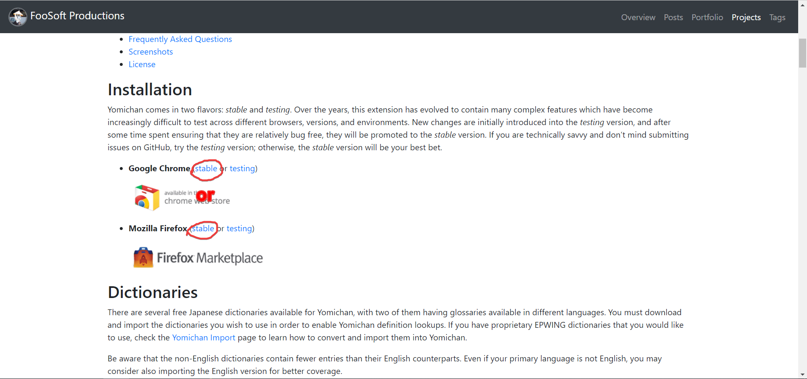

It should take you to your respective store.

Once you’re there, click whatever button there is

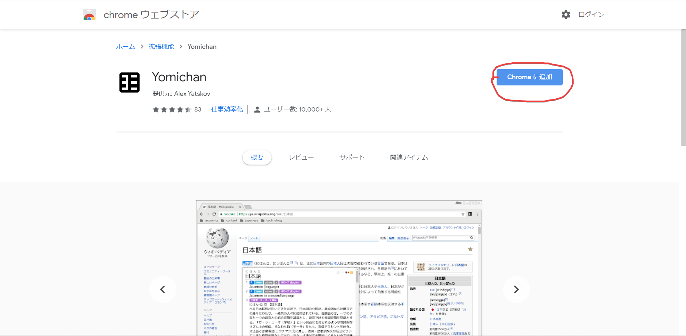

Once you have Yomichan, click the Yomichan ﾖﾐ icon in the menu and then click the monkey wrench icon.

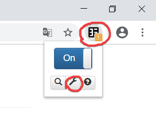

**Fixing Yomichan settings / Optimizing Yomichan**

*Newer versions of Yomichan may have different settings.*

Right off the bat, make sure you uncheck, “Show usage guide on startup” the only reason is because it can get annoying. Next, check “Show advanced options”

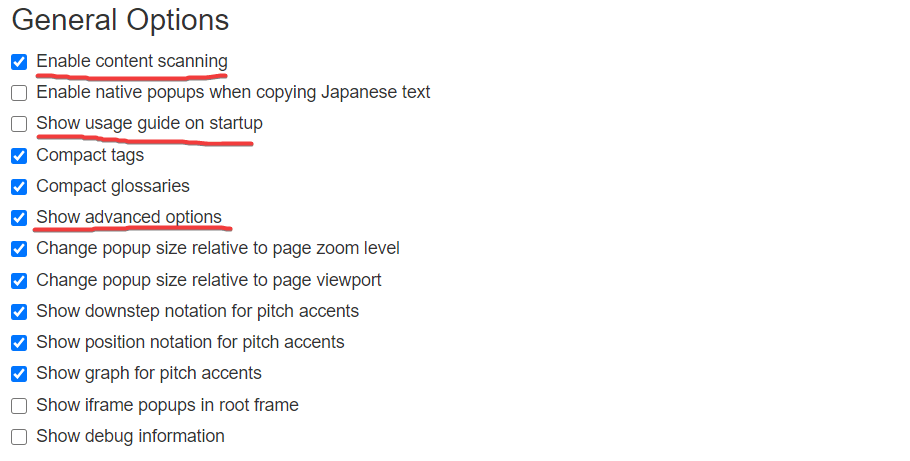

I underline in red which settings are important. I suggest you check “Compact tags” and “Compact glossaries”. For me this is better, it isn’t important though so it’s more like personal preference.

Scroll down a little.

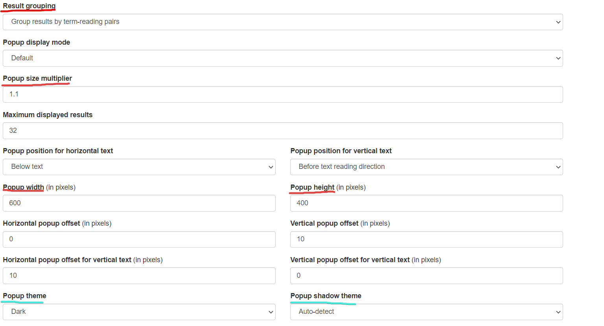

I have underlined in red which settings are important. Popup size multiplier is important; by default, the default Yomichan text in the popups can feel too small, and straining to read. You will realise this after a lot of reading. Recommended values are 1.1, 1.2 and 1.3. Anything above may be too big, and anything below may be too small. Popup width and Popup height are important too, this is because of one reason: I recommend you use as many Yomichan dictionaries as possible. Modifying the popup width and height allows for more room for the definitions.

Compare.

I’m looking up 愚問 for demonstration purposes by the way, I ALREADY KNOW that word.

**Default size:**

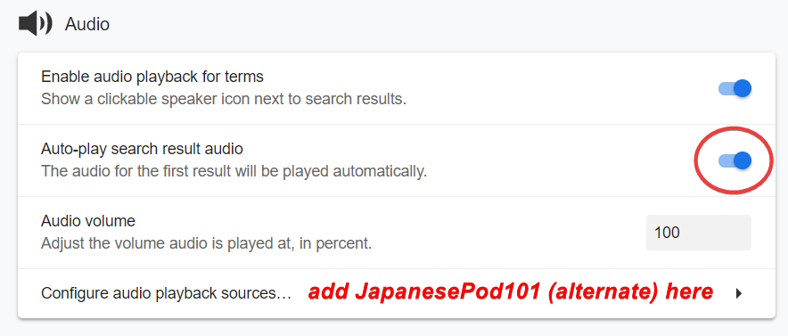

**Modified:**

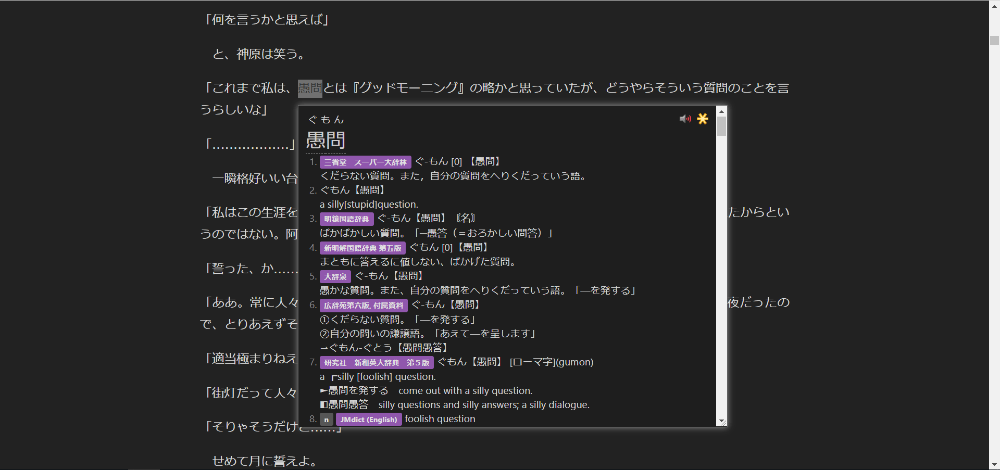

*Much better when you’re actually experiencing it! And I was too lazy to find a word with a long definition, where this change actually shows its worth.*
Next, check your Audio Options. Make sure they are like this. Playing audio automatically is very useful. Make sure you have “JapanesePod101” and “JapanesePod101 (alternate)” in your playback sources. JapanesePod101 sucks. But they seem to have native audio recordings of a lot of words, but there are a lot of words which don’t have audio and a few are just wrong lol. Yomichan illegally accesses it. From the main source “JapanesePod101” most if not all katakana word audio are cut out, the alternate source “JapanesePod101” (alternate) seems to have them though

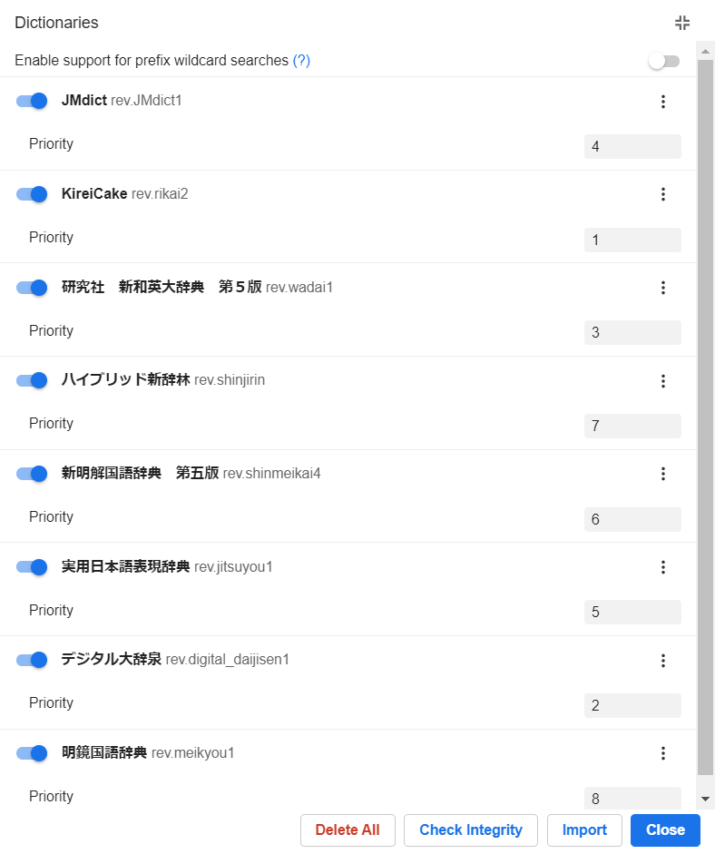

Next, check your scanning options. Remove the scan delay.

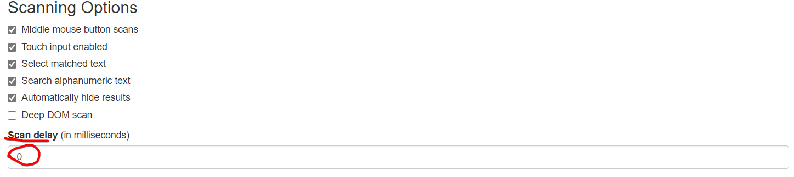

Scroll down a little.

This is the most important part.

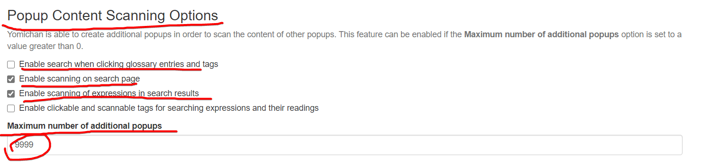

Make sure your settings are my settings!!!

This is the biggest reason why you should use Yomichan for the monolingual transition.

Demonstration:

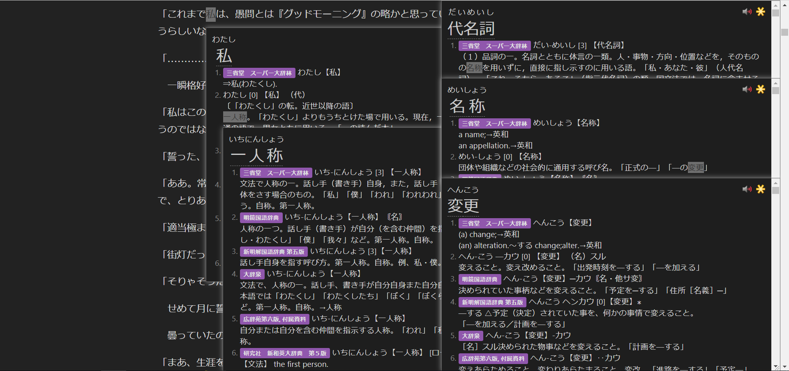

I looked up 私 for demonstration purposes. I ALREADY KNOW that word.

*btw I personally just look at the English definition when I can’t read the definitions at all, but when it is only one or two words I look the words up, this is just for demonstration purposes after all*

You may think, “what’s the point of that?” It is kinda inevitable that you’re gonna not know at least 1 word in the definition, so this becomes useful.
Next, I’ll talk you through *how to actually get the monolingual dictionaries*

### Getting and using monolingual dictionaries
Again, I recommend you use monolingual dictionaries with Yomichan. I will talk about alternatives later.
Download my [NEW Yomichan dictionaries pack](https://drive.google.com/file/d/1hcxKK-06LJxp-pr-8EuSPrCaFhWwXylp/view?usp=sharing)

Extract the .zip file (You can use [7zip](https://www.7-zip.org/) for this), and you will be greeted with more .zip files. 
**Do not tamper with these.**

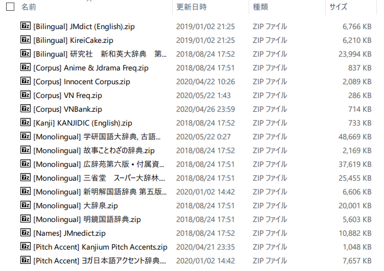  
*old pic btw*


These are our Yomichan dictionaries. **You only need all dictionaries tagged [Monolingual] and [Bilingual], the rest are kinda optional**

Scroll down in your Yomichan settings to *Dictionaries*. Click *Import Dictionary*

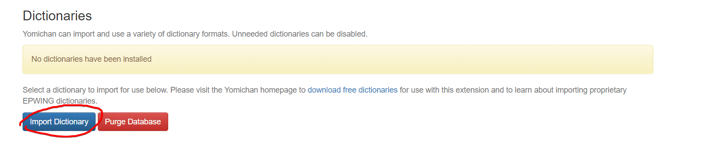

Import all dictionaries tagged [Monolingual] and [Bilingual] **do not import 学研**

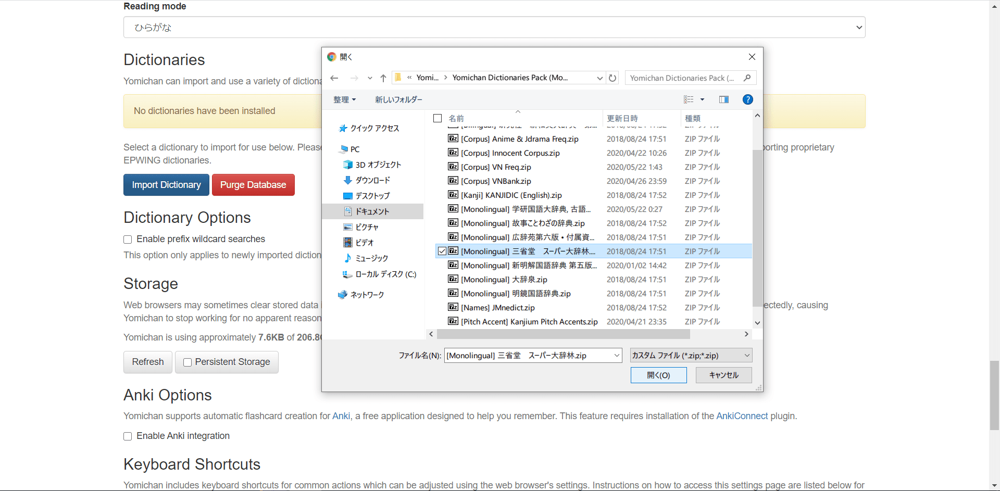

*old pic btw*  

You can only import one dictionary at a time. So wait for one to finish importing before importing the next.

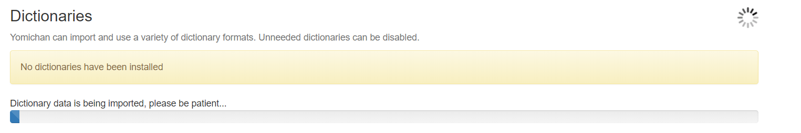

*Dictionary data is being imported, please be patient…*

After that, import the rest. It should look something like this in the end.

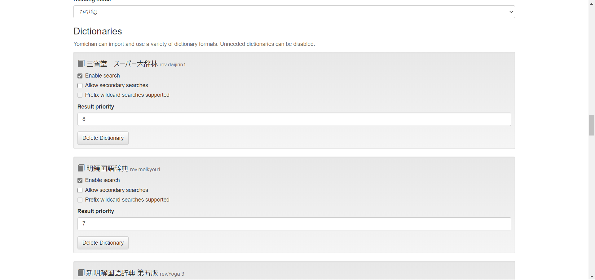

Then change your dictionary order. You can do this by changing result priority.

**Here’s my (shoui)’s personal dictionary order:**

新明解国語辞典 第七版  
大辞林３  
明鏡国語辞典  
大辞泉  
広辞苑第六版, 付属資料  
岩波国語辞典  
ハイブリッド新辞林  
国語大辞典  
精選版 日本国語大辞典  
実用日本語表現辞典  
故事ことわざ辞典  
Weblio古語辞典  

**Here’s what I recommend for first time monolingual users:**

明鏡国語辞典  
ハイブリッド新辞林
新明解国語辞典 第七版 
実用日本語表現辞典 
JMdict (English)  
研究社 新和英大辞典 第５版  
大辞林３ 
大辞泉       
精選版 日本国語大辞典   
KireiCake   

I shall explain each dictionary in the next section.  

### Every Dictionary Explained.

#### Monolingual

**新明解国語辞典 第七版** - 7th edition of Shinmeikai. Very verbose and precise with their definitions, always uses easy language, written from the ground up, instead of being based on old Meiji era dictionaries like the rest. This is the smallest dictionary.  	

**明鏡国語辞典** - 1st edition of Meikyou. Very concise and compact, has expressions, always uses easy language. #1 recommended for first time monolingual users. Best for definitions on Anki cards. Second smallest.  

**大辞林３** - 3rd edition of Daijirin. One of the bigger dictionaries, a great all rounder, has names such as place names, common names and famous people too. I would put this next to Daijisen.  

**大辞泉** - Unknown edition of Daijisen, maybe 2nd. This is a big dictionary, I like that it has every possible kanji combination for said word and has expressions. Formatting is bad on this version of Daijisen. Hope to get an updated version in the future, then it will be one of the biggest. I have the source.  

**広辞苑 第六版, 付属資料** - 6th edition of Koujien, the most authoritative dictionary in Japan. Language is a bit on the trickier side for beginners. It is one of the bigger dictionaries. Definitions are ordered by oldest to newest and are usually boring. This dictionary has a certain charm I like though. Optional.  

**岩波国語辞典** - 6th edition of Iwanami dictionary. What a stupid dictionary, it has missing entries. I think the source EPWING it was converted from was bad or something? The definitions "[feel like the Meikyou](/img/iwakoku.png)". Anyway, it is optional.  

**ハイブリッド新辞林** - Daijirin's little brother, Shinjirin. The best thing about it is its concise definitions and how it has separate entries for different kanji variants like 撃つ vs 打つ. Highly recommended for beginners. My version of this dictionary has an error where some words with multiple kanji in the same entry get combined in the headword.  

**国語大辞典** - "Kokugodaijiten" - A certain version of the 日本国語大辞典, the biggest Japanese dictionary in the world. But this is only about 1/10 of that dictionary but still bigger than the Daijirin. Has the same error as Shinjirin. Example:かえって It is optional and probably pointless. Superseded by 精選版.

**精選版 日本国語大辞典** - "Seisenban" - Another version of the 日本国語大辞典, but this is about 5/10 of that dictionary, but still the biggest digital dictionary to date. It has a heavy emphasis on classical Japanese, example sentences are like 500 years old and can appear to look crazy difficult, but it really comes through when you look up a word that's only in this dictionary. Keep it enabled to fill in gaps.  

**実用日本語表現辞典** - Lets call this Jitsuyou. This is one of the dictionaries Weblio uses, and whatever gap was still left after all the dictionaries above, will be filled in with this dictionary. Very useful, it's at the bottom of my order because it's only needed when the other dictionaries don't have a word.  

**故事ことわざ辞典** - a proverbs dictionary. Optional.   

**Weblio古語辞典** - archaism dictionary Weblio uses. Very optional.

**学研国語大辞典古語辞典故事ことわざ辞典学研漢和大字典** - the WORST dictionary ever. Do not import. Don't believe me? Import it then.  

Anything else like 新明解国語辞典 第五版 and 大辞林 第二版 are just older versions. I would not import them. Kept in pack for autism purposes.  

####Bilingual

**JMDict (English)** - The dictionary Jisho.org uses. This is the most popular bilingual dictionary and you have already probably used it. Pretty much every Japanese-English dictionary project uses JMDict, apps like Shirabe Jisho on iOS, Akebi and Takoboto on Android all use JMDict. The biggest flaw of this dictionary (apart from it being bilingual) is how it has no example sentences.

**KireiCake** - Based on an older version of JMDict but includes extra entries for slang. You may often see duplicate entries when used in tandem with JMDict, but for the entries that are exclusive to KireiCake, you should keep it.  

**研究社 新和英大辞典 第５版** - Kenkyuusha New Japanese-English Dictionary, 5th Edition, a Japanese-English dictionary intended for Japanese people. It has many example sentences which can prove to be very useful for Japanese learners. Better than JMDict.  

**新和英** - Version of 研究社 新和英大辞典 第５版 without example sentences. Not recommended.  

**研究社露和辞典 (Russian)** - Kenkyuusha Russian-Japanese Dictionary. Self explanatory. Only included this because why not. Do not import if you are not a speaker of Russian.  

**大修館書店中日大辞典　第二版** - Taishuukan Chinese-Japanese Dictionary, 2nd edition. A simplified Chinese dictionary for speakers of Japanese. If you are ever going to learn simplified Chinese, I recommend this. Do not import if not a learner of Chinese.  

**超級クラウン日中大辞典** - Choukyuu Crown Chinese-Japanese Dictionary. Something Matt gave me, but it is broken, this is also a Chinese-Japanese dictionary that supports both traditional and simplified. Do not import if not a learner of Chinese.    

### Why do you say use a lot of dictionaries?

You need to have a lot of dictionaries and have every one of them enabled because there will always be some words that are in some dictionaries and not in others. Take for example 禿同, that is only in 実用日本語表現辞典, and 院試, which is only in 日本国語大辞典. We want to use monolingual dictionaries as much as possible here.

## Alternatives

### Online Dictionaries

[Sakura-Paris Kojien Free Search](https://sakura-paris.org/dict/)

This site has **all** the major dictionaries, for free and online. You can’t view all the definitions at the same time though. But there is support for images. Compare definition of 簡体字 in the 大辞泉 in Yomichan and Sakura-Paris. Some non-JIS characters seem to not show up in Yomichan. (This is just an error in converting the EPWINGs to Yomichan format)

Weblio: <https://www.weblio.jp/> (Uses 大辞林 第三版, 実用日本語表現辞典)

Goo: <https://dictionary.goo.ne.jp/> (Uses デジタル大辞泉)

Kotobank: <https://kotobank.jp/> (Uses デジタル大辞泉、大辞林 第三版 and 精選版 日本国語大辞典) 

Jitenon: <https://kokugo.jitenon.jp/> (I don’t know what dictionary this uses, seems to be its own, and it's not very good)

Google: search “[word] 意味” e.g. “侮る 意味” (I’m not sure what dictionary Google uses, but it’s kinda good)

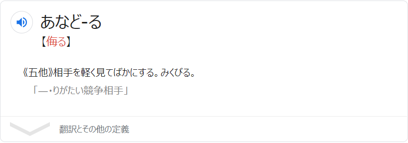

### Offline Alternatives

You’re gonna be learning Japanese for a long time, so it is possible that your internet may go out when you’re tryna nihongo grind! So you’re basically screwed right? Nope! 

*You download anime right…?*

### Yomichan Offline
You can still use Yomichan offline. Here’s how.


That’s how.

### EB (EPWINGS)

EB is an EPWING reader.

EPWING (pronounced *E P wing*, i just pronounce it *epwing*) is a digital dictionary format.

There’s EBWin, EBMac, EBPocket and EBWeb. To use EB, download it, install it and load the EPWINGs. I’ll go into detail.

Download this .zip I’ve just prepared for you (this has EBWin, EBMac and the EPWING files you need): [Google Drive](https://drive.google.com/file/d/1fDhrnxFlPl7PZVlX83cZRhTSRk3xetb2/view?usp=sharing)

**NEW: Compact, Standard and Full EPWING dictionary packages can be found in [Resources](/resources)** 


### Linux Installation Instructions for Qolibri

 *EB is not supported on GNU/Linux systems. Please use qolibri instead.*

**Arch** (AUR, make sure you have yay installed):

```$ yay -S qolibri```


### Windows/OS X Installation Instructions for EB

First things first, extract the zip you just downloaded above.

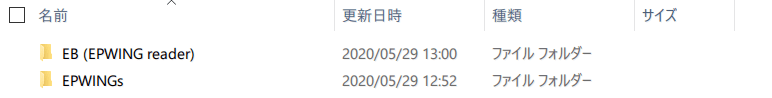

It should look like this inside the folder “Offline Dictionaries”

In the EB folder, you can find the files you need to install EB.

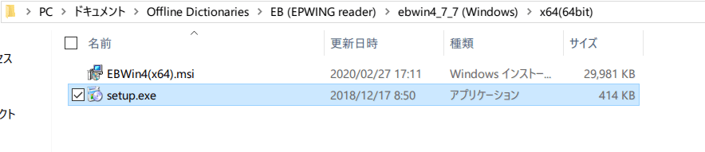

After EB is installed. Launch it.

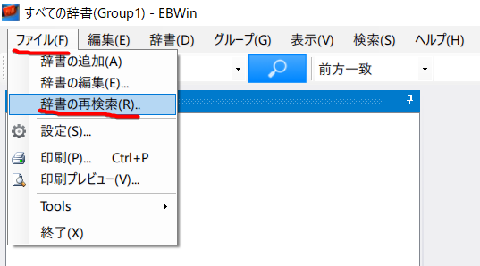

Click File (F) and Re-search Dictionaries (R)

It will open your file explorer, find the “Monolingual” folder and click “OK”

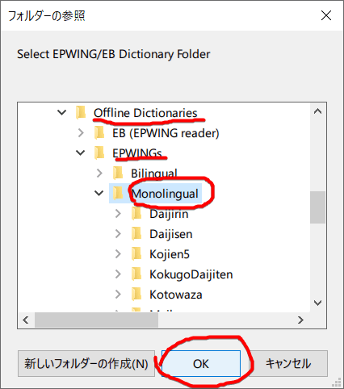

Now you can use the search feature to search a word. But first, maybe clean your dictionary bar?

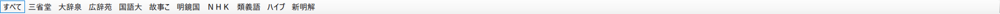

Here how it looks if you just click OK and leave it.

I’ll talk you through how to make it better.

**(壱) Sorting dictionary order**

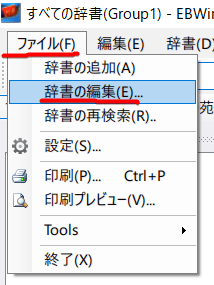

Then

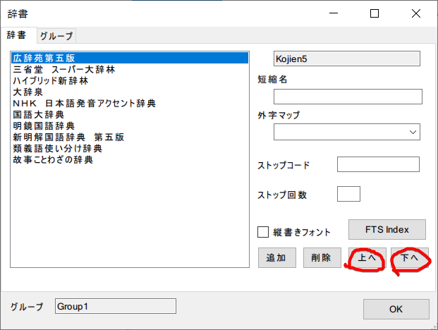

This is largely a personal preference. I have sorted mine to meet my preferences.

**(弐) Changing dictionary short-name.**

You wouldn’t want the 三省堂 スーパー大辞林 to be called “三省堂”  or ハイブリッド新辞林 to be “ハイブ”. You can change the dictionary short-name like this.

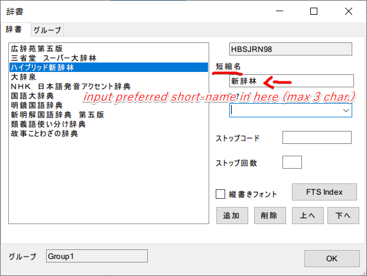

Click “OK”. See the result.


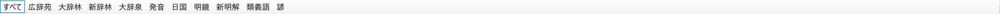
Click on a dictionary to search it specifically. Or すべて to search all of them.

When searching in the dictionary. **I recommend you do a kana search**

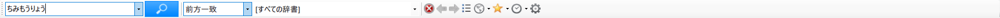

Here’s how it looks like when I do a すべて search.

I am looking up 魑魅魍魎 for demonstration purposes. I ALREADY KNOW that word.

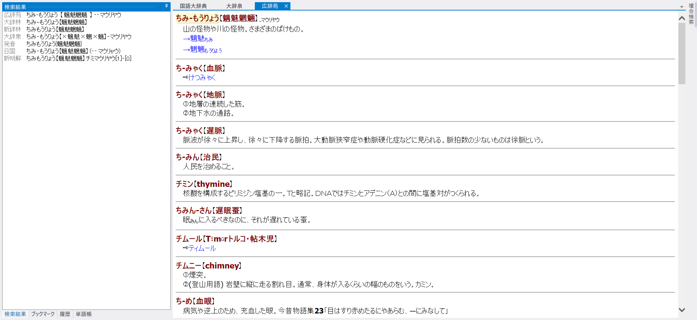

On the side bar you can change between dictionaries.

Because of my dictionary order, the 広辞苑’s definition is listed first.

Oh, I nearly forgot, how to look up words in the definitions with EB? First of all, enable clipboard search.

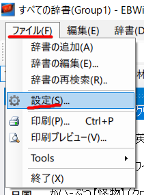

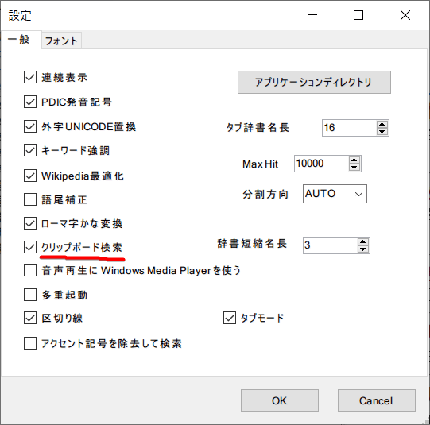

Check “clipboard search/クリップボード検索”

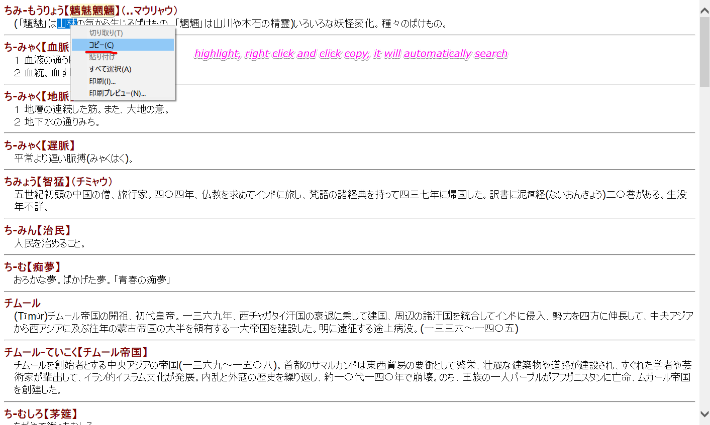

## Mobile Users

So you’ve read up to here and was probably thinking, “I’m screwed, I don’t have a PC” Don’t lose hope just now...

You can use EBPocket. You can find this on the App Store and Google Play Store. I was able to find it in the UK App Store lmao.

~~I don’t have an Android so I dunno how to move your dictionaries to Android~~  I got an Android now so just drag and drop dictionaries to the `EBPocket` folder in `/storage/emulated/0`

If you use iOS, you can just transfer the “Monolingual” folder to EBPocket using iTunes.

Edit: Wait iTunes needs a computer.. lmfao. Well, maybe you can use a friend's

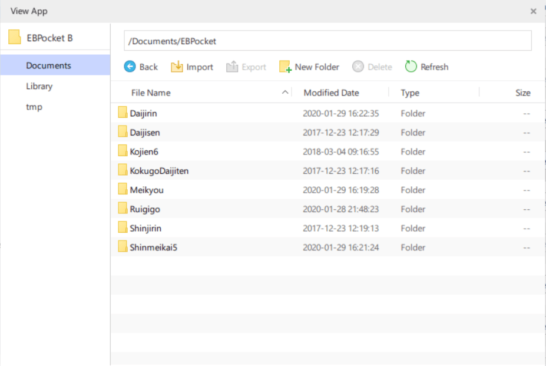

*Actually I don’t even use iTunes I just use some alternative called 3uTools lol.*

Here’s how it looks like when you actually use it:

I am looking up 修羅場 for demonstration purposes. I ALREADY KNOW that word.

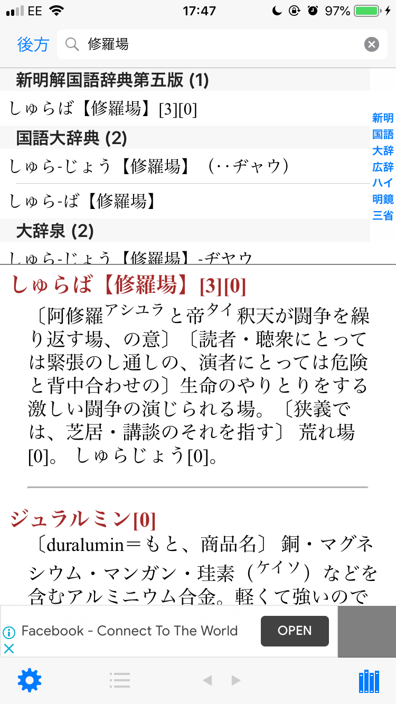

I hoped this helped.

Now let’s finally get on to how to approach using monolingual dictionaries.

## Approaching Monolingual Dictionaries

There’s a few ways to approach getting used to monolingual dictionaries. I’ll go through each one of them.

Primarily in the AJATT community, there’s this one piece of advice:

### The “Throw away the bilingual dictionary forever, and start using the monolingual dictionary straight away!” Approach**

I mean, if you read novels, this may be an OK approach. Because you will already be familiar with those words, because novels generally just have more words than anime and manga. If you only watch anime and read manga, this may prove to be quite frustrating. When this piece of advice was put out. Yomichan didn’t exist. So people in that time would have found this piece of advice terrible and tiring to constantly look up everything in the definitions. 
This isn’t a fundamentally flawed approach, I think it’s pretty good how it says “just read the dictionary more bro lololo”, because that’s exactly what you need to do. I just disagree with throwing away the bilingual dictionary completely, because you still need it in the beginning of the monolingual transition. 

**I recommend learning words within definitions using a bilingual dictionary.**

If you’re feeling adventurous, you can use the monolingual dictionary for looking up words in monolingual dictionaries if you want. I try to use monolingual dictionaries as much as I *can*.

### The Morphman Approach
no

### What you SHOULD do

How did I learn how to be comfortable with monolingual dictionaries? I read more.

When I read more novels I got more used to written Japanese, and when I looked up words, they were in monolingual, so when I learned more words, I got better at using the monolingual dictionary. Huh? Yeah. It’s really that simple. Read more. Read the novel more = reading the dictionary more because you need a dictionary to read novels :)

####>What did you do when you came across a word you didn’t know in the definition?

I looked it up with Yomichan. I tried reading the monolingual definition. If there were too many words I didn’t know in the definition,  I looked at the English definition (as a last resort) and moved on. You just need to keep doing this. REPETITION. Read more books. You will get comfortable with the monolingual dictionary if you just read a lot. Yes. Read more. Read a lot. That’s all there is to it. Yomichan just makes the process easier, you don’t waste your energy manually searching, instead your energy goes into actually reading. That’s why I recommend using Yomichan.

###>Soo… what’s the best way to approach monolingual?

Read more novels with a monolingual dictionary. I recommend reading novels on [Itazuraneko](https://itazuraneko.neocities.org/library/shousetu.html) using Yomichan.

###>But wouldn’t I be reading the dictionary more than the actual novel?

So what? It’s good that you are reading the dictionary more.

*Love Live picture*


**10 Important Tips and Tricks**

(壱). Read at least 1 novel (it can be a light novel) before going monolingual.

(弐). Try to experiment with what dictionary order is the best for you.

(参). If the word you look up with Yomichan is only in bilingual, try doing a kana search for it

(肆). If you don’t understand the definition even if you looked up all the words, just look at/use  the bilingual definition (last resort). You will get better at understanding when you use it more.

(伍). It is okay to check the bilingual definition to check that you’re getting the right basic idea.

(陸). Don’t worry about how much time it will take to “transition”

(漆). For monolingual Anki cards, just try to remember the gist of the definition. I tried to demonstrate this in #japanese-faq

(捌). Try to look up words you already know, in the monolingual dictionary, this is just to try to get accustomed to the dictionary at first hand.

(玖). Forget looking up very concrete nouns such as animals in the monolingual dictionary, you are better off just using Google Images instead.

(拾). Don’t overdo yourself! If it's too hard, try to use the bilingual dictionary until you feel confident again!

**Other Guides**

[Matt’s monolingual walkthrough](https://youtu.be/D-AfT8XW63w)

[Cure Dolly’s view on monolingual](https://youtu.be/AW-pw-EAMkY)

Have fun immersing!
