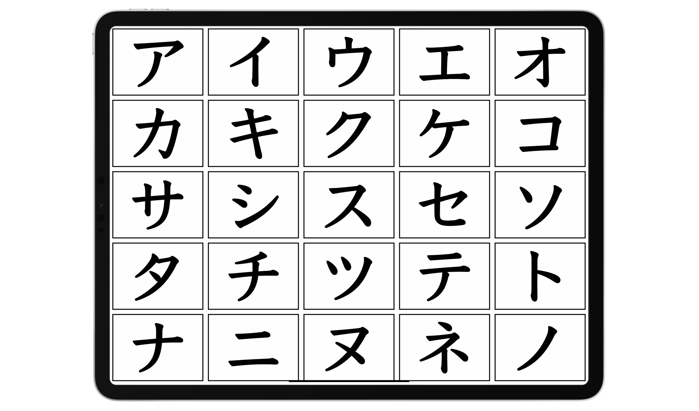

# Preview Draft

*If you don't need a preface, please skip to [2.1 How to learn Japanese](#21-how-to-learn-japanese)*  

## 1.1 Why many people "fail" to learn Japanese

Many people have simple goals in mind when learning Japanese: to enjoy untranslated Japanese content and to speak Japanese fluently. You'll hear everyone say something along those lines when asked about their learning goals. However, many also fail to reach these goals even after years of study. Is the language just too hard? Are they just not studying hard enough?  
I believe it is actually not their fault, but rather the method's. In language learning, the method behind your learning makes a huge difference in the kind of progress you make.

As it turns out, reaching such goals is not possible with "traditional" methods of Japanese learning. Many students are led to failure for not including a crucial ingredient, **immersion**, into their study routines. **Immersion** refers to listening to or reading native content made for native speakers. For example, anime is originally in Japanese without subtitles, so when consumed in this form, we call it immersion.   

## 1.2 Problems with traditional methods

A Japanese learner following a “traditional” study method would usually go through the following steps:

- Learning the alphabet(s);
- Learning basic sentences such as greetings and self-introductions;
- Learning basic grammar structure and vocabulary;
- Coming up with sentences either by having conversations with a tutor or study partner, or by writing;
- Translating example sentences from their native language to their target language and vice versa;   
- Looking up further material about grammar structures and vocabulary in textbooks or YouTube videos recommended by a tutor;
- Practice speaking using the knowledge they have learned from their study.
- Accumulating more vocabulary and grammar structures, which becomes a measure of one’s own progress;
- And finally, in the endgame, moving to or visiting Japan in hopes of having opportunities to practice their skills.

None of that is bad in itself, it is actually sufficient study, but it's not enough to get you to a high level of proficiency. The problem is that they aren't actually engaging with the real language—but what do I mean by that?

Let's take swimming as an example. You can't just stay in the baby pool with floaters and take your time to become a pro at the baby pool before attempting to swim in the kids’ pool. This won’t make you a good swimmer. You also can't expect to become a good swimmer by just learning the theory behind the techniques in isolation and practicing them in isolation without actually swimming in a real pool.

How about a more relatable example: competitive video games. You won’t get better at the game just playing against the AI and grinding in training mode all day. You have to play the real game against other people even if you think you’re going to lose by a landslide. This is "playing the real game", with no strings attached.  

  It's important to learn how to move on!

A common trap students fall into in language learning is staying on beginner resources for too long.  
They want to ensure they know every single detail of their basics and refuse to move onto the real language. They refuse to engage in anything they aren't already comfortable with, because they are too afraid of not understanding anything. They feel like they aren't “ready". Yet it’s important to leave your beginner resources as soon as possible because, in reality, you will never be ready until you actually start engaging with the real language and get yourself used to it.  

Perfectionism can be a double-edged sword in language learning. As a perfectionist myself, I've suffered more than I've gained wanting to make sure I've gotten every single detail down of trivial things that didn't really matter in the big picture.  

Learning a language is like climbing a mountain. you can try to climb that mountain without ropes and whatnot assisting your route, and though, it will take lots of struggle, you will eventually make it if you persist. traditional study is like building that rope so that it's easier to climb that mountain, but you can't climb the mountain just by making a rope!-You eventually have to climb it, and no matter how much rope you decide to make, eventually you just get diminishing returns, and climbing that mountain is still going to be difficult and time-consuming.

## 1.3 The scale of language

Language is… huge. There’s so much to it that far exceeds the limitations of a classroom or app-based approach that tries to teach in a "x means y" or "x does y" format. Learning a language to a high level requires an enormous amount of experience hearing and reading what native speakers say.

It’s often difficult to grasp why they sometimes use that phrase in this context, or this word here instead of that other one… This sets a challenge for us learners as we can't just study grammar and vocabulary to learn how to speak like natives.

Attempting to construct sentences in said target language without the required experience often leads to unnatural, or easily misunderstood phrasing. Lack of experience with how native speakers play with their language will make it difficult to understand them, due to unfamiliarity with sentences outside of a learning resource’s scope.

This is why in your learning routine, **you must “immerse” yourself in the language—read and listen to what natives write and speak.**

Language learning is a process of subconsciously memorizing patterns by the way of comprehensible input. What this means is, when you understand something (comprehensible) in your immersion (input), your brain subconsciously stores that pattern for later information retrieval. You see, being able to comfortably read this guide is only possible because you have had so much experience reading English in the past that, when you read this, your brain thinks something like, "Oh, there's pattern #234 used with pattern #82 and pattern #10!".    
And since you are a proficient English reader, this is done effortlessly. You have seen the same patterns elsewhere before. You can detect the tone and degree of formality in my writing all thanks to your brain also storing the context, and other information about the patterns you come across.

Notice how I haven't mentioned "knowing the grammar" or "having memorized the vocabulary"? This is because you don't organically process language in this manner. Some readers may not even be native speakers and probably have studied English grammar before, but it is unlikely they are actively thinking about it when coming into contact with English every day.

## 1.5 Coming to terms with sucking 

In language learning, and in anything that requires skill, you are always going to start off struggling for a long time until you get better. As mentioned earlier, many learners (I am guilty of this too) fall into the trap of attempting to master something before ever trying to engage in practice with what they need to work on. For example, a student might fuss over a certain aspect of grammar for way too long and never find the time to move onto something else they should be spending their time with.

**☝ THIS HERE**, ladies and gentlemen, is what we want to avoid. We have to get into the habit of letting go of time-wasters and start doing what we actually need to do. 

Yes, you won't understand that book or anime perfectly the first time, but that’s not how learning works. It always takes a third, fourth, fifth and even sixth attempt to finally learn something.

## 1.6 WHAT is "immersion"?  

## 1.7 Stages of learning

Language learning is a long-term endeavor. It should be noted that your experience as a beginner getting into the language will differ greatly from an intermediate or advanced learner. The process does not change between intermediate and advanced learners since they have already gotten past the initial hurdle. This guide will steer you through the labyrinthine beginner stage, and then from the intermediate stage and onward.

## 2.1 How to learn Japanese

The learning process for the beginner consists of:

- Learning the *hiragana* and *katakana*, which are two of the writing systems of Japanese. 
- Learning basic vocabulary and their kanji with a software called *Anki*.
- Learning grammar through a YouTube playlist.
- Starting immersion with easy content and with high repetition. This is how you will be spending most of your time.

### Long term study process

The methodology covered in this guide consists of an immersion-based approach supplemented by study.

Your long-term study consists of:  

-    Learning vocabulary;
-    Learning grammar structures;
-    Looking up vocabulary and grammar found in immersion;
-    Using flashcards to better memorize vocabulary.

As you can see, studying pretty much boils down to learning vocabulary and grammar. This is very important. We can't have immersion without study, but we also cannot have study without immersion, as we want to be able to get meaning from our immersion and see how what we've studied is used in real language.

## 2.2 Hiragana and Katakana  

<figure>
  
  <figcaption>"Hiragana" and "Katakana" written in their scripts respectively.</figcaption>
</figure> 

Hiragana and katakana, these two are parts of the Japanese writing system. The 3rd part of it being kanji.
Japanese's writing system can be described as more of a "syllabary" than an alphabet. It is technically wrong to call these alphabets, as each character represents a syllable rather than a vowel or consonant. Take for example, "か", this reads as "ka".  

 Hiragana and katakana are collectively referred to as the "**kana**".  
### Hiragana 
<figure>
  
  <figcaption>An example of a couple hiragana. This isn't all of them.</figcaption>
</figure> 
Hiragana can be described as the "main alphabet" of Japanese. It's used in grammatical things, parts of words with Japanese origin, for words that aren't usually written in kanji, and sometimes names. It's the curly and cute variant of kana.

### Katakana

Katakana is the angular and pointy version of kana. It has the exact same sounds as hiragana. It's used in loan words (words borrowed from other languages like English), onomatopoeia words (Japanese is full of these!) and slang words. It may also be used in names, mainly foreign names.  

### How you are going to learn the Kana

#### Step 1 - the chart

First I want you to take a good look at this kana chart

<a href="/img/hiragana_katakana_LARGE.png" target="_blank">View in browser</a> 
<a href="/img/hiragana_katakana_LARGE.png" download>
Download image</a>

This chart will come in really handy when you are learning to read the kana. I recommend you save it.  

Things you can do with the chart:
- learn to read kana by referring to the table. The columns representing vowel sounds, and the rows representing consonant sounds. Since か is in the A column and the K row, it is pronounced "ka".  
- learn how they are written by looking at the stroke orders. (the little blue arrows and numbers on the characters).  
- use it as a master reference for all singular kana. This will help you a lot when you are learning how to read Japanese.  

#### Step 2 - the YouTube video

<h3> <a href="https://youtu.be/_wZHqOghvSs" target="_blank">Watch this YouTube video</a> </h3> 
It's a 2 hour long video about hiragana and katakana. It is a great introduction into the kana.  

#### Step 3 - the grinding
Once you have done that, play this kana grinding game.  
<h3><a href="https://gohoneko.neocities.org/learn/kana" target="_blank">The kana grinding game</a></h3> 

<h4>How to play</h4>
1. Click "show/hide options"
2. Click "check all" for Hiragana
3. Start guessing how the hiragana are *pronounced*
4. Repeat until confident (may take a few days or weeks), and then do the same thing but with all "Hiragana combinations" also checked.
5. Repeat until confident, then do it with all "Katakana" also checked, and then with all "Katakana combinations" also checked.  

This whole process can take up to 3 weeks to a month depending on the person. Do not feel discouraged if this part of learning Japanese is taking a while, as there are other things to do such as beginner level immersion.

#### Step 4 - reading practice

What also helps immensely in memorising the kana is reading sentences in kana.   
Not everything in Japanese is written in kana, and you will have trouble trying to read most things at this point without *kanji* knowledge, but sometimes in Japanese, kana is put over kanji to help you read. This is known as furigana. An example can be seen here! <ruby>
  日本語<rp>(</rp><rt>にほんご</rt><rp>)</rp>
</ruby>. This just means the Japanese language ("nihongo"). I wrote it in its kanji form and put hiragana over it.

I recommend practicing your kana by trying to read some Tadoku graded readers, which you can find [here](https://tadoku.org/japanese/free-books/#l0)  

<strong><h3>You do not need to be able to understand anything right now. This is just for getting better at reading kana.</h3></strong> 

## 2.3 Vocabulary & Kanji
## 2.4 Grammar
## 2.5 Basic Immersion
## 2.6 Beginner learning loop

## Contributors

I'd like to thank everyone that has contributed to the making of this guide:  

iamatryhard  
shigatsunoraion  
kaio.n  
saegusa.mayumin  
pedipanol  
.ikki.  
ultravioletspring  
deviru  
kazuhira___  
marv.n  
