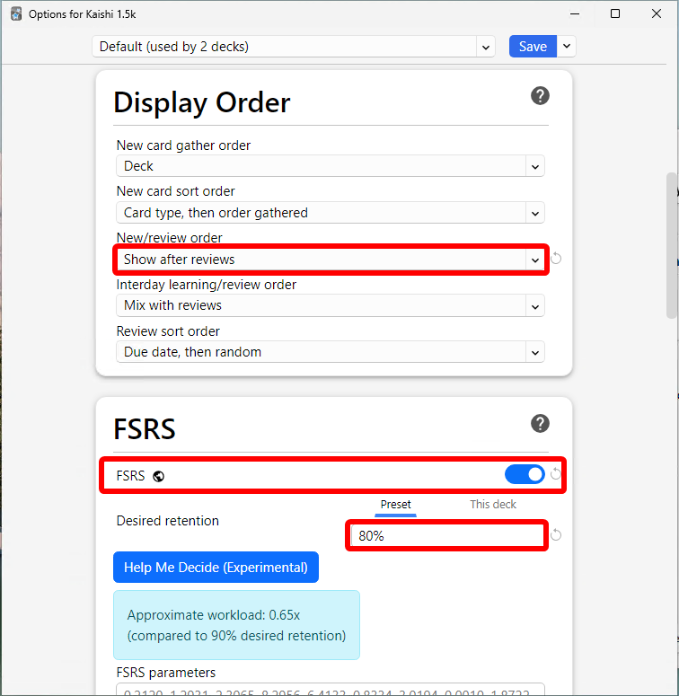
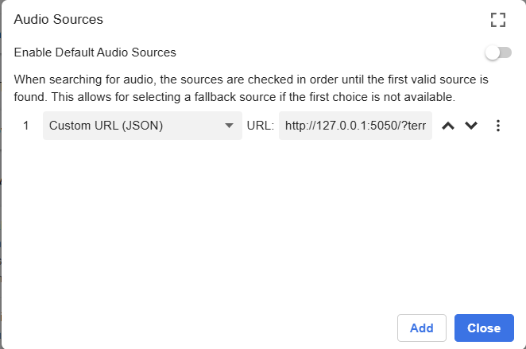

# My personal method - "the Shoui method"

## Introduction  
Many people have asked me over the years what I did *specifically* during my Japanese learning journey. This article will just extensively detail my learning approach, specific things I did and overall philosophy to learning Japanese.  

Everyone learns differently. Not because some people can leave out important ingredients (immersion. this is a non-negotiable btw), but because everyone each has their own way of doing what is supposedly the "same" method.   
For better or for worse,  everyone has their own spin-off of what can be classified as "the immersion method".  

Naturally, this individual variation means everyone is doing technically a different thing to learn Japanese, and that is something to take into consideration.  
My philosophy in life is that "everything matters". It would border on intellectual dishonesty to shrug off variation in learning approaches as "insignificant" to a final goal as monumental as getting proficient at Japanese. The process is too intertwined.  

I believe the process has a lot of moving parts, and that everything is important. And because everything matters, I also believe that certain steps and methods to learning Japanese could also be the difference between *making it* and *not making it*.  

Whether or not this is important to you is up for *you* to decide.  
Deciding if "being good"/"making it" is even a matter of concern for you is entirely dependent on *your goals*.  
You can never change someone's goals. I understand this painfully well, to the point "it depends on your goals." has become a bit of a 口癖 for me whenever I answer questions in the TheMoeWay Discord. Factually, there is never really a cut-and-dry answer in Japanese learning.  

My goals though, have always been to:  

- get good at Japanese
- **help others learn**

My primary motivation for writing TheMoeWay in the first place was because I felt like important information was being withheld from me.  
This was around 2018-2019. Immersion wasn't exactly considered mainstream in the community back then. The community did nothing but keep each other stuck in an eternal beginner loop, where the only people who were permitted to climb the ladder where those who lived in Japan and developed a social life around the Japanese language.  

When I first found out about immersion through "AJATT" and Matt vs. Japan, it was near-revolutionary to me at the time. It gave me exactly what I wanted. The mindset, the pragmatic approach, etc., it was everything that I felt was critically lacking in the Japanese learning community.  
I was tired of the bullshit. I knew things had to change. I knew I had to spread this information to make sure others don't fall into same traps I fell into.  

In a way, TheMoeWay was just me writing to my past self. It didn't matter if what I was writing wasn't entirely factual, the crucial part was that the information was *everything my past-self wishes they could have known*.  

And with that, people shill my website without me even doing anything. I have never advertised my site myself. I wrote what I thought would help people and people starting sharing it around. 

The fact that something I wrote as a teenager, without any expectation of it getting popular, ended up helping so many people still feels surreal to me. Combined with the continued encouragement from members of the TheMoeWay Discord to finally put "the Shoui method" into words, it feels like the right time to do so.   
Even if this write-up is dismissed as too opinionated, too eccentric, or eventually fades into obscurity, helping even 1 person achieve their goals would be enough. I didn't just want to get good at Japanese, I always wanted to make the path clearer for others who were struggling in the same ways I once did.  

If this can help even one person break out of stagnation, it would mean the world to me.  

## Core principles

- Do not use Japanese subtitles.   
- Relate it back to the real world.  
- You improve by pushing yourself out of your comfort zone.
- Simplicity (of setups) over all.  
- Listening is what will make you into a fluent speaker.

## What I did as a beginner 

### Traditional Study
The first nearly a year of my Japanese learning journey involved me doing ineffective methods, such as:

- using language learning apps
- communicating with a "study buddy" in Japanese 100% of the time, even if my Japanese was completely wrong.
- using Discord to text chat to Japanese people.
- watching YouTube videos (in English) about Japanese.
- trying to "learn kanji" with various methods, including writing them down from a .pdf of Remembering the Kanji, JLPT kanji lists, and using kanji flashcards that showed ON and KUN and meanings and various words on the back.
- grinding through a JLPT N5 + N4 vocab list (used Shirabe Jisho for this)
- learning grammar with YouTube playlists and JLPT N5+N4 study material.  
- trying my hardest to read NHK Easy News.

Out of all these things, the most useful parts were these:

 - learning vocab
 - learning grammar
 - output attempts

 These 3 effectively laid the ground work for immersion gains. 
 
 I found out about immersion when someone in a Japanese learning Discord told me "read more, and you'll get good". He was the only person in that community who wasn't a haafu, 帰国子女 or Chinese or Japanese native that had good Japanese. I held onto this, that's when I started looking into immersion methods. That's when I found the [classic DJT guide](https://djtguide.neocities.org/guide). I will say though, this guide does a very bad job at telling you what the process of getting good actually looks like, and leaves out two crucial components: **raw listening** and **tolerating ambiguity**.  

That guide told you to do Core2k (Kaishi didn't exist then). But I already knew too many of the words because I grinded N5 and N4, so I didn't do Core2k, and started reading. But it was too grueling. Being told "just read" while not understanding key concepts such as **acquisition vs. learning** and **tolerating ambiguity** set me on the path for burnout. I didn't make much meaningful progress, because I spent hours on single pages, and thought I had to understand EVERYTHING from day 1 of immersion for it to be "real learning." There was no way for me to rack up a huge amount of Japanese exposure with such an approach.  

It was only when I discovered AJATT through Matt vs. Japan and was introduced to the concept of **tolerating ambiguity** that I finally started to make progress I could call *progress*. The idea of "if you want to get good at watching anime without subtitles, then start watching without subtitles now!" was exactly right.  
After taking his advice and trying it out for myself, I was convinced. Because the words I learned now finally had application. And because, after a while, I could finally understand raw Japanese, no crutches, no Japanese subs, no translation, no cope. And that was huge.  

That's why I pass these ideas down in the [Japanese Guide](/guide):

- learn vocab
- learn grammar
- immerse ASAP. listen without subs. tolerate ambiguity.  

Also, when I started immersing, I ran into many "ohh, so that's how you say that idea" moments.  
I could relate my immersion back to real-world use. Because I had previous output attempts.  
Immersion methods often underemphasize output, but I believe that you should combine output with immersion for the best effect. I understand why they discourage output though, my output before I had a 100 hours of immersion under my belt was stagnant and awful, with no signs of improving.    
### Immersion - how I immersed as a beginner

The most simple way to put it was "a 9:1 listening-reading split".  

I wasn't doing an entirely audio-purist approach. I never went "audio only, audio cards only, avoiding reading altogether" level crazy.  
Rather, I would:

- watch raw (no subs) anime. or other raw listening (J-drama, YouTube etc.)  
- read a bit of a novel or manga to learn new words
- Anki those words I learned from reading

This was the effectively the learning loop I had as a beginner.

Do Anki first thing in the morning → immerse in 12-13 episodes of raw anime → read a bit of a novel or LN with Yomichan (now Yomitan) for about 30m-1h, add some new cards → sleep  

## What you should do

If you haven't already, you should **learn core vocab with Kaishi every day** and cover **the gist** of grammar taught in your chosen grammar guide.   

I will note though, I didn't do Kaishi, and I didn't do Core2k either. My first Anki deck was actually a mining deck, which I hated, and I was just learning common words anyway. I consider doing Kaishi as the better alternative for learning core vocabulary.  

Personally, I first learned Japanese grammar with that Japanese Ammo playlist I have linked in [Resources](/resources), but I think her explanations aren't that good and if I could, I would go back and learn from the grammar guides that are recommended these days. Namely: Yokubi, Cure Dolly, IMABI.  
Fussing too much over grammar as a beginner is a practice in futility. Do not put too much effort into grammar before you are already proficient. You only need to learn the basic ideas.  

I emphasize learning vocab and grammar because if you really want to do exactly what I did, then you need to have a constantly expanding vocabulary when you immerse every day.  

On the same day you learn words from Kaishi, immerse in raw anime. 

Ironically, I was way less picky about what I immersed in when I was a beginner, so I wasn't really concerned with anime difficulty, so I just watched whatever interested me. This happened to be CGDCT SoL anime, battle shounen and ecchi harem anime.  

After you consider your listening done for the day, read a bit of a novel to mine some words. (My mining setup details: (link))

So to summarize, all on the same day:  

- do Kaishi
- learn the gist of basic grammar
- immerse in raw anime
- try reading a bit  

I'd dub this "**stage 1**" of the shoui method. The constant loop of immersing in raw anime, learning words and doing a bit of reading on the side.  
Do this for a **minimum of 100 hours of listening**.  

I was personally doing this for a bit longer than that, around **1000 raw anime episodes**, so approx. 300 hours.  

### Shoui method stage 1 – listening

Remember, do not use Japanese subtitles. They are a crutch. Neither real life or content in its untouched form has subtitles. So why keep such training wheels?  

When listening, try to relate what you're hearing back to the real world. Mentally simulate output in your head while immersing.  
Try to think, *"How would I use what I am hearing right now myself? Could I put my own spin on this saying?"*  
Don't just mindlessly immerse, try to think about what the Japanese you're hearing is actually doing. Can you think of other instances where you heard this word / construction? Can you think of any ways what you are hearing right now differs from what you have heard in the past?  

*Envision how you will use what you are currently hearing in your life later on.*    

This is an ever important concept, and in my opinion, is the "correct" way to listen. You'll be approaching listening with this mindset through the entirety of your Japanese learning journey.  

At this stage, I don't think you need to fuss too much about immersion content variety. Sticking with anime is fine, but I did venture out to J-drama and YouTube videos around this stage too.  

### Shoui method stage 1 — reading  

I don't place much emphasis on reading in the beginning.  

What I mainly did for reading was:

- Set my UI language on my phone and PC to Japanese
- Interact with Japanese YouTube so I naturally saw words in video titles all the time.
- Try reading through a novel after my listening. Gradually read through the book. The structures you acquired from listening will gradually make reading a little less hard.
- Use the green Yomitan button to add cards for the words I had to look up.  

**Reading is hard**, I always tried to read carefully. I was against the idea of letting things slip through my comprehension, but I think it's important to maintain a balance here.  

*Intensive reading* is where you read carefully and make sure you understand everything (very difficult as a beginner btw. and "understanding" can only go as far as the ceiling of your current ability, but even the smallest achievements count).  

*Extensive reading* is where you just read "for enjoyment".  

As a rule of thumb, I did something along the lines of a half intensive, half extensive reading strategy.  
To further my understanding, I made sure I had access to good Yomichan dictionaries, and searched online for things I was extremely struggling with. Sometimes, it is tempting to put things into machine translation, but I found that this creates the illusion that you "learned" what a previously difficult structure means, rather than actually building the foundation for you to understand intuitively how things came to be, so it's counterproductive for our goal. Always try to decipher texts entirely on your own! This also makes use of AI kind of pointless / also cements the illusion of learning.  

### Shoui method stage 1 — mining

Since I didn't do Kaishi or Core2k, some of you might be wondering how you can do the shoui method when you still need to learn core vocab.  
#### Backstory
First I'll be completely honest: I didn't do a core deck not because I already knew everything, but because I **refused** to do it because of my ego.   
In actuality, I most likely only knew close to approx. ~1000 words when I started immersing, so that's less than half Core2k. I also didn't have the patience to sift through the Core2k deck to find the point where I start running into cards I don't know. The guide I was originally following (DJT Guide) also told you to set up Yomichan, set up a mining deck and start reading as soon as possible, so I did.  

I started reading 日常の夏休み because it had furigana (furigana is cope btw, but i just chose it because EVERYTHING was so damn hard, this was slightly less hard.), and I was looking up words with Yomichan and indiscriminately adding every single word I didn't know into Anki. I learned and reviewed my backlog of cards at a rate of 20 new cards per day.   
I never really cleared that backlog. After I found out about AJATT and Matt's methods, I started to re-think my approach. I wasn't missing out on much by not doing that deck I made, it was all common words and mis-mines (cards you add to Anki that are not actually the word/structure used in the text because you were too low-skill to parse the sentence correctly.) anyway. So I deleted the deck and started fresh.  

#### How you should start mining

Truth be told, you don't need to finish a core vocab deck before you start mining. If you value orderliness in your life, you might feel inclined to finish Kaishi until the very end before you start mining, but I don't consider it a strictly necessary step. Words you will learn in immersion are inevitably going to cover the 1-1500 frequency range anyway.  
That's the reason Kaishi 1.5k has less cards than Core2k and other decks (such as Core2.3k, Core6k). Because others in the TheMoeWay community also started immersion *before* finishing Core2k and got good results. I know how grueling Kaishi can be for some people. It's best to end the process as soon as possible and start making a personal deck.  

I can't speak through experience about this, but others in the community have said so: 

> *Your mining deck will be easier and more effective than Kaishi/Core.*  

You should be ready to take the plunge at around ~1000 words learned.  

[Setup your mining deck with my mining setup](#mining-setup-w-lapis-shoui-method)   

## My grammar learning method

You shouldn't think too deeply about grammar as a beginner. There is no "learning grammar" like it's a monolith. It's a multi-step process.  

In my method, as a beginner, all you should do is:

- learn the basics from your chosen guide (the gist)
- listen & read a LOT. let the grammar flow through you.  
- try to output

After you are good enough to read LNs semi-comfortably, then:

- grind JLPT grammar points  
- try to learn Japanese grammar in Japanese  
- learn remaining grammar points you didn't learn as a beginner.  
## My Anki learning method

Make sure you read my [Anki setup guide](#anki-setup), as this will only make sense if you've read that.  

When learning & reviewing Anki cards, by far the most crucial piece of information has always been the **MEANING**, and then the **reading**.  

I always did Anki first thing in the morning, I made sure I did it as early as possible so I didn't have to think about it later in the day.  

I always used PassFail (again, see my [Anki setup guide](#anki-setup)).  
When reviewing, I look at the word, try to recall the meaning and reading, then press ++space++ to reveal the back, then and grade based on whether I failed to recall **both** the meaning & the reading (in that case, I press ++2++), or if I succeeded to recall both the meaning & the reading, then I press ++1++.  

Reveal: ++space++  
Pass: ++1++  
Fail: ++2++  
Undo: ++ctrl++ ++z++  

I try to spend as little time as possible on my reps while still trying to keep them effective (no cheating, you'll only be cheating yourself.)  

I stuck with 20 cards/day as a new card limit for the majority of my learning journey. Though sometimes I have done 30, 40, 50 and sometimes even uncapped.  

## Points of contention / quirks

### Holding on to old decks
I don't agree with the idea of holding on to your old decks. This is extremely common in TheMoeWay, where people hold on to an old deck they have, and keep reviewing it even if it's full of common words. There are very little gains to be had there. Even if they hate it, people find it so difficult to let go of their old decks, they treat it like the game savefile of their Japanese learning progress— this couldn't be further from reality.   

I delete all my Anki decks almost every year, and I couldn't be happier. I would even consider a yearly deck refresh part of the shoui method.  

If those words were *really* so important, you would see them next time you immerse. And if you do see them, and had to mine them again... then Anki simply failed to do its job helping you remember the word.  

### Monolingual Dictionaries

I started using monolingual (Japanese→Japanese) dictionaries quite early, after I finished reading 1 book in Japanese. I didn't go full monolingual though, as I still kept bilingual (Japanese→English) dictionaries. But the point is, I didn't ever hesitate to read monolingual definitions for things, if I could.   
### Isolated kanji study — Remembering the Kanji (RTK)

I did RTK. 2200 kanji. I didn't do the "Heisig method" (keyword→write the stroke order) all the way though, I only did that for the first 1000 kanji, then I did "recognition RTK" (kanji→keyword) for the remaining 1200 kanji.  
I did RTK after I finished 1 book in Japanese, after being utterly convinced I *had* to do it by the classic AJATT philosophy.   
To be honest, RTK is one of the most painful memories I have of learning Japanese, I dont know if anything else comes close. Doing 100 new vocab cards a day? Reading a book start to finish in a day? Listening for 10 hours every day? Doesn't even come close to the painfulness of RTK.

**Isolated kanji study is the most debated part of Japanese learning**.  
Many people in the community say it is a complete and utter waste of time, "just read.", they say.  

However, as much as I hated doing RTK, I think it was worth it. I am not one to immediately recommend every single Japanese learner to do RTK, but when I look at other learners, I always feel vindicated that RTK was, in fact, *not* a waste of time. It is quite common to see people in the TMW Discord post about how they thought a certain common kanji looked like another common kanji the entire time they've been learning. I never had this issue after I did RTK, lol. Unique kanji will *immediately* look unique, no confusion. People that have not done isolated kanji study and follow the advice of "just read" **still** confuse kanji that look slightly similar, proving that just reading is not enough for kanji mastery. In my opinion, ignoring the composition of kanji in favor of only reading is cope.   

But the important question is, **do you care**? I did, so I did RTK.  

The "modern" solution to this kanji distinction + stroke order memorization problem is to do the QM Kanken deck *after* you are already a fluent reader of Japanese. In a way, this kills two birds with one stone, but I don't agree with delaying kanji distinction to this late.  
### Passive Listening
I've always been sold on the idea of passive listening.  
Passive listening is where you put Japanese audio on in the background while doing other stuff.    
While I have always shilled passive listening, others in the community find it ridiculous/useless for these main reasons:  

- it's annoying
- what if i dont understand? isnt it useless then. just do active immersion instead  

But I think that's missing the point. I did passive listening because I believed that raw quantity was useful. I appreciated how it filled in the gaps in my day where I wasn't doing Japanese or couldn't do Japanese with something passable as *input*. And plus, your ears are technically still listening to the audio, even if you are not paying attention. Your brain just filters it out as background noise until it hears something that catches your attention. That's when you'll start paying attention to the passive immersion, and that's when it's most useful.  

I mainly used audiobooks and YouTube channels I batch downloaded as passive immersion content.  

### Pitch Accent & Pronunciation

I was sold on the idea that you could get a perfect accent from just listening to the language. This however, turned out to be false. However, I am still confident that people who don't listen enough will not become good speakers and will not have good pronunciation.  

I knew about the existence of pitch accent really early on, before I even started immersion, but I didn't pay attention to it until I had about 200-300 hours of listening under my belt. Pitch accent is very fundamental imo, and you are shooting yourself in the foot for ignoring it, it's pretty much inseparable from the Japanese spoken language.    
I believe phonetic training is useful and even necessary, but I didn't start doing this until 2023, 4 years after I started immersion.  

As with everything related to pitch & pronunciation, **the earlier, the better**.  

### Audiobooks: cope?

I've been saying audiobooks are cope for years. But how could I say such a thing? Technically they're THE listening content that uses the highest concentration of words, with the longest sentences and most complex vocabulary, so it *must* be the best for listening, right? Well, no. It's only good for pitch accent and training your working memory in Japanese. The fact that they have long sentences and complex vocabulary is a valid point, this makes them 'harder' than most content, but the language used is still right up a reading main's alley. The main concern is **audiobooks are too clear** and **too slow**, this is not reflective of real-world speech at all. I think, if you want to be "dekiru", you should get good enough to understand audiobooks, but at the same time, immerse in every other kind of listening content, that includes scripted and unscripted speech.   

## Stage 1.5
Weird limbo phase I had between these two stages... I find it difficult to separate them cleanly. So I'll just make it clear what I was doing until I felt like I had advanced to "the next stage of learning".  
My immersion was still mainly listening, watching anime, j-drama, YouTube and listening to 声優ラジオ everyday, but truth be told, I was coping hard over reading. I still considered reading secondary to listening, (and to be honest, I still do in my philosophy), but I really wanted to reach my goal of being able to read an LNs in Japanese. I just found it too difficult to read a book in Japanese. So I coped, and stuck with listening. I finished about 8 books in total around this time, but I still sucked at reading. That's when I was introduced to visual novels, and started shilling them because they were far more engaging than books. That's what prompted me to make the [VN Guide](/vn) and say "VNs supercharged my reading". Because they did, before I read through a VN, I was coping *hard*. After that my reading noticeably improved and I felt more confident to read more, and I came back to books with my newfound skill and confidence.   
I keep saying "I was coping" because even though I avoided reading, I firmly believed that I was **stagnating** hard by continuing to do my listening-focused approach. I *knew* I needed to read more to improve.  
So to conclude, I felt like I was done with this chapter of Japanese learning after I finished 8 novels, 2 VNs and had about 500 hours of RAW listening.  

## Stage 2 — monolingual dictionaries & vocab count skyrocketing

The main goals I set for myself at this point were to switch entirely to monolingual dictionaries and get good enough to try and understand listening content deeply.  
To do this, I knew I had to significantly improve in these areas:

- vocab knowledge & depth
- grammar
- total immersion quantity

This was the stage where I made myself read 12 volumes of 俺の妹がこんなに可愛いわけがない。 in a row, after watching the anime.  
This was also when I realized just how OP the "watch anime adaptation, then read the light novel" method really was! I talked about this in [Reading Tips](docs/readingtips).  

This was also when I started pushing the philosophy: (in reading) "Aim for 99%+ comprehension, aim to understand everything".  

What I did was:  

- Get rid of bilingual dictionaries entirely
- Watch 俺妹 (it doesn't have to be this, it can be any anime with an LN)
- Read the LN series, carefully. Make sure I understand everything. Look up everything I have even a shadow of a doubt of whether I truly understand it or not. Mine everything. ONLY use monolingual dictionaries unless I have no choice. Look up every word I don't know in the dictionaries. Mine all those words too.  

I was making huge gains at this point, to say the least. How many words I looked up was doing INSANE work in filling gaps in my vocabulary.  

This was also when I started doing "reading weeks" and "listening weeks"— this is an important part of the shoui method.

If I am committing so much time to one task (reading), I don't want even THINK about trying to fit in everything else. I function better if I know I am only going to be doing one thing.  
So here's what I did:

- Week A, all my time goes into reading. Listening is just passive or recreational
- Week B, focus on listening. The gains you made from your previous reading week would be insane.
- Continue the cycle with another Week A, then Week B.  

This way, I save myself from having to think about "balancing" my immersion.

After I went full monolingual, mined 12 books and mined countless of words from monolingual dictionaries. I really felt like I was no longer "coping" about reading. I felt like I got my first taste of what it feels like to be "good" at Japanese.  
My vocab size increased by so much, I could feel my listening substantially improve, just because I knew more words and Japanese in general.  

This was also when I decided it was a good time to finally revisit grammar. I learned all JLPT grammar points from the [NihongoKyoshi grammar deck](https://drive.google.com/file/d/1tDBaabwgZMO8nxkcwcw4qBXayuk_513T/view?usp=sharing), after realizing that not learning them in isolation made me whitenoise them in immersion.  
For basic grammar, I decided it was a good opportunity to look up all basic grammar particles in a monolingual dictionary, read their definitions and try to internalize them the best I could.  

So to summarize:

- Go full monolingual
- Watch an anime adapted from a light novel
- Read the full light novel, with only monolingual dictionaries. Mine EVERY word.  
- Split your time into reading weeks & listening weeks.  
- Grind JLPT grammar points. 
- Read monolingual dictionary definitions for basic grammar.  

## Stage 3 — specialization

Throughout the earlier stages, you would have always felt like reading improved your listening, and listening improved your reading, but this compliment starts to shrinken when you are already good at each area. At this point, if you really want to hone in on a certain skill, you'll just have to keep doing that thing.  
So that leaves you with the option: what do you want to focus on? I chose reading.  

I wanted to make my Japanese ability at least some what on-par with my English ability, to the point I could function entirely in Japanese on the internet without feeling any 不自由. To do that, I would need to read *way* more than I currently had. So I did. I went from about 20 books to 100 books, only taking breaks in between to focus on other stuff in life.   

During this reading phase, I didn't neglect listening, I just made sure I read half a book every single day.   
I went hard on listening and mimicking the speech patterns and mannerisms of one Japanese native I liked the speaking style of. This was a 声優, which almost always have 声優ラジオ's, which you can find 100's of hours of online. I put this on as passive immersion all the time. I also put Japanese TV and YouTube on as passive immersion.  
I also went hard on actually outputting to natives. Talking in their communities like Discord and 5ch. Shadowing. Texting entirely in Japanese.  

For reading, I was still doing "the shoui method"– mine everything. Use monolingual dictionaries. But eventually, I started using them together, because I felt like I already immersed so much in Japanese and used the monolingual dictionary enough for Japanese to feel intuitive enough to the point where I can reap the benefits of both the monolingual and bilingual dictionary at the same time. Even if I have bilingual dicts in Yomitan, I am completely unphased by needing to read a monolingual definition, it's just natural to me.   

My reading content wasn't primarily fictional content anymore. I started immersing in 5ch, ふたばちゃんねる, 知恵袋, Note.com, Wikipedia, NHKニュース and other areas of the Japanese internet (through Google search).  

Though you need to block Reddit machine translation from poisioning your search results these days, do that with [uBlacklist](https://chromewebstore.google.com/detail/ublacklist/pncfbmialoiaghdehhbnbhkkgmjanfhe).  

Honestly, at this point, there is not much else to "the shoui method", other than:

- Read IMABI
- Study pitch. 
- Never complicate the mining process
- Find something that will keep you coming back to Japanese. Whether it be something you like reading/watching, or something you like doing *with* your Japanese.   


## Conclusion

After all this, I don't think there is much else to do other than do whatever you want with your Japanese and:  

- Read more
- Listen more
- Speak more
- Write more 


## My setups
Perhaps the most revolutionary pieces of technology for your Japanese journey would be:

- a Windows PC
- an Android phone  

I was an iPhone user without a computer when I started learning, and all the tools sucked and still suck to this day. I hated learning on an iPhone. Getting my own PC was extremely helpful. So if you don't have a PC currently, I recommend you get one now. Even if a used $150 refurbished business laptop would be miles better for your JP learning journey than ANYTHING you can do on iPhone/iPad and even Android phones.  
I do not use Mac, and I will never write about Linux setups. All my setups are for people with Windows PCs. The Android setups are a bonus.  

### Anime

As long as it doesn't have subs, it doesn't matter how you watch anime. I used torrented soft-sub anime and watched with MPC-HC, then later on I started using MPC-BE. I always turned on the "Ignore embedded subs" option.  

People shill mpv, for its video quality and customizability, but I hope mpv devs and mpv shills understand how user unfriendly and unerogonomic mpv really is compared to MPC.  

The best part about mpv is its scripting abilities, which many people in the community who use subs leverage to mine from anime. But I don't mine from anime, it goes against the shoui method to mine from anime because of how much friction it adds to the learning process. Also Japanese subtitles are cope.  

You might as well just use hianime.to with the subs turned off, I've watched anime like this too.  
## Yomitan Setup (Beginners)

Download Yomitan for your browser here:  
[Chrome Web Store](https://chromewebstore.google.com/detail/yomitan/likgccmbimhjbgkjambclfkhldnlhbnn)  
[Microsoft Edge Add-ons](https://microsoftedge.microsoft.com/addons/detail/yomitan-popup-dictionary/idelnfbbmikgfiejhgmddlbkfgiifnnn)  
[Firefox Add-ons](https://addons.mozilla.org/firefox/addon/yomitan/)  

Upon installation, you then need to install some dictionaries. If you press `Get recommended dictionaries…`, nearly all these dictionaries listed I actually recommend for basic use. So get these:

- JMnedict
- KANJIDIC
- BCCWJ
- JPDB
- Jiten
This isn't everything you need though.  


**I do NOT recommend "Jitendex"!** It's JMdict, but with a ton of HTML, CSS and hyperlinks added to the cards. **This creates friction for Anki card creation**.  How do you effectively filter out superfluous information without manual labour? You can't. Use a simple version of JMdict. The ones I recommend are from [yomidevs/jmdict-yomitan](https://github.com/yomidevs/jmdict-yomitan?tab=readme-ov-file#jmdict-for-yomitan)  

In addition to the "Recommended Dictionaries" (excluding Jitendex) you can install within Yomitan by default, you should also get these additional dictionaries you can find at [my dictionary collection](https://learnjapanese.link/dictionaries)  

- `Bilingual/[Bilingual] JMdict (English) ("Legacy")`
- `Bilingual/[Bilingual] 研究社　新和英大辞典　第５版.zip`
- `Bilingual/[Bilingual] NEW斎藤和英大辞典.zip`
- `Bilingual/[Bilingual] Babylon Japanese-English.zip`
- `Bilingual/[Bilingual, onomatopoeia] Onomatoproject.zip`
- `Kanji/[Kanji] TISMKANJI.zip`
- `Monolingual/[Monolingual] 実用日本語表現辞典 Extended (Recommended)`
- `Monolingual/[Monolingual, Encyclopedia] PixivLight.zip`
- `Grammar/[Grammar] Bunpro.zip`
- `Grammar/[Grammar] Dictionary of Japanese Grammar 日本語文法辞典.zip`
- `Grammar/[Grammar] JLPT文法解説まとめ(nihongo_kyoushi).zip`
- `Grammar/[Grammar] どんなとき使う日本語表現文型辞典.zip`
- `Grammar/[Grammar] 毎日のんびり日本語教師 (nihongosensei).zip`
- `Grammar/[Grammar] 絵でわかる日本語.zip`
- `Pitch Accent/[Pitch] アクセント辞典v2 (Recommended).zip`
- `Frequency/[Freq] CC100.zip`
- `Frequency/[Freq] Jiten (Anime).zip`
- `Frequency/[Freq] Anime & J-drama.zip`
- `Frequency/[Freq] VN Freq v2.zip`

The order you put your dicts is important, here is what I recommend for beginners:

1. Jitendex (JMdict)
2. 研究社　新和英大辞典　第５版
3. Bunpro
4. Dictionary of Japanese Grammar
5. 実用日本語表現辞典  
6. (everything else can be in whatever order.)

This is good enough for a beginner.  

Now change some very important Yomitan settings:

Under "Popup Behavior", ENABLE **Allow scanning popup content**. Set the **Maximum number of child popups** to `9999`  

  

Without this, you won't be able to look up Japanese words in dictionary entries. With this enabled, the process becomes much easier, you can infinitely look up words within entries.  

Another option I always enabled was automatic audio playback.  
Under "Audio", enable "**Auto-play search result audio**".  

If you find it too distracting you don't need to enable it though.  

Also, the default pop up size on Yomitan is stupidly tiny. Double the size here:

  

Width=800, Height=500.  


Lastly, TURN OFF this stupid thing:


## Anki setup

The Anki card type I used for the majority of my Japanese learning journey was the [Animecards](https://animecards.site) format, but with the front modified to include both the word and the sentence.  
I switched to [Lapis](https://github.com/donkuri/lapis) eventually, as I saw it as the "saving grace" of card types for its simplicity-driven philosophy and wide compatibility with people's preexisting setups. Animecards has also since switched to Lapis as well.   
While not the card type I personally used (if you *really* want it, that can be found here: ["Shoui card type"](https://drive.google.com/file/d/1DZYu0cJd3-2T6a1_FBwFBV98hmiTeSfl/view?usp=sharing)), I will be showing you how I personally setup Anki using the [Lapis note type](https://github.com/donkuri/lapis).

### Installation  

Download Anki [here](https://apps.ankiweb.net/). Install the version for your operating system.   


As of 2025, this now installs the "Anki Launcher", which achieves nothing but be more difficult to use for the average user.  
Upon installation, you will see this:


Press ++enter++, and the actual Anki program will now be installed.  

When complete, it should say "Anki will start shortly. You can now close this window." Close the black terminal window.  
Then, you should see a new window pop up like this:

  

This sets the **display language**, for the user interface of Anki. Any language you can read is fine.  

Now you will see the main Anki screen.
Before you do anything, I recommend you install essential addons.
Do that by:

- Click on "Tools" to open the tools menu.  
- Click on "Add-ons"  
- Click "Get Add-ons.."
- Paste the *add-on code* for the desired addon, and click OK. Do this for all add-ons in the list.

Here are the add-on codes for all essential add-ons you *must* have.  

- AnkiConnect: `2055492159`
- PassFail2: `876946123`
- AutoReorder: `757527607`
- True Retention: `613684242`
- Local Audio Server for Yomichan: `1045800357`
- Advanced Browser: `874215009`  

  
 
 

After you have added all the add-ons, restart Anki by closing it out completely and reloading it.  

The basic setup for Anki is actually now complete. 

### Importing a deck

Download the [Kaishi 1.5k deck](https://github.com/donkuri/kaishi/releases). The `.apkg` file.  

Load the deck into Anki by double clicking on the `.apkg` file. Alternatively you can load it using "Import File" in Anki and selecting the file manually.  

Then, you should see this, import it by clicking **Import**:


After that, you can close the import window.  

The deck is now imported. Now you need to adjust the *deck settings*. This will be explained in **Global deck settings**, because it applies to all decks as well.  

### Global deck settings

Once you have a deck imported, click on the cog/gear icon then click "Options"
 

Adjust the settings as follows:

- Maximum reviews/day: `9999`
- Learning steps: `1m 5m 10m`
- New/review order: `Show after reviews`
- FSRS: ON
- Desired retention: any value between `80%` - `95%` 

*The desired retention I used personally was <b>95%</b>, if you really want to copy me, use that, at your own discretion, but I think that might be too much for most people. 80%-90% is best for most. FSRS didn't exist for the majority of my JP learning journey, but I think it's marginally better than the stock Anki algorithm. 

  

You are now ready to learn with Kaishi, and any other deck.  
### Mining setup w/ Lapis (shoui method)  

Here's how to mine with my setup.  

PREREQUISITES:

- Yomitan
- AnkiConnect addon installed in Anki.  
- I'm assuming you've imported the [dictionaries I recommended](#yomitan-setup-beginners) in this guide.  

Then:

1. Download Lapis [here](https://github.com/donkuri/lapis/releases/download/v1.6.0/Lapis.apkg)
2. Import it into Anki, then after you import that apkg, delete the deck it leaves behind. We only need the note type.  
3. In Anki, click "Create Deck" on the bottom. Give your deck a name (e.g. `Mining` and press OK)  
3. Open the Yomitan settings by clicking the Yomitan icon  in your browser toolbar, then the  cog icon.  
4. Click on "**Anki**" in the sidebar, then ENABLE **Enable Anki integration**.  
5. Then click **Configure Anki flashcards…**
6. Change "Deck" to the name of your deck you just created (e.g. `Mining`). Change the "Model" to `Lapis`.  

Now configure the card fields:


| Field | Value |
| --- | --- |
| Expression | `{expression}` |
| ExpressionFurigana | `{furigana-plain}` |
| ExpressionReading | `{reading}` |
| ExpressionAudio | `{audio}` |
| SelectionText | `{popup-selection-text}` |
| MainDefinition [1] | `{single-glossary-jmdict-legacy-2026-01-14}{single-glossary-研究社-新和英大辞典-第５版}` |
| DefinitionPicture |  |
| Sentence | `{cloze-prefix}<b>{cloze-body}</b>{cloze-suffix}` |
| SentenceFurigana |  |
| SentenceAudio |  |
| Picture |  |
| Glossary | `{glossary}` |
| Hint |  |
| IsWordAndSentenceCard [2] | y |
| IsClickCard |  |
| IsSentenceCard |  |
| IsAudioCard |  |
| PitchPosition | `{pitch-accent-positions}` |
| PitchCategories | `{pitch-accent-categories}` |
| Frequency | `{frequencies}` |
| FreqSort | `{frequency-harmonic-rank}` |
| MiscInfo[3] | `{document-title}`  |

[1] Ideally, put your two favourite dictionaries in here. What I've defined here (Jmdict+kenkyuusha) is just the basic list that will be fine for people that are not going monolingual yet. This is supposed to be a safety net when you are too lazy to highlight text for `SelectionText`. Ideally you would highlight your chosen definition, then press the green button to add a card, but I understand, that is actually a lot of work. So `MainDefinition` is your safety net. Your next safety net/fallback is `Glossary`, which contains everything in the Yomitan pop up when you added the card. Lapis is intelligent and can fallback to the relevant field if one is blank. (E.g., if `SelectionText` is blank, it will fallback to `MainDefinition`. If `MainDefinition` is blank, it will fallback to `Glossary`)  

[2] In my method, I put both the sentence and the word on the front. But I rarely ever read the sentence, it was just there for visual context. Depending on who you are, (if youre the type to use that sentence as a crutch, then remove the `y` please.), you might find this useful or you might find it to be shooting yourself in the foot. Personally, I liked having it, as it was more reflective of real world use without being tiresome and too easy at the same time like sentence cards.   

[3] I put this to {document-title} because I mainly mined from novels when reading from ッツ, so this would be adding the name of the book as embedded information in the card that you can access later.  

Now, all you need to do to mine a card, is hover over a word, hold ++shift++ to show Yomitan, then press the green button. Test it with this: テスト. Use the green button to add the card. Press the book icon to open the Anki browser to the card.  

Ideally, you should highlight the definition you want on the back, *before* pressing the green button. This makes your cards look really clean. 　

Try that out with this word: この世 　

Use your mouse to highlight the first line of the 研究社　新和英大辞典　第５版　definition, then press the green button. Press the book icon, then "Preview" in Anki to see how the card looks. Compare it to the previous card you added. The one where you highlighted the definition you wanted looks cleaner. If you want to refer to the full information when reviewing, Lapis lets you see that by clicking the edges of the left and right edges of the box the definition is shown in.  

My mining philosophy is to **mine everything**. I don't worry about what I mine. I also make sure to put as minimal effort into my mining process as possible. This means the majority of my cards are made by just clicking the green button or highlighting then clicking the green button.  

### FREQUENCY SORTING (EASY!)  

This sorts the order your mined cards are shown to you based on how common they are in Japanese.  
It's really easy, assuming you already have frequency information on your cards. (If you have `{frequency-harmonic-rank}` for FreqSort, you already have frequency on your cards)

PREREQUISITES: 

- AutoReorder add-on for Anki, code: `757527607`
- I'm assuming you're using Lapis, and I am assuming you already have frequency information on your cards.  

After you installed the AutoReorder Anki-addon, reload Anki. Then:  

1. Go to `Tools` → `Add-ons` then double click `AutoReorder`
2. In this text editor window, carefully change the deck enclosed in quotes name after `search_to_sort:` to the name of your deck. Also carefully change the field name after  `sort_field:` to `"FreqSort"` (enclosed in quotes.)
3. Press OK, then restart Anki. Your cards will automatically be repositioned based on how common they are, every time you launch Anki.

Example text for people who are confused. If your deck name is "Mining", and you're using Lapis. Here's what it should look like:
```json
{
    "search_to_sort": "deck:Mining is:new",
    "shift_existing": true,
    "sort_field": "FreqSort",
    "sort_reverse": false
}
```

Caution, if your deck name *has spaces*, you would need to do something called "escaping" the spaces. E.g. if your deck name was "Mining Deck", you would need to do this:
```json
{
    "search_to_sort": "\"deck:Mining Deck\" is:new",
    "shift_existing": true,
    "sort_field": "FreqSort",
    "sort_reverse": false
}
```

That's... it. You are done! Feel free to just normally mine cards as you usually would. They will be automatically reordered every time you launch Anki.  
#### FREQUENCY BACKFILLING

Do this if you have already mined a ton of cards that do not have frequency info.  
[Follow this.](https://github.com/MarvNC/JP-Resources?tab=readme-ov-file#backfilling-old-cards)  

### LOCAL AUDIO (EASY!)

Tedious to set up, but very important imo.    
I'll try to make it as simple as possible to understand.  

FIRST, you need to download a big file. Officially this is a .torrent, but I think that's too user unfriendly. So I uploaded it as a direct download.  

➡[DOWNLOAD LOCAL AUDIO .tar.xz HERE](https://mega.nz/file/dRElUKCR#xvnd132dOmowzMls6LBqT8Rq5pmARWwVrrs2XuiZJFU)  

You need the local audio server Anki add-on, code here: `1045800357`.  
Install this Anki add-on (`Tools` → `Add-ons` → `Get Add-ons...` → paste code → `OK`) and restart Anki.  

You also need [7-Zip](https://www.7-zip.org/) or [NanaZip](https://apps.microsoft.com/detail/9n8g7tscl18r) (if on Windows 11) if you don't have it already.   

Also, I recommend putting the local audio .tar.xz file on an SSD, not a mechanical spinning hard drive.  

<h3> STEPS BELOW </h3>  
[DOWNLOAD LOCAL AUDIO .tar.xz HERE](https://mega.nz/file/dRElUKCR#xvnd132dOmowzMls6LBqT8Rq5pmARWwVrrs2XuiZJFU)   


**RIGHT CLICK** the `.tar.xz` > **7-Zip/NanaZip** > **Extract to %folder%**, to get `local-yomichan-audio-collection-2023-06-11-opus.tar`  

Then, for this new `.tar` file, do the same: **RIGHT CLICK** the `.tar` > **7-Zip/NanaZip** > **Extract to %folder%** to extract all the local audios. This will take a long while.   

  
After that is done, you should see a `user_files` folder. You need to move this to the correct location: here's how to do that👇 


In Anki, navigate to `Tools` → `Add-ons`, then click on the `Local Audio Server for Yomichan`, then click `View files`.


  

This path is `%APPDATA%\Anki2\addons21\1045800357`. You can also access it by pasting it into ++win++++r++  

Find your extracted .tar folder, inside, there should be a `user_files` folder.  
MOVE the entire "`user_files`" folder into the local audio addon folder, so it looks like this:  
  
 

You are nearly done!  
Now you need to just regenerate the local audio database!  
`Tools` → `Local Audio Server` → `Regenerate database`  
  

<h3> LAST STEP! </h3>

1. Go to your Yomitan settings.  
2. Go to **"Audio"**.  
3. Click `Configure audio playback sources…`.  
4. REMOVE everything you see here. (three dots > Remove)  
5. Press "Add". Click the drop down box and choose "**Custom URL (JSON)**".   
6. Paste this in the URL field:
`http://127.0.0.1:5050/?term={term}&reading={reading}`  

It has to be "JSON"! Not "Custom URL" without the JSON!  

  
You're done! 🎉

### Yomitan setup (Monolingual)

My monolingual setup has evolved over the years. I can tell you what I did in the past, and what I recommend right now.  

#### Backstory 
Originally, I just had old versions of the 新明解国語辞典 and 明鏡国語辞典 installed alongside JMdict and 研究社　新和英大辞典　第５版, and would refer to them every now and then. I imported them as soon as I heard of their existence for Yomichan, though I wasn't serious about monolingual back then.

When I became serious about monolingual, I wrote the (long since outdated) [Monolingual Guide](/monolingual). That's when I settled on this dictionary order:

- 明鏡国語辞典
- ハイブリッド新辞林
- 実用日本語表現辞典
- 新明解国語辞典 第五版
- JMdict (English)
- 研究社 新和英大辞典 第５版
- 大辞泉

There are *far* better alternatives now. I **don't recommend** you follow that order. 

During my first, **serious** monolingual phase, where I went 100% monolingual, I imported every single dictionary, and was mainly using 大辞林 and 旺文社国語辞典 第十一版. 

#### ✅ My current stack 

I use my Yomitan dictionaries ordered like this:  

- 広辞苑 第七版
- 新明解国語辞典 第八版
- 三省堂国語辞典 第八版
- 大辞林 第四版
- デジタル大辞泉
- JMdict Surface Forms
- 実用日本語表現辞典v2 (extended)
- PixivLight
- 精選版　日本国語大辞典
- 日本語俗語辞書
- 明鏡国語辞典 第二版

Any additional dictionaries (such as freq, pitch, grammar, TISMKANJI and bilingual dicts) are not part of "the stack", and you can add them anywhere you want.  

The stack I recommend for most getting into monolingual is:

- 三省堂国語辞典 第八版
- 大辞林 第四版
- JMdict
- 新明解国語辞典 第八版
- 広辞苑 第七版
- デジタル大辞泉
- JMdict Surface Forms
- 実用日本語表現辞典v2 (extended)
- PixivLight
- 精選版　日本国語大辞典
- 日本語俗語辞書
- 明鏡国語辞典 第二版
- (other bilingual dicts like 研究社, Babylon and 斎藤 at the bottom)

If you don't like being overwhelmed and just want the most minimal setup:

- 大辞林 第四版
- 実用日本語表現辞典v2 (extended)
- PixivLight

This should have you covered, but you'll be at the mercy of a single dictionary's interpretation and wording.  I recommend the 広辞苑→新明解 combo for the extended nuance it can bring, but I understand how that can be too much of a "wall of text".  
#### ❤️ Dictionaries beginners in TheMoeWay love　　

These dictionaries often come up in discussions about "what dictionary should I use" in TheMoeWay.   

- 小学館例解学習国語 第十二版
- 三省堂国語辞典 第八版
- 明鏡国語辞典 第三版 (has furigana)
- 旺文社国語辞典 第十一版 (avoid 12th edition convert, expressions don't have reading information.)

The best out of these are 三省堂国語辞典 第八版 (this dict is really the goat sometimes) and 旺文社国語辞典 第十一版.   
I think 明鏡国語辞典, the dict itself, is pretty good and concise. It's clear to understand. But I think furiagana is cope. So you should just use the 第二版 on my drive instead.  

小学館例解学習国語 第十二版 is lacking too much in depth. Just use the bigger, more serious dictionaries instead of this.  

Overall, I don't think any of these other than 三省堂国語辞典 第八版 add much value to the stack.  
#### 100% coverage?  

For true, 100% coverage, you would need to keep all 4 bilingual dictionaries, as well as have all monolingual dictionaries. If you want to go fully monolingual, you would need to import every single dictionary to ensure the word doesn't slip through.  
Importing every dict is too ridiculous, unrealistic and useless for 99% of cases though.  

Consider adding these on top of "the stack" if you feel like your dictionary setup doesn't cover enough: 

- 三省堂 全訳読解古語辞典
- 角川新字源
- 漢字源
- きっずジャポニカ 新版
- all the 四字熟語 and 慣用句 dictionaries.

### Where to find all these dictionaries

The majority of these dictionaries can be found at [my dictionary collection](https://learnjapanese.link).  

Others, such as (角川新字源, きっずジャポニカ and other 四字熟語 dicts) can be found at both [Marv's collection](https://github.com/MarvNC/yomitan-dictionaries) and [Caoimhe's collection](https://drive.proton.me/urls/GH0GV6DMEC#RP55zc2DL8vD)  

#### Dict explanation write up

Something I wrote in TMW about dictionaries.  
```
新明解 →三国→新選国→現国→旺国→明鏡→岩国→大辞泉・大辞林→日国→広辞苑
(pragmatics/subjectivity→canonical/objectivity) 

these are the "pragmatic" dicts, they interpret meaning beyond its objective meaning to explain subtle nuances. 新明解 interprets more wildly than 三国. 三国 is written to be easy to understand, even if it flattens nuance.
- 新明解国語辞典
- 三省堂国語辞典

this one is aimed at correct usages:
- 明鏡国語辞典

these are school-oriented dictionaries. they are inoffensive. they try to be clear, safe and sufficient
- 新選国語辞典
- 現代例解国語辞典
- 旺文社国語辞典

these are general purpose, neutral and comprehensive dictionaries aimed at modern Japanese. these two feeling very similar is not an accident, although 大辞林 wins on entry count:
- 大辞泉
- 大辞林

this one is for historical depth. it explains how a word came to mean what it means. it's as comprehensive as 大辞林 and 大辞泉 but does not have an explicit modern Japanese focus.
- 精選版 日本国語大辞典

this one aims to be the authority, focusing only on semantics. it lists the original meaning first, before the newer meanings. its aim is to be as neutral as possible, the polar opposite of 新明解
- 広辞苑
```

### MINING with monolingual

This is a pretty important detail.  

Ideally, you would highlight the definition you want *every time*. This results in a clean definition added to SelectionText.   

But I understand this is a lot of work for some people. In that case, just put the best dictionaries as high as possible and just add the card as usual.  

The best combination of dictionaries for Anki card definitions are, in my opinion:

- copy and paste the most simple definition from either 広辞苑 第七版 or 三省堂国語辞典 第八版 in the SelectionText field.
- under it, copy and paste the definition line(s) in 研究社　新和英大辞典　第５版 in the SelectionText field.

Unless, you are SERIOUS about going full mono (which I was for a long time), I think the best combo is the above. Consider putting these two in your MainDefinition so they appear by default.  

Additionally, MINE the dictionary. This is such a crucial piece of the shoui method. If you see a word you don't know, look it up with Yomitan, and mine it. Then mine every single word within definitions of every other word you don't know. Preferably, learn these words as monolingual as possible, but resort to the bilingual dictionary if it's too difficult. 

### How to review monolingual Anki cards

This is a very difficult skill to train.  
When you first do it, it's very difficult. I think the difficulty of this is directly correlated to how good you are at Japanese already.  

My method of reviewing monolingual cards was as follows:  

- I rarely ever remembered the definitions verbatim, unless they were short.
- I usually just reviewed based on how well I understood the paraphrased (in Japanese) idea of the definition.
- I also just reviewed based on the "gist", so a step below a paraphrase. 
- If the definitions were short, then I would review based on if I remembered all the words it used.  
- If a card was too difficult, I put the bilingual definition in SelectionText and used that instead.  

### Novel reading setup 

My novel reading setup, if you were to simplify it was just:

- Go to [ッツ](https://reader.ttsu.app/)
- Load an .epub
- Start reading. Start mining.  

This is fine for most people. Stick to it if you like it.  

But I have always customized my settings. My eyes aren't very good.  

#### ッツ customizations

How it looks (vertical)  


How it looks (horizontal)

This is a very "shoui method" part of the setup. I am not even sure people would want to copy me on this one, but I genuinely think my setup is awesome.  

I am a HUGE MS明朝 shill. Because I found that if bolded and made big enough, it looks like literal ink on my 1080p monitor. It's SO crisp. 
This only works on Windows. Do **not** try using it on Android, Linux or macOS.   

Also if you have a HiDPI display (display with a resolution above 1080p), there might be literally no point in doing this. I just do it because I noticed zero unclearness in the text on a 1080p monitor. Like I said, it looks like ink to me, it's that crisp. 

Install Japanese supplemental fonts on Windows if you haven't already, this comes with MS明朝. It should come with the Japanese language pack if you chose to install it. 

Go to ッツ. Zoom in with your browser 150% if you are on a desktop PC with 100% Windows scaling. If you are using a laptop, with 125% Windows scaling, zoom in 125% instead.  

Then in ッツ change your settings accordingly, depending on whether you want to read 縦書き (Vertical) or 横書き (Horizontal).  

I swore off 縦書き after noticing it was the cause of my eye strain. Any friction to me reading more was bad, so I just switched to 横書き and never looked back. This is a deeply personal factor though, I personally find 縦書き quite cool, but would prefer to read in 横書き.  

=== "Vertical"
    Writing Mode: Vertical  
	Theme: light-theme  
    Font family (Group 1): `MS Mincho`  
    Font family (Group 2): `MS Gothic`  
    Font size: 21
    View Mode: **Paginated**  
    Line Height: `1.9`  
    Reader Left/Right Margin: 250  
    Blur Image: Off  
    Manual Bookmark: On  

=== "Horizontal"
    Writing Mode: Horizontal  
	Theme: light-theme  
    Font family (Group 1): `MS Mincho`  
    Font family (Group 2): `MS Gothic`  
    Font size: 21
    View Mode: **Continuous**  
    Line Height: `1.9`  
    Reader Max Width: 758  
    Blur Image: Off  
    Manual Bookmark: On  

YOU ARE NOT DONE YET! Now you need to apply the CSS.

And REMEMBER your 150% browser zoom! (125% if on a laptop!)  


Get Stylus for your browser first:

- [Google Chrome & Microsoft Edge](https://chromewebstore.google.com/detail/stylus/clngdbkpkpeebahjckkjfobafhncgmne)
- [Mozilla Firefox](https://addons.mozilla.org/firefox/addon/styl-us/)


Now, while on ッツ, click on Stylus in your browser extensions toolbar and click on the ッツ link under "Write a style for...". By default, the URL regex will be wrong. We need to fix the URL regex first:

On the top, drop down box, choose "URLs starting with", and in paste in exactly `https://reader.ttsu.app/b`  

Now you can paste the CSS code below and press ++ctrl++ ++s++ to save.
```css
.book-content div, .calibre2 p {
	    font-family: MS Mincho;
	    font-weight: 900;


	}
	.book-content div, .book-content p {
	    font-family: MS Mincho;
	    font-weight: 900;


	}
	.book-content .calibre2 {
	    font-family: MS Mincho;
	    font-weight: 900;


	}
	.book-content .calibre3 {
	    font-family: MS Mincho;
	    font-weight: 900;


	}
	.book-content .calibre4 {
	    font-family: MS Mincho;
	    font-weight: 900;

	}
	.book-content .calibre {
	    font-family: MS Mincho;
	    font-weight: 900;


	}
	.book-content rt {
	    font-family: Meiryo;
	}

	
	.book-content rt.calibre {
	    font-family: Meiryo !important;
	}

	.book-content rt.calibre2 {
	    font-family: Meiryo !important;
	}

	.book-content rt.calibre3 {
	    font-family: Meiryo !important;
	}
style attribute {
	    font-family: MS Mincho;
	    font-weight: 900 !important;

	}

body {
    	    font-weight: 900;
}

main {
    	    font-weight: 900;
}

.koboSpan, 
[id*="kobo"], 
.p-text span {
    	    font-family: MS Mincho;
	    font-weight: 900;

}


#ttu-book-body-wrapper span {
    	    font-family: MS Mincho;
	    font-weight: 900;

}
```

You should be done. Your ッツ should now look exactly like my ッツ. If it doesn't look exactly like mine. You did something wrong, and should go back and read the instructions carefully.  
<h3> What about mobile? </h3>

On Android, I just use mainly default ッツ settings but switch the font to KZ UDMincho (preloaded in ッツ).  

## "Original" shoui method write-up from 2022

In 2022, I wrote the first coherent idea of what "the shoui method" is in my Discord server. This encapsulates my 2022 learning philosophy pretty well. 

   
    Shoui method
    Process:
    Read full LN mine the whole thing then binge anime season (or listen to anything comprehensible for around 6 hours)
    # Rule A, When reading, don’t move on to the next paragraph until you think you understand it inside and out (Read analytically). What matters is your EFFORT. (Whitenoising is cringe)
    # Rule A.a, As a beginner or intermediate you will never truly understand something 100%. Re-read books you enjoyed a lot at a later date to prove this point further. 
    # Rule A.b, again, no matter how hard you try to understand something you may just not understand it at your stage. Re-immerse in that content at a later date to prove this point. 
    # Rule B, Not all listening content is equal. The best is conversation/SoL. Audiobooks are not better despite having literary vocabulary. Audiobooks are a cope.
    # Rule C, Grammar study is needed. Doing Cure Dolly/DoJG and Nihongokyoshi-net JLPT grammar in monolingual is recommended. If you do not do grammar study you may very often "whitenoise" grammar points you see in the wild because you won't even know it is a grammar point. Immersion only works through comprehensible input. Make it comprehensible. Do grammar study. Look up everything. 
    # Rule D, LNs over VNs because they are easy to pick up and read and easy to re-read later.
    # Rule D.a, Japanese subtitles are cope after the beginner stage. Do not use them when watching anime or whatever. Look at Rule G for more info. 
    # Rule E, Reading will never make you fluent. Natural output will not come from reading. It will only come from listening.
    # Rule E.a, Pitch accent may or may not require dedicated study of the pitch accent patterns. ymmv
    # Rule E.b, Listening rules over all. Listening is the actual language, reading is not. 
    # Rule, E.c, Do mental shadowing, or mental larping, while listening. Pretend you are the person speaking while listening. This helps a lot with your output just clicking and your Japanese inner monologue. 
    # Rule F, Look up everything. Make sure you have a good Yomichan setup of all the recommended dictionaries. But there is a problem that arises when looking things up because ideally you will only want to look up things you do not yet know. But are you sure you really know the things you are choosing not to look up? Could you be whitenoising over a grammar point or a set expression thats written in a differrent order for example? Relates to rule A.a. 
    # Rule G, Anki must be minimal and have no frills attached to it. Your cards should be as barebones as they can be. And you should think less about what you can or cannot do with an Anki card. For example, do not waste time thinking if you should even add the card in the first place, because shoui method anki setup has 0.1 second card creation, you should just add everything you had to look up. Do not think what grade you should give your cards. Install PassFail so you can use a binary grading system that will make your life easier. 
    # Rule G.a, preferrably, mine from books. Mining from anime ruins enjoyment for me personally. It makes more sense to mine from books anyway because you are Yomichanning it anyway and the instant Anki card will be high quality with little to no manual intervention. I used to have "Anime cards" however I do not see how they are more beneficial than my one-click cards from novels. 
    # Rule H, Monolingual dictionaries. It is an absolute necessity you switch to a monolingual dictionary as soon as possible. More info can be found in the monolingual guide. I do not have to explain.
    # Rule H.a, after you get decent you might want to start going down dictionary rabbit holes. The aim of this isn't to learn the word you looked up in the book you are reading, rather it is to learn the common words that the dictionary uses to fill the holes you still have in your Japanese. 
    # Rule I, do not glamourize "hard" reading content. That is the stupidest thing that has ever plagued the Japanese learning community. Traditionally, reading something like Muramasa earned you big dick points in Japanese learning communities but this is unreasonable and does not make you good at Japanese. What makes you good at Japanese is being good at every other skill involved with reading and listening. "Hard" reading content tends to use obscure words and kanji while being easy grammar-wise. Just read what you want. There is always something to learn in all content, so never read anything just because of its difficulty. This is not a dick measuring contest.

And I still agree with all of it, other than the part about "hard" content. I said that in the context of average learners being obsessed with difficulty. The truth is, there is always something to learn in every content, and being good at Japanese means being good at every single skill, not just being able to read uncommon words. When you're already "dekiru" at Japanese, and can read novels just fine, you can improve in the shortest span of time by pushing yourself and reading the hardest stuff.  