# Anime/Japanese Online Streaming Workflow Setup

This guide will go over how to set up a workflow while streaming anime online on Chrome or other Chromium based browsers. Unfortunately, this guide is more primarily focused on anime streaming sites as I do not regularly search for other forms of Japanese media; however, this method still works well for those who use any form of online streaming in the browser. If you aren't interested in anime streaming or found a site that works for you, go immediately to [Starting the Setup](#starting-the-setup).

## Finding an Anime Streaming Site

There are many streaming sites available to you in [Resources](https://learnjapanese.moe/resources/#anime), so feel free to check them out there and get a feel for them if you plan to research and find a streaming site that best suits you. Some things to consider when looking for an online streaming site should include ensuring the video player actually works.

### Recommendations

With the important stuff out of the way, let's get to the streaming site recommendation. For around a year now, I've been searching for a frequently updated, free streaming site that works for immersion learners. This included having soft subtitles/Japanese subtitles option, newly released series, large catalog, updated site, easy to navigate, and free. For the most part, many popular anime streaming sites have hardcoded subs while others had server issues too often, slow or outdated sites, paid for access, frequent adblock detection, too many ads, broken pages, etc. at least until this one particular site. Eventually, I found an anime streaming site seemed to meet all the criteria and more, and that was **[Anime Fever](https://www.animefever.tv/)** (animefever.tv). Because of this, I recommend this site for anyone looking to watch anime via online streaming.

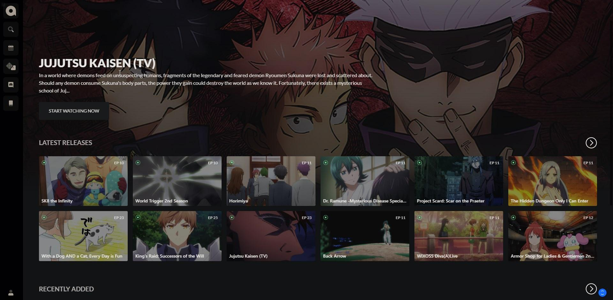
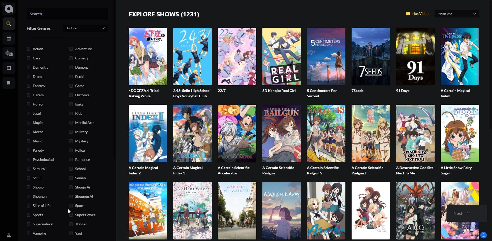

!!! tip "Ad-blocker"
	**Please turn on your adblocker when visiting the site!** Do not use any trashy ones like ABP! Use [uBlock Origin](https://chrome.google.com/webstore/detail/ublock-origin/cjpalhdlnbpafiamejdnhcphjbkeiagm?hl=en). If you are using Brave, then disable their built in ad blocker and use uBlock instead.

When you visit this site, you will be greeted by a stunning UI and a page of newly released episodes, even as early as the same day that you visited the website. I took the image above on March 20, 2021, the same day episode 11 of Horimiya was released which, as you can see, is the third episode in latest releases in my screenshot. The subtitles in all the episodes are not hardcoded, meaning they can easily be turned on and off by the viewer. Which differs from it's competitors who use hardcoded subs, which are subs that cannot be modified by the viewer. 

### Navigating the Streaming Site

##### Navigate to the screenshot icon
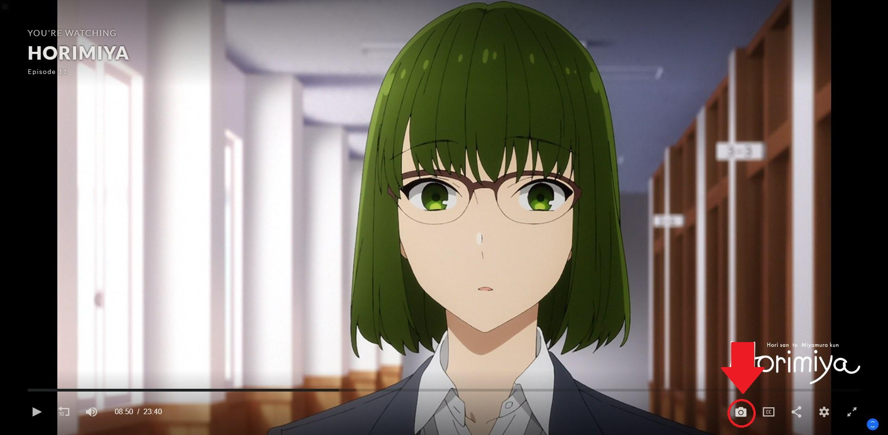

##### Result from screenshot


The player has all the functionalities of a normal player with added features not typically found on online players such as easy in-media screenshots of the scene by clicking on the camera icon which is located underneath the progress bar, and the ability to turn off the subtitles. On it's own, it's a really good resource for those in the absolute beginner stage for the purpose of getting exposure to the language since the ability to turn off the subtitles helps the learner to focus on the dialogue and improve their ability to parse through words, which is a crucial skill for listening and speaking ability.

##### Navigate to subtitle settings


### Downsides of Anime Fever

The player does have some downsides to consider. As I mentioned earlier, sometimes it detects your browser's built-in adblock, so you may have to disable it. Also, you may experience a run out of memory issue from many visits to the site which means you have to clear browser cache to continue using the site; however, **this issue is not very common** regardless of whether you have lower end PC or not. Additionally, the maximum video quality for the site is 720p for free viewers as only subscribers are able to view in full 1080p although most free anime streaming sites cap at 720p. 

!!! info
	You can use sites that have hardcoded subs like [Animixplay](https://animixplay.to/), [twist.moe](https://twist.moe/), [Animepahe](https://animepahe.com/) etc. if you choose, however, you will have to install another script/extension that hides subtitles behind a dark colored bar.


**If you have paid anime services such as Crunchyroll, use that** if you prefer, but Anime Fever is a very good, free alternative to that site. Here is a general recap of what the pros and cons when considering Anime Fever for your preferred anime streaming website:

|                  Pros                   |                             Cons                             |
| :-------------------------------------: | :----------------------------------------------------------: |
|             Soft-subtitles              | Have to use adblock/adblock may be detected though UBlock has no issues |
|     Easy screenshots for anki cards     | Might experience a "run out of memory" error though not common for many |
| Newly released series and large catalog |     Maximum quality is 720p unless you are a subscriber      |

#### Honorary Mention

!!! note "Second Option"
    If the cons outweigh the pros for you, another site to consider is [MyFlixer](https://myflixer.to/country/JP?page=1).


MyFlixer doesn't primarily focus on anime as it hosts media from around the world, so there is less options for series compared to Anime Fever. The site does contain a decent amount of series, and it has a simpler UI for those who experience memory issues/sluggish performance, and rarely detects built-in browser adblockers or UBlock Origin.


The player is virtually the same to Anime Fever, except that you cannot take screenshots of the content and there is a JP subtitle option available, however, the subtitles are not selectable. Most importantly, you can turn subtitles off to replace with selectable ones.

## Starting the Setup

This workflow allows you to view Japanese subtitles directly on any HTML5 video player, including anime streaming sites. This method should work for most Japanese media streaming sites or videos overall. It's ideal for those who don't want to download long-running anime with hundreds of episodes, or those who don't have the storage space to torrent anime. Nearly all episodes on the site play properly, so the workflow is a good substitute for those who use Animelon.

From this point forward, it is assumed that you've already picked out your preferred anime streaming site. **Before installing anything, make sure your browser is a Chrome or Chromium based browser.** 

Now, go to the [Asbplayer Github releases](https://github.com/killergerbah/asbplayer/releases) page, and download the latest .zip file for the Asbplayer extension. Once the download is complete, unzip the file using 7-Zip which you can download [here](https://www.7-zip.org/) or by using your preferred unarchiver. 

##### Unzipping extension with 7-Zip


Now, ensure developer mode is on by navigating to `chrome://extensions`, or click the puzzle piece icon on the right hand side of your browser's search bar then click "Manage Extensions", and turn on the developer mode option on the right hand corner of the extensions page. 

##### Second way to find extensions


##### Turning on Developer Mode


Once you've done that, navigate to the left hand corner of the page and click on the "Load Unpacked" button.


Now your file manager will appear. Navigate to the folder with the extension, or the one named `asbplayer-extension-[insert current version number here]`. An example is my directory which is named `asbplayer-extension-0.4.2`. Highlight/click once on that folder and click the select folder button on the bottom right hand corner of the file manager.

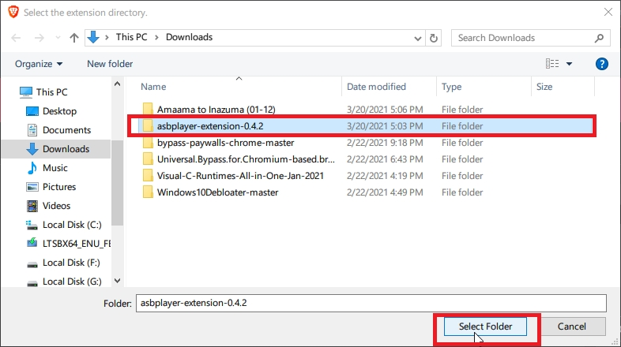

If you followed the steps correctly and have experienced no issues so far, you should see this extension show up on your extension manager page. 

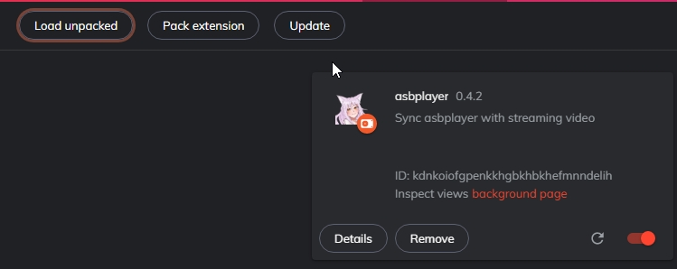

Once you see this, go to the main [Asbplayer](https://killergerbah.github.io/asbplayer/) site. 

!!! note "Bookmark"
    Probably a good idea to bookmark this page if you plan to stream often.

First, make sure both of these options are enabled by clicking the extension on the right hand side of the browser's search bar.

- Display subtitles in synced video elements
- Record audio when copying subtitle
  


Now, navigate to your preferred show and episode in your streaming site and download [subtitles](https://learnjapanese.moe/resources/#subtitles) for that episode. Now, open your File Manager and drag your downloaded subtitle that corresponds to the anime that you choose into the main Asbplayer site.


You should see a screen where you can see all the subtitles and the timestamps of when they are appear on the screen. If you properly pulled up the episode in the same tabs/windows prior to loading the subtitles, then you should see the progress bar when you hover towards the bottom of the browser window.

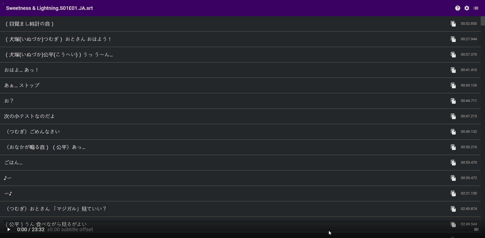

Now click on that tiny little camera icon on the right hand side of the progress bar. That icon finds all the HTLM5 videos playing in your browser excluding incognito mode videos. Click on the option with the same url as the episode that you choose to view. The camera icon turns from white from grey once you designate a video for it.


Now, the video and the subtitles are synced, so you can view the subtitles directly on the video itself. You can also text select  the subtitles directly on the video itself rather than switching back and forth between the tabs which allows for Yomichan to be used directly on the video. If the icon does not show up after loading your video, refresh the video in a different tab and refresh the extension by going to `chrome://extensions` and click the reload icon next to the enable-disable button on the right hand side of the extension.

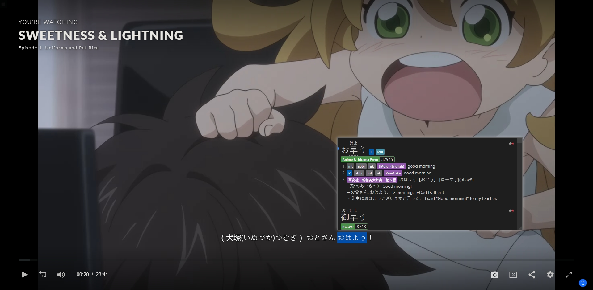

The other tab highlights the current subtitle line while the video is playing. We'll get to another use of this tab in the next section. 

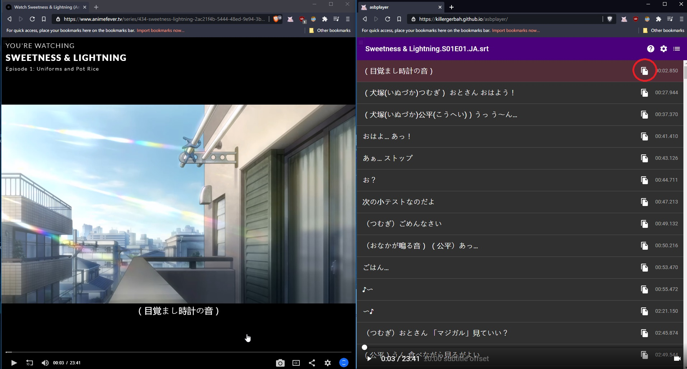

You can also put Asbplayer and the streaming site side by side, so you can easily copy the sentence of your choice to add to your deck using the copy icon on the right hand side. Switching between the two tabs works well if you get distracted by the subtitles or have two monitors, especially if you don't often add sentence cards. 

### Important Hotkeys

You can use these hotkeys directly on the player to navigate:

|       Key        |                          Function                          |
| :--------------: | :--------------------------------------------------------: |
|    Left/Right    |                   Previous/next subtitle                   |
| Ctrl + Shift + Z | Copy current subtitle while streaming video in another tab |
|      Space       |                         Play/Pause                         |


## Grabbing Audio and Exporting Sentence Cards

!!! tip "Anime Cards"
     Make sure to manually add the image + missing fields for your card as you can't make full anime cards solely using asbplayer.

### Exporting Sentence Cards

First, open your Anki application and [install](https://ankiweb.net/shared/info/2055492159) the Anki Connect addon. Then, navigate to:

> Tools -> Addons -> AnkiConnect -> Config -> "webCorsOriginList"

Once you've headed to the configure section, you need to add the main Asbplayer site url after `http://localhost` and separate it with a comma like the example below. *Ignore the ellipses, it's just meant to signify that there is text before this part.*

```
...
"webCorsOriginList": [
        "http://localhost",
        "https://killergerbah.github.io"
```

Click "Ok" once you have done this, and exit out of the addons window. Now, navigate to the main Asbplayer site.

Click on the settings icon on the right hand side of the page. This should open up a window with Anki Settings for the deck and cards.

!!! warning "Brave"
	Common error experienced by Brave users is the Anki Connect URL showing a "Failed to Fetch" error. To fix this, turn off your Brave adblocker and click on the settings icon again to continue. You should no longer see this error. If you have already done this, make sure you have your Anki application open, then click "Retry Anki URL".

Now, you can pick which deck and note type you want to choose by clicking the white arrows and clicking again on the option you prefer. You can also choose where you want the sentence field, definition field, and audio field to be located. Make sure all of this filled out, otherwise you will get a "can't add because note type is empty" error.

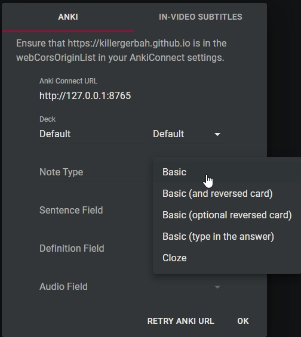

Once you picked out the options, click "OK". Now click the copy icon on the right hand side before the timestamps of the desired subtitles. Now, click the far right menu button to open up your copy history and click the star icon in the copy history tab.

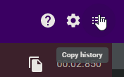

Now an Anki Export window will pop up. Type in the desired definition and you should see a little "Export Succeeded" notice on the top of the subtitle player. Be sure not to add a duplicate card as you will get a "cannot create note because it's a duplicate" error.

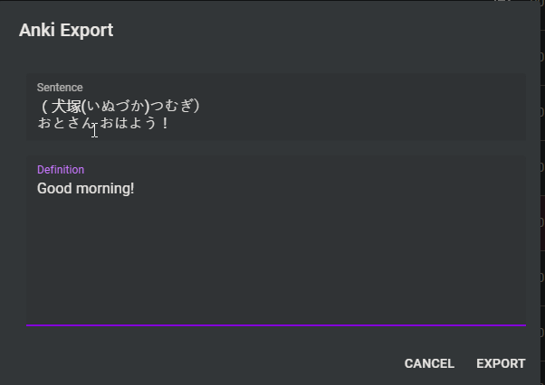

##### The result


### Adding the Audio Field

The audio field will only apply if an audio source was playing when the subtitle was copied. Make sure your Anki card type has an audio field before exporting. **Be sure to use ++ctrl+alt+z++ as that is the only way to copy and paste audio + the sentence for the card**, then navigate to the copy history menu where you should see your pasted sentence and export it with the star icon. You should now see an auto-filled audio option which you can click to playback. Click export once you've filled in all the fields. 

This shortcut is probably the fastest way to create a card using Asbplayer and most efficient due to the easy audio capture. This is the best workflow option for mining while streaming because using ++ctrl+alt+z++ easily adds a card with audio in the copy menu for you to export. To complete the mining process, grab a screenshot by clicking the camera icon if you are using the [Animecards](https://animecards.site/) format or any similar one. 

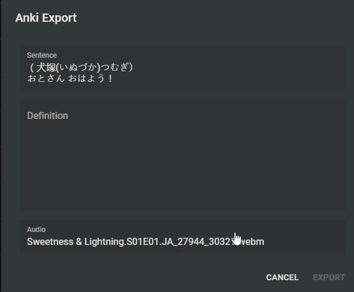

Result:


## [Optional] Subtitle-Configuring

### Style Settings


The site (compatible with extension v. 0.5.0+) has a feature where users can adjust subitle color, size, outline color, outline thickness, background color, and background opacity for streaming video. To modify this, click on the settings icon, then click on the "In-video subtitles" tab to see all the options. To modify color, you can use the color wheel available to you, or you can Google any RGB color codes for a particular color you want. 

!!! warning
	Anytime you make a modification to the subtitle settings, you have to reload and reconnect asbplayer to the video. 

### Subtitle Position Adjusting

This feature allows you to change how low or high you want the subtitles from the screen. Some streaming sites auto-position the subtitles in odd places, such as Netflix which directly places subs on top of controls, so this can help fix that issue. To alter this, you need to open the extension menu by clicking on the extension. Now, you should see a popup menu that looks like this:


Clicking on the `↑` or `↓` arrows or typing in the number of spaces above or below the bottom of the screen modifies the position of the subtitles. Unlike style settings, there is no need to reload and reconnect to the video when you make these changes.

