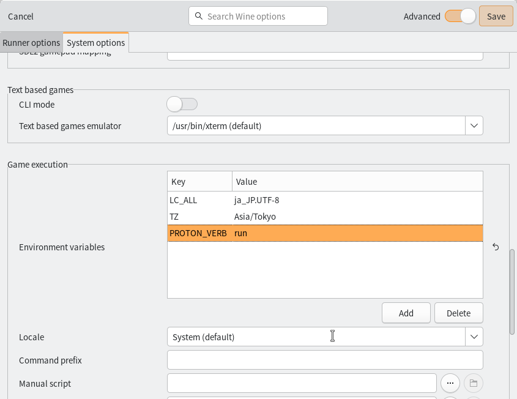
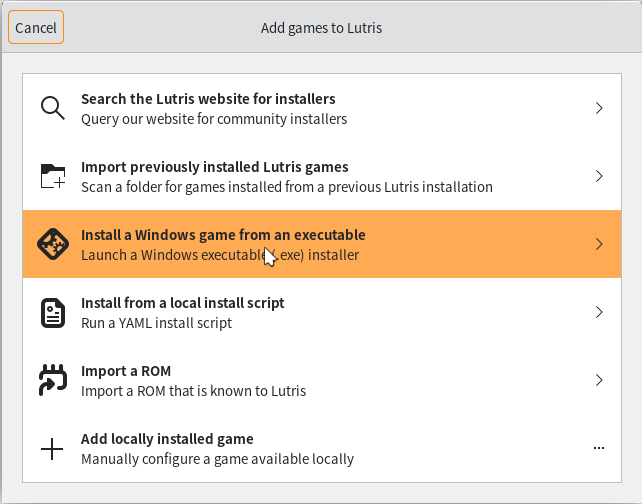
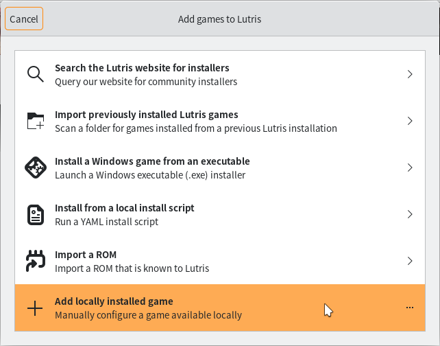
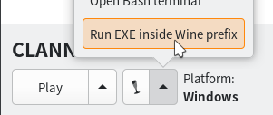

# Visual novels on Linux

Visual novels are Microsoft Windows-only programs, therefore you must use Wine in order to run them on Linux. With huge progress and development being made in Linux gaming in recent years, this has gotten a lot easier and consistent.  

Follow the steps below. 

## Requirements

The general requirements for running visual novels (which are Windows games, and thus are best ran with a version of Proton) include the following:

- Vulkan support
- Wine with all dependencies satisfied (including lib32 ones)
- Steam
- Lutris
- Proton-GE installed into Lutris
- A virtual CD-ROM utility if manual installation is required and/or no crack is available. 
- ja_JP.UTF-8 locale generated

### Vulkan Drivers

In order to run visual novels, or any game on Linux through Wine/Proton, your GPU must support Vulkan, and you must have the appropriate Vulkan drivers installed for your distribution and hardware. Refer to your distribution's wiki for more information on setting up Vulkan drivers.  

Relevant Links:  

- [Vulkan - ArchWiki](https://wiki.archlinux.org/title/Vulkan)  
- [Vulkan - Gentoo Wiki](https://wiki.gentoo.org/wiki/Vulkan)  

### Wine with all dependencies

You need to follow Glorious-Eggroll's How To Get Out Of Wine Dependency Hell guide.

Relevant Links:  

- [How to get out of Wine Dependency hell - GloriousEggroll's Blog](https://www.gloriouseggroll.tv/how-to-get-out-of-wine-dependency-hell/)  

Refer to your distribution's package repository if instructions for your distribution are not listed.  
Do not forget about lib32 dependencies!

### Steam Runtime

Install Steam if you haven't already. Refer to your distribution's package manager for more information.  

Relevant Links:
 
- [Steam - ArchWiki](https://wiki.archlinux.org/title/Steam)  

### Lutris  

Lutris is a games launcher that will help us launch our visual novels. You can find instructions for how to install it on your distribution [here](https://lutris.net/downloads).    

### ProtonUp-Qt

ProtonUp-Qt helps download, install and manage Proton versions. 

Relevant Links:

- [Download ProtonUp-Qt](https://davidotek.github.io/protonup-qt/)  
- [AUR (en) protonup-qt](https://aur.archlinux.org/packages/protonup-qt)  

### Virtual CD-ROM utility: CDemu

This step is optional and is only required if:

- Your VN installation files are dumped to a disc image file (such as .mds, or .cdi) that is not mountable with standard tools.
- There is no NoDVD patch available for your VN
- You are trying to play your own ripped VNs and don't have access to the original disc(s) or a DVD drive.  
- Similar to point #1 but, your game requires a reinstallation into the Wine prefix due to it requiring install info written to the Windows registry in order to run.  

Relevant Links:

- [CDemu - ArchWiki](https://wiki.archlinux.org/title/CDemu)  

### Generate ja_JP.UTF-8 locale  

Uncomment the line `ja_JP.UTF-8 UTF-8` in `/etc/locale.gen` and run `sudo locale-gen`.  

  

Relevant Links:  

- [Locale - ArchWiki](https://wiki.archlinux.org/title/locale)  

## Setup  
### Install Proton-GE  
After you have installed all the required packages, install Proton-GE with ProtonUp-Qt. Lutris will be able to see Proton versions installed into Steam, so don't worry about where to install it.  

As compatibility with games can vary with different Proton-GE versions, use Proton-GE 9.10 for the same environment as this guide was tested on. 


### Install / Run the Visual Novel
What you need to do in Lutris now depends on whether the VN is already installed or not.  

=== "VN needs installation"

		
	  
	  <figcaption>These instructions will assume the files are on some sort of disc or disc image file.</figcaption>
	</figure> <br>

	First, you need to mount the disc. If you own the disc, insert it into your DVD drive now. I recommend mounting through your desktop environment, but if you don't use a desktop environment, use `mount` to mount it to `/media/cdrom`.  

	If you have a copy of the disc dumped to either an .ISO, .MDS, .CDI or something similar, you need CDemu installed.  
	Mount your disc image with the following command:  
	```bash
	cdemu load 0 /path/to/disc_image.mds
	```
	The disc image will now be loaded into a virtual DVD drive. You can mount it through your desktop environment, or mount manually with `mount` e.g. `mount /dev/sr0 /media/cdrom`  
	  

	In Lutris, make sure you set the default Wine version for the Wine runner to the Proton-GE version you installed with ProtonUp-Qt.

	
	

	Then you need to set the correct environment variables.  
	

	| Key    | Value |
	| -------- | ------- |
	| LC_ALL  | ja_JP.UTF-8    |
	| TZ | Asia/Tokyo     |
	| PROTON_VERB | run |


	Now in Lutris, click the `+` in the top left corner to add a game, then in the window that pops up, choose `Install a Windows game from an executable`

	

	It is recommended to use Japanese locale when running visual novels, even on Windows.  

	

	Set the Wine prefix directory. This is not the path for the install files.  

	**USE A BLANK PREFIX.** I suggest `~/Games/VNs`. This prefix can be used for all your other VNs as long as **the same Wine version is used**- using a different Wine version on a prefix that was made with another version can actually render the prefix unusable!  

	

	Choose the setup executable for the VN's installer.
	

	Proceed with the installation. I do not recommend installing DirectX from the VN installer, always say no to that. When complete, Lutris should automatically set the game executable path to the game's run executable defined in the installer info/registry. 

	After that you are all done and are ready to play the visual novel on Linux!  

=== "VN already installed"

	In Lutris, make sure you set the default Wine version for the Wine runner to the Proton-GE version you installed with ProtonUp-Qt.

	Click the cog icon next to Wine under "Runners"  

	

	

	Set the Wine version to GE-Proton9-10.

	

	Then you need to set the correct environment variables. 

	

	| Key    | Value |
	| -------- | ------- |
	| LC_ALL  | ja_JP.UTF-8    |
	| TZ | Asia/Tokyo     |
	| PROTON_VERB | run |

	Now in Lutris, click the `+` icon in the top left corner, and choose `Add locally installed game`

	

	Set the runner to Wine. The runner settings should automatically be correct if you followed the previous steps.  

	

	Now set the path to the game executable, and set the Wine prefix. This Wine prefix has to be a blank one if using Proton-GE on a prefix for the first time. After you run one VN in that prefix using that Proton-GE version, you can share the prefix for other VNs too.
	  

	After that you are ready to play your VN on Linux!


## Textractor 

Thanks to the PROTON_VERB=run environment variable we set earlier, we can run Textractor along a VN under Proton.  

### Download Textractor

- Download Textractor at its [GitHub Repository](https://github.com/Artikash/Textractor/releases)  

### Install Textractor

I used the "Run EXE inside Wine prefix" option in Lutris to install Textractor to the prefix. For some reason, trying to install it like a new game just doesn't work for me.  

  

I used the "Install for all users" option when installing. 

### Add Textractor to Lutris

Now, add the Textractor executable to Lutris. The path should be `/path/to/wineprefix/drive_c/users/steamuser/Desktop/Textractor/x86/Textractor.exe`.  You need the x86 one for 32-bit VNs and x64 for 64-bit VNs.  

!!! info "Unsure what architecture your VN is?"
	Use the Linux command [file](https://man7.org/linux/man-pages/man1/file.1.html) on the executable to find out if it is 32-bit or 64-bit.
	Example: `file VN.exe`  
	If the output is: 
	```
	VN.exe: PE32 executable (GUI) Intel 80386, for MS Windows
	```
	Then it is 32-bit.  
	If the output is:
	```
	VN.exe: PE32+ executable (GUI) x86-64, for MS Windows
	```
	Then it is 64-bit.

Textractor should just work as expected.   

Proceed to [Learning Japanese with VNs](/vn) for more information on how to use Textractor.  

## AlphaROMdiE  

AlphaROMdiE is sort of an all-purpose NoDVD patch mainly for KEY visual novels. You can try using it when you can't find a NoDVD patch specifically for your visual novel. To use it, set the executable path to the AlphaROMdiE exe to set the options. After that, close it, and then edit the executable path to run AlphaROMdiE but with the VN's executable as an argument. For example: `/path/to/vn/AlphaROMdiE.exe <VN_executable.exe>`. 

Alternatively you can configure AlphaROMdiE without running it on its own.  
For the 1st option, you must create an empty file `disable_conv` in the same location as AlphaROMdiE.exe, for the 3rd option, you must create an empty file `other_engine` in the same location as AlphaROMdiE.exe. You can do this easily by doing: 
	```bash
	touch disable_conv other_engine
	```

## Troubleshooting

### Nitroplus Games Very Slow / other VN is very slow 

Nitroplus VNs, such as Soukou Akki Muramasa, Phenomeno, Totono, Saya no Uta (untested) etc. may run very slowly when you run them with Proton.  
You can run these games just fine using standard Wine. I tested these games with `System (9.12)` in Lutris on a new prefix. They ran fine, but the fonts weren't right. You can fix that by downloading and copying these fonts into your Wine prefix's fonts folder (`drive_c/windows/Fonts`).

- [Windows Japanese Fonts.zip - Google Drive](https://drive.google.com/file/d/1OiBgAmt3vPRu08gPpxFfzrtDgarBGszK/view)  

Alternatively, you can continue to use Proton to run them, but usually, you have to disable Esync, Fsync and install `xact` into the Wine prefix using Winetricks.    
Nitroplus VNs generally require some sort of special config to work properly, check ProtonDB for more information. If the game is on Steam, you can use the `GAMEID=<steam game id>` and `STORE=steam` in your Command prefix to make UMU automatically find patches for your VN.  

Relevant Links:
 
- [ProtonDB](https://www.protondb.com/)  
- [UMU Proton Fixes](https://github.com/Open-Wine-Components/umu-protonfixes/tree/master/gamefixes-steam)  

### Fonts do not look right 

If this is the case, you need to download and import the fonts from Windows into your Wine prefix's font folder (`drive_c/windows/Fonts`).  
You can download them here:

- [Windows Japanese Fonts.zip - Google Drive](https://drive.google.com/file/d/1OiBgAmt3vPRu08gPpxFfzrtDgarBGszK/view)  

### ゲームがインストールされていません / Game not installed error

This happens on games that rely on reading values in the Windows registry to check if the game is installed in the directory set at install time. If you see this error, perhaps the game files were moved, breaking the directory check, or you are using a different Wine prefix that does not have these registry values present. There is no good manual way to repair these values, or add them on an environment that doesn't already have them, therefore, I recommend backing up your savedata and re-installing the game using the Wine prefix you wish to play the game on.   

It is actually not a Wine specific error, it happens on Windows too! These games are just made that way. 

  


### Weird scaling / stretched / mouse input not followed correctly.

Try putting the game into windowed mode and relaunching it.  
<br>

<h3>Found this useful? Consider supporting me on Patreon!</h3>  

[:fontawesome-brands-patreon: Support me on Patreon](https://www.patreon.com/shoui){: .md-button }
