# Visual novels on Linux

Pick your poison:
=== "Virtual Machine"
	!!! warning "Graphics performance."
		Some VNs will struggle to keep a consistent frame rate, will lag/have bad input latency. This requires tinkering with the chosen video adapter. See the [video adapters](#video-adapters) section.

This is painless and **does not** require good hardware. All you need is VT-x. I got it running flawlessly on an old laptop with only 1 CPU core and 1 GB of RAM allocated to the virtual machine + power saving mode on the laptop.  

Japanese visual novel novels rarely ever require a good computer or an updated Windows version. The majority are written to work flawlessly on *Windows Vista SP2, 32-bit*. This means running Windows 10 or 11 and using 64-bit Windows for VNs is useless and a waste of resources. It should be noted that new VN releases only state Windows 10/11 as a supported OS, but this is just because they haven't tested any other versions of Windows. I got the latest 美少女万華鏡 running on Windows 8.1, a game that states Windows 10/11 as supported.  
There are some edge cases to this, but for the most part, everything should work on 32-bit versions of:  

- Vista
- 7
- 8
- 8.1

10 and 11 is **useless**. Since VNs rarely require 64-bit version of Windows, 64-bit is also useless and will only waste memory. 

You can use Windows 7 32-bit, but the version I recommend is **Windows 8.1 32-bit**, for DirectX 11 support. You can use whatever edition or source you want for this, but I highly recommend you download a Windows ISO that has updates (e.g. for 7, get one with SP1, for 8.1, get one with Update 3) 

I used **Windows 8.1 Embedded Industry Pro 32-bit, ja-JP, with Update 3**. This is a very optimized OS. There is no bloat post-install. It just works. I got it from [here](https://files.rg-adguard.net/file/d4264c0b-6bc1-a0a9-39c6-3f1e0923c0d1) (requires Windows to generate).  

The reason I recommend installing a Japanese-language version of Windows from the get-go is because all the correct settings (locale etc.) will be set already and it will come with Japanese fonts installed already, without having to go through the Windows Update servers. Some VNs, such as KEY games implement "gaijin checks" that also check for timezone, install language, region, etc. To avoid these issues entirely you can just install Windows in Japanese.  

Activating Windows is easy. If you are asked for a product key during install, use one of the keys [here](https://github.com/iMoeAriaCG/Windows-Key-Collection).  
Post-install, you can activate using [MAS](https://massgrave.dev/) offline .cmd version with TSforge.  

### 1. Install VirtualBox

**Refer to your distribution's documentation!**  

I got it working with the [Arch Wiki article](https://wiki.archlinux.org/title/VirtualBox).  

(mainline kernels use `virtualbox-host-modules-arch`, LTS kernels use `virtualbox-host-modules-lts`)
```bash
sudo pacman -S virtualbox virtualbox-guest-iso virtual-host-dkms
```
```bash
sudo modprobe vboxdrv
```
```bash
sudo usermod -aG vboxusers <user>
```

### 2. Set up the VM 

Open VirtualBox and click the blue "New" button.  
Select Windows ISO image you downloaded.   
For the virtual machine specs. The default is literally fine. It will run well on 1 CPU core and 1 GB of RAM. Bump that up to 2GB of RAM if you feel memory pressure though.    
You can set things up seamlessly with Proceed with Unattended Installation. Just choose a password for the Windows user, **click "Install Guest Additions"** and click finish.   

Post-install, restart Windows once to get VirtualBox Guest Additions working.   

After VirtualBox Guest Additions are installed and working, set up VirtualBox Shared Folders: Devices > Shared Folders > Shared Folders Settings...  

This is how you will be sharing files to your VM. Create a new folder on your Linux system. Click the + folder icon, add that as the Folder Path. You can leave the other fields blank. Enable Auto-mount, Make Machine-permanent and Make Global and click OK.  

Download [WinCDEmu](https://wincdemu.sysprogs.org/) and drag it into your shared folder to access it from the VM. Install it.  
Also install some redists:

- [Microsoft Visual C++ 2015-2022 Redistributable (x86)](https://aka.ms/vs/17/release/vc_redist.x86.exe)  
- [DirectX End User Runtimes](https://www.guru3d.com/download/directx-end-user-runtimes-(june-2010)/)  
- [Additional runtimes: Visual Cpp Redist All-in-One](https://github.com/abbodi1406/vcredist/releases) (grab the x86 only release)

<h2> <b>TIP</b>: If you experience <b>ANY</b> issues related to accessing/running/using/mounting files on the shared folder, then <u><b>COPY/MOVE</b></u> them to a <u>folder inside Windows</u> and try again.</h2>

The instructions for installing VNs on Windows are detailed in my [Visual novels on Windows](/vn-win) guide. You can now follow that to get your VNs installed.

For Textractor, you will need to port forward port `6677` to use the websocket from Linux. Power off the machine and run this (replace YOUR_VM_NAME with your VM name):
```bash
VBoxManage modifyvm "YOUR_VM_NAME" --natpf1 "vnport,tcp,,6677,,6677"
```

Now you can follow the [Learning Japanese with VNs](/vn) guide.  

### 3. Windowed Mode

Here's how I recommend you play your VNs:

- Disable Auto-resize guest display (View > Auto-resize guest display)
- Resize the VM (View > Virtual Screen 1) according to the aspect ratio of your visual novel. (4:3→ 1024x768, 16:9→1280x720 or the highest resolution the VN supports)  
- Hide the bottom toolbar. Machine > Settings > Expert > User Interface, uncheck the box for the bottom toolbar.
- Fullscreen (全画面表示/フルスクリーン) the visual novel (should be in the visual novel's options menu).  
- Enable Scaled Mode (View > Scaled Mode) (toggle shortcut: right ctrl+C). The shortcut for the menu is right ctrl+Home

Add a KDE window rule like this to "lock" the VirtualBox VM scaled window:

Example, for 4:3
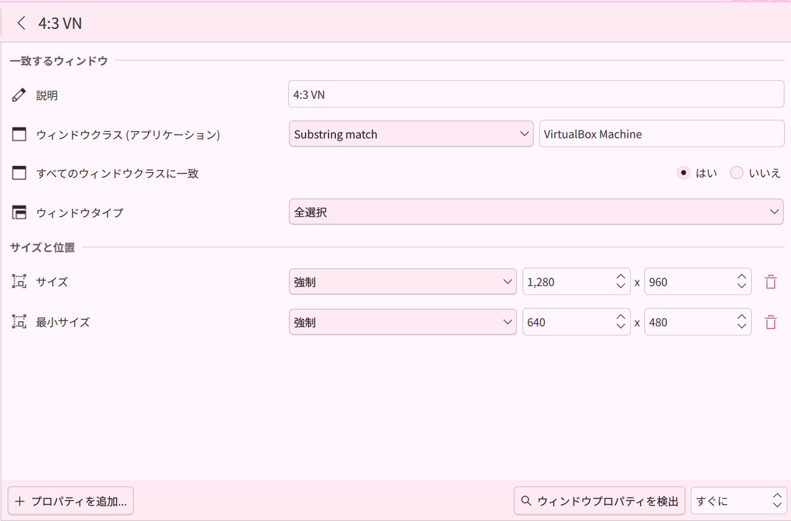
Example, for 16:9
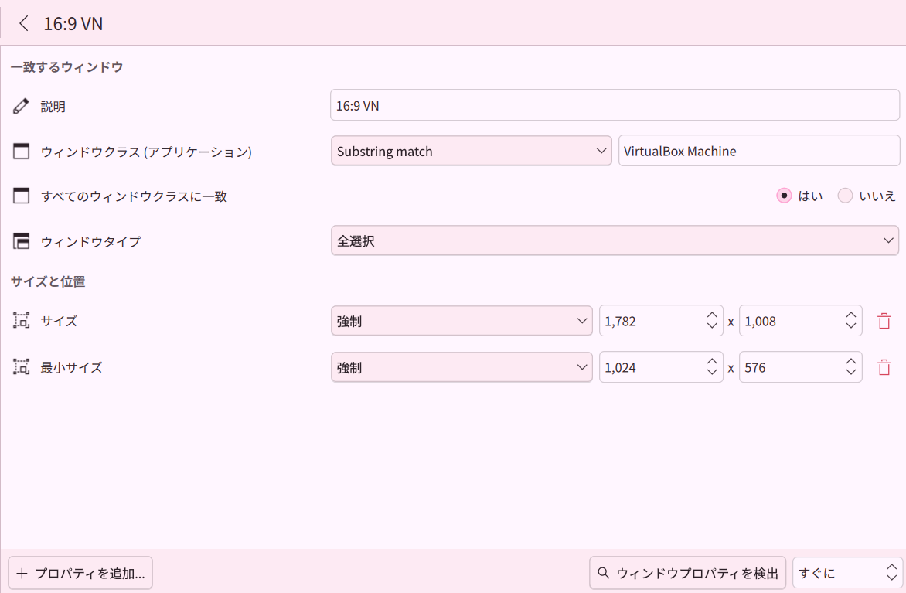

### Troubleshooting

#### Video adapters
Some games really don't like the VBoxSVGA video adapter. They will either: crash, refuse to start, be unable to go full screen. For these games, you need to switch to the VMSVGA adapter.  

* VBoxSVGA: default, supports 3D acceleration. Potentially the fastest speed for GPU demanding VNs. Bad compatibility.
* VBoxVGA: better compatibility, good speed depending on engine.
* VMSVGA: best compatibility. supports higher 4:3 resolutions. Recommended for older VNs.

#### Textractor can't launch / Visual C++ 2015-2022 runtime install error

You need to make sure you have an updated version of the Windows version you are running. The most painless way to achieve this is to just have an .iso with service packs/updates already installed.  

Recommended:  

* Windows 7 SP1, 32-bit
* Windows 8.1 with Update 3, 32-bit
### Power saving

I recommend this for laptops.  
You can conserve power by restricting VirtualBox's threads to a single core. Even if you only give 1 CPU core to the guest OS, VirtualBox still runs multithreaded on the host OS. This means that while the virtual machine is running, the host OS's scheduler does not let the rest of your CPU cores enter PC6/PC8 deep C-states, causing unneccessary battery drain.  

You can force VirtualBox to run on a single core by using `taskset`.  
To run your VirtualBox VM on the physical core 0 (1st core) and its hyperthreaded sibling, run:  
```bash
taskset -c 0,4 VirtualBox --startvm "YourVMName"
```  

You should check how Linux sees your CPU topology with `lscpu -e`. For most processors on Linux, CPU 0 and CPU 4 correspond to the 1st physical core and its hyperthreaded sibling. Note that this differs from the Windows topology mapping (Windows equivalent is CPU 0 and CPU 1).  

```
% lscpu -e    
CPU SOCKET CORE L1d:L1i:L2:L3 ONLINE    MAXMHZ   MINMHZ      MHZ
  0      0    0 0:0:0:0          yes 3600.0000 400.0000 799.9090
  1      0    1 1:1:1:0          yes 3600.0000 400.0000 798.5420
  2      0    2 2:2:2:0          yes 3600.0000 400.0000 799.9970
  3      0    3 3:3:3:0          yes 3600.0000 400.0000 800.2590
  4      0    0 0:0:0:0          yes 3600.0000 400.0000 800.1550
  5      0    1 1:1:1:0          yes 3600.0000 400.0000 799.9570
  6      0    2 2:2:2:0          yes 3600.0000 400.0000 800.0190
  7      0    3 3:3:3:0          yes 3600.0000 400.0000 799.9650
```

With VirtualBox running on a single core, the VM will run slower and with higher input latency, but it is better for laptop battery life.  

=== "Wine"
	!!! failure "Video cutscene playback"
		Visual novels rely on Microsoft Media Foundation technology for video playback, something introduced in Windows Vista. Although AAA games can play videos fine, (because they use things like BINK Video and aren't reliant on a core Windows technology), video playback on visual novels (literal picture books) can be finnicky. Media Foundation has not been fully reimplemented in upstream Wine yet, and Proton provides no fixes or improvements to Media Foundation. Although you may see improvements by installing mf-fix/K-Lite Codec Pack/wmp9/wmp10/wmp11/lavfilters/ffdshow in your Wineprefix with Winetricks.

	Visual novels are Microsoft Windows-only programs, therefore you must use Wine in order to run them on Linux. With huge progress and development being made in Linux gaming in recent years, this has gotten a lot easier and consistent.  

	Follow the steps below. 

	## Requirements

	The general requirements for running visual novels (which are Windows games, and thus are best ran with a version of Proton) include the following:

	- Vulkan support
	- Wine with all dependencies satisfied (including lib32 ones)
	- Steam
	- Lutris
	- Proton-GE installed into Lutris
	- A virtual CD-ROM utility if manual installation is required and/or no crack is available. 
	- ja_JP.UTF-8 locale generated

	### Vulkan Drivers

	In order to run visual novels, or any game on Linux through Wine/Proton, your GPU must support Vulkan, and you must have the appropriate Vulkan drivers installed for your distribution and hardware. Refer to your distribution's wiki for more information on setting up Vulkan drivers.  

	Relevant Links:  

	- [Vulkan - ArchWiki](https://wiki.archlinux.org/title/Vulkan)  
	- [Vulkan - Gentoo Wiki](https://wiki.gentoo.org/wiki/Vulkan)  

	### Wine with all dependencies

	You need to follow Glorious-Eggroll's How To Get Out Of Wine Dependency Hell guide.

	Relevant Links:  

	- [How to get out of Wine Dependency hell - GloriousEggroll's Blog](https://www.gloriouseggroll.tv/how-to-get-out-of-wine-dependency-hell/)  

	Refer to your distribution's package repository if instructions for your distribution are not listed.  
	Do not forget about lib32 dependencies!

	### Steam Runtime

	Install Steam if you haven't already. Refer to your distribution's package manager for more information.  

	Relevant Links:
	
	- [Steam - ArchWiki](https://wiki.archlinux.org/title/Steam)  

	### Lutris  

	Lutris is a games launcher that will help us launch our visual novels. You can find instructions for how to install it on your distribution [here](https://lutris.net/downloads).    

	### ProtonUp-Qt

	ProtonUp-Qt helps download, install and manage Proton versions. 

	Relevant Links:

	- [Download ProtonUp-Qt](https://davidotek.github.io/protonup-qt/)  
	- [AUR (en) protonup-qt](https://aur.archlinux.org/packages/protonup-qt)  

	### Virtual CD-ROM utility: CDemu

	This step is optional and is only required if:

	- Your VN installation files are dumped to a disc image file (such as .mds, or .cdi) that is not mountable with standard tools.
	- There is no NoDVD patch available for your VN
	- You are trying to play your own ripped VNs and don't have access to the original disc(s) or a DVD drive.  
	- Similar to point #1 but, your game requires a reinstallation into the Wine prefix due to it requiring install info written to the Windows registry in order to run.  

	Relevant Links:

	- [CDemu - ArchWiki](https://wiki.archlinux.org/title/CDemu)  

	### Generate ja_JP.UTF-8 locale  

	Uncomment the line `ja_JP.UTF-8 UTF-8` in `/etc/locale.gen` and run `sudo locale-gen`.  

	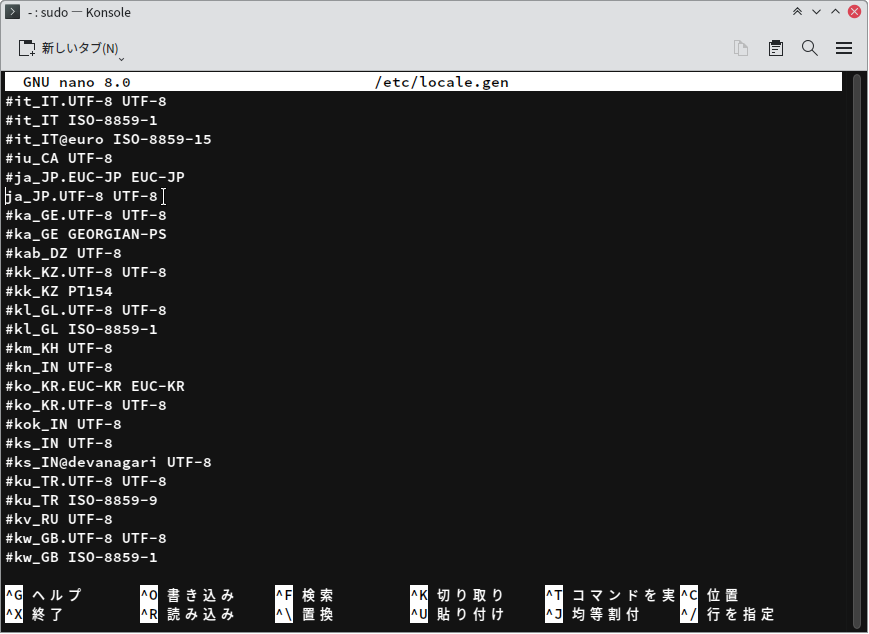  

	Relevant Links:  

	- [Locale - ArchWiki](https://wiki.archlinux.org/title/locale)  

	## Setup  
	### Install Proton-GE  
	After you have installed all the required packages, install Proton-GE with ProtonUp-Qt. Lutris will be able to see Proton versions installed into Steam, so don't worry about where to install it.  

	As compatibility with games can vary with different Proton-GE versions, use Proton-GE 9.10 for the same environment as this guide was tested on. 

	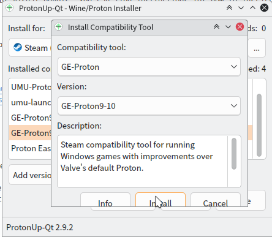

	### Install / Run the Visual Novel
	What you need to do in Lutris now depends on whether the VN is already installed or not.  

	=== "VN needs installation"

			
		
		<figcaption>These instructions will assume the files are on some sort of disc or disc image file.</figcaption>
		</figure> <br>

		First, you need to mount the disc. If you own the disc, insert it into your DVD drive now. I recommend mounting through your desktop environment, but if you don't use a desktop environment, use `mount` to mount it to `/media/cdrom`.  

		If you have a copy of the disc dumped to either an .ISO, .MDS, .CDI or something similar, you need CDemu installed.  
		Mount your disc image with the following command:  
		```bash
		cdemu load 0 /path/to/disc_image.mds
		```
		The disc image will now be loaded into a virtual DVD drive. You can mount it through your desktop environment, or mount manually with `mount` e.g. `mount /dev/sr0 /media/cdrom`  
		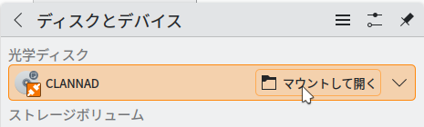  

		In Lutris, make sure you set the default Wine version for the Wine runner to the Proton-GE version you installed with ProtonUp-Qt.

		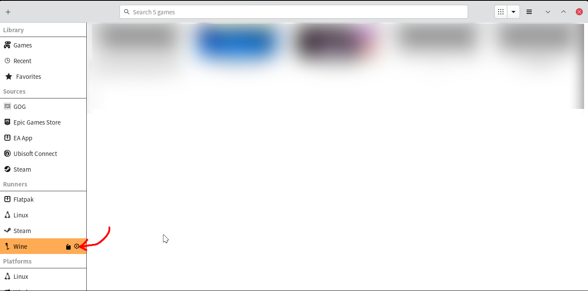
		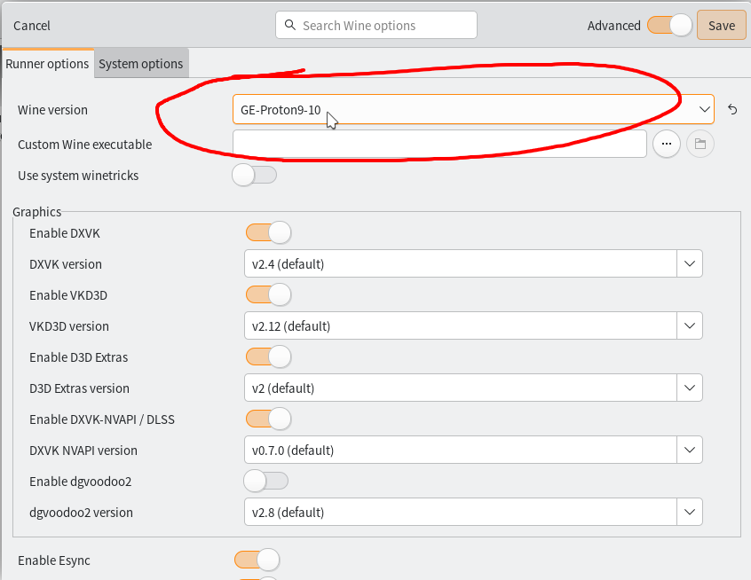

		Then you need to set the correct environment variables.  
		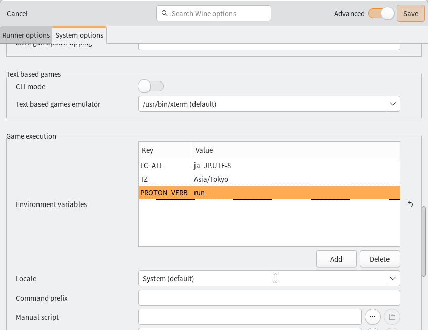

		| Key    | Value |
		| -------- | ------- |
		| LC_ALL  | ja_JP.UTF-8    |
		| TZ | Asia/Tokyo     |


		Now in Lutris, click the `+` in the top left corner to add a game, then in the window that pops up, choose `Install a Windows game from an executable`

		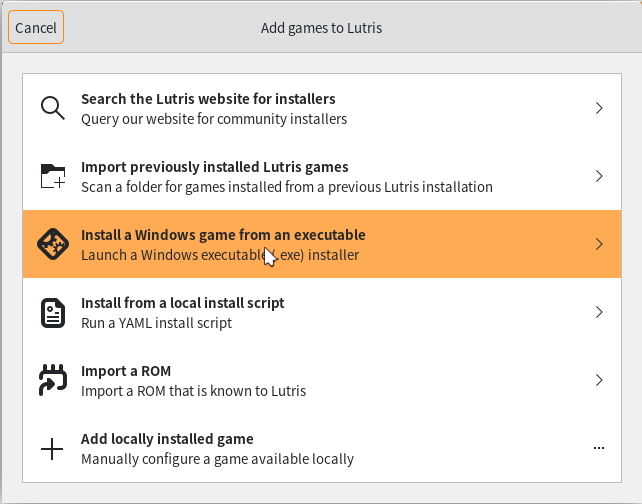

		It is recommended to use Japanese locale when running visual novels, even on Windows.  

		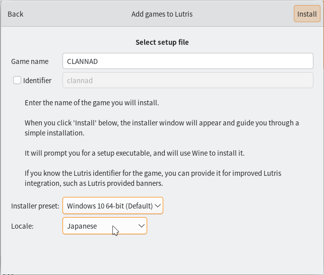

		Set the Wine prefix directory. This is not the path for the install files.  

		**USE A BLANK PREFIX.** I suggest `~/Games/VNs`. This prefix can be used for all your other VNs as long as **the same Wine version is used**- using a different Wine version on a prefix that was made with another version can actually render the prefix unusable!  

		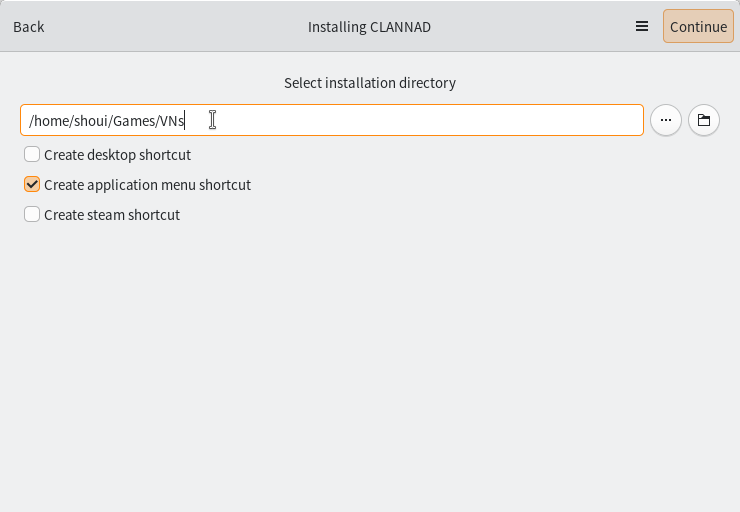

		Choose the setup executable for the VN's installer.
		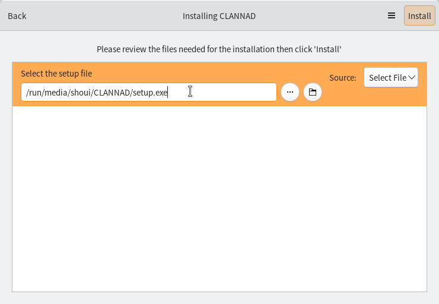

		Proceed with the installation. I do not recommend installing DirectX from the VN installer, always say no to that. When complete, Lutris should automatically set the game executable path to the game's run executable defined in the installer info/registry. 

		After that you are all done and are ready to play the visual novel on Linux!  

	=== "VN already installed"

		In Lutris, make sure you set the default Wine version for the Wine runner to the Proton-GE version you installed with ProtonUp-Qt.

		Click the cog icon next to Wine under "Runners"  

		

		

		Set the Wine version to GE-Proton9-10.

		

		Then you need to set the correct environment variables. 

		

		| Key    | Value |
		| -------- | ------- |
		| LC_ALL  | ja_JP.UTF-8    |
		| TZ | Asia/Tokyo     |

		Now in Lutris, click the `+` icon in the top left corner, and choose `Add locally installed game`

		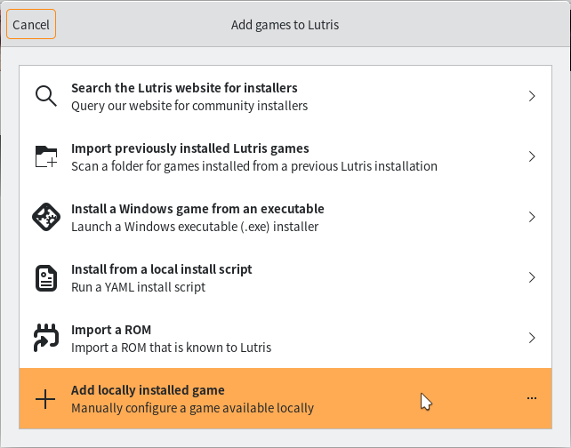

		Set the runner to Wine. The runner settings should automatically be correct if you followed the previous steps.  

		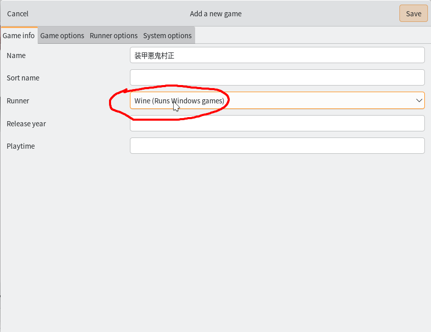

		Now set the path to the game executable, and set the Wine prefix. This Wine prefix has to be a blank one if using Proton-GE on a prefix for the first time. After you run one VN in that prefix using that Proton-GE version, you can share the prefix for other VNs too.
		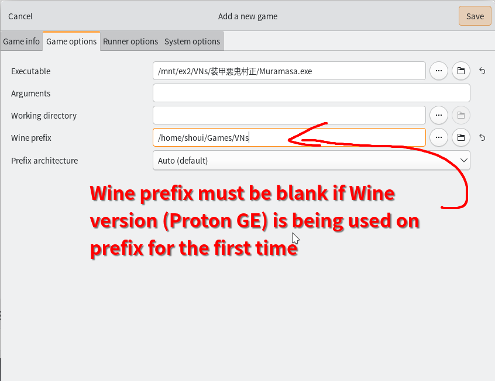  

		After that you are ready to play your VN on Linux!


	## Textractor 

	This is where things can get a little finnicky. There is no good way to launch 2 .exe's at the same time and have the two processes know of each other using Proton because of the way Proton is designed to only launch 1 program at a time in a single prefix. There are ways to get around this, and by far the best way I have found involves using a batch script with a custom Command Prompt.  

	### Download Textractor

	- Download Textractor at its [GitHub Repository](https://github.com/Artikash/Textractor/releases)  

	### Install Textractor

	I used the "Run EXE inside Wine prefix" option in Lutris to install Textractor to the prefix. For some reason, trying to install it like a new game just doesn't work for me.  

	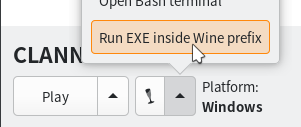  

	I used the "Install for all users" option when installing. 

	### Set Up Textractor to launch with VN  

	This is a little complicated due to the nature of Proton, but you can get it working with a custom `cmd.exe` and a `.bat` file. You will need to use a `.bat` script for each VN you add to Lutris.  

	The `cmd.exe` in Wine does not function in the exact same way the Windows one does, however, the `cmd.exe` from [ReactOS](https://en.wikipedia.org/wiki/ReactOS), in fact, does. So we will be downloading the `cmd.exe` from ReactOS and running that in Wine. You can take the `.exe` yourself from a ReactOS system at `C:\ReactOS\system32\cmd.exe` or download the one I have prepared below.  

	- [Download ReactOS's cmd.exe](https://drive.proton.me/urls/N3V2A1KY1W#dgCG2T5mQaGQ)  

	I recommend you put this at the root of your Wine prefix for easy access. 
	For example, `/home/<user>/Games/VNs/cmd.exe`  
	This guide will assume the `cmd.exe` is placed at the root of your Wine prefix.  

	Now, we need to edit a .bat script. 
	```bat
	@echo off

	:: Without this, Japanese file paths don't work correctly.
	echo "Setting UTF-8..."
	chcp 65001 > nul

	echo "Launching VN..."
	:: Edit the following lines to match your file paths. The Z:\ drive is mounted as your Linux filesystem.
	cd /d "Z:/path/to/vn/folder/"
	start <VN EXECUTABLE NAME>.exe

	echo Launching Textractor...
	:: This will work as is without editing if you installed Textractor to the prefix. 
	:: Use x86 for 32-bit executables and x64 for 64-bit executables.
	cd /d "C:\users\steamuser\Desktop\Textractor\x86"
	start Textractor.exe

	exit
	```

	You need to edit the lines under "Launching VN..." to match your file paths. After that, you can save this as a `.bat` file in any directory and as any name you wish.  
	I suggest making a folder called `scripts` or something in your Wine prefix.

	!!! info "Unsure what architecture your VN is?"
		Use the Linux command [file](https://man7.org/linux/man-pages/man1/file.1.html) on the executable to find out if it is 32-bit or 64-bit.
		Example: `file VN.exe`  
		If the output is: 
		```
		VN.exe: PE32 executable (GUI) Intel 80386, for MS Windows
		```
		Then it is 32-bit.  
		If the output is:
		```
		VN.exe: PE32+ executable (GUI) x86-64, for MS Windows
		```
		Then it is 64-bit.

	In Lutris, go on "Game Options" for the VN, change the executable to the ReactOS `cmd.exe` you downloaded, add the argument to start your `.bat` file in *Arguments*:  
	```
	/k /path/to/startup_script.bat
	```
	I recommend creating a folder called `scripts/` or something in the root of your Wine prefix for easy access.  
	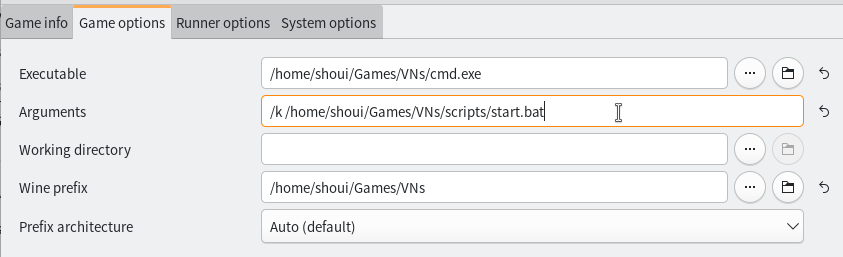  

	You will need to create a startup script for every VN you add, but this isn't complicated as it just involves editing file paths.  

	With this setup, the VN and Textractor should launch together.  

	Proceed to [Learning Japanese with VNs](/vn) for more information on how to use Textractor.  

	## AlphaROMdiE  

	AlphaROMdiE is sort of an all-purpose NoDVD patch mainly for KEY visual novels. You can try using it when you can't find a NoDVD patch specifically for your visual novel. To use it, set the executable path to the AlphaROMdiE exe to set the options. After that, close it, and then edit the executable path to run AlphaROMdiE but with the VN's executable as an argument. For example: `/path/to/vn/AlphaROMdiE.exe <VN_executable.exe>`. 

	Alternatively you can configure AlphaROMdiE without running it on its own.  
	For the 1st option, you must create an empty file `disable_conv` in the same location as AlphaROMdiE.exe, for the 3rd option, you must create an empty file `other_engine` in the same location as AlphaROMdiE.exe. You can do this easily by doing: 
		```bash
		touch disable_conv other_engine
		```

	## Troubleshooting

	### Nitroplus Games Very Slow / other VN is very slow 

	Nitroplus VNs, such as Soukou Akki Muramasa, Phenomeno, Totono, Saya no Uta (untested) etc. may run very slowly when you run them with Proton.  
	You can run these games just fine using standard Wine. I tested these games with `System (9.12)` in Lutris on a new prefix. They ran fine, but the fonts weren't right. You can fix that by downloading and copying these fonts into your Wine prefix's fonts folder (`drive_c/windows/Fonts`).

	- [Windows Japanese Fonts.zip - Google Drive](https://drive.google.com/file/d/1OiBgAmt3vPRu08gPpxFfzrtDgarBGszK/view)  

	Alternatively, you can continue to use Proton to run them, but usually, you have to disable Esync, Fsync and install `xact` into the Wine prefix using Winetricks.    
	Nitroplus VNs generally require some sort of special config to work properly, check ProtonDB for more information. If the game is on Steam, you can use the `GAMEID=<steam game id>` and `STORE=steam` in your Command prefix to make UMU automatically find patches for your VN.  

	Relevant Links:
	
	- [ProtonDB](https://www.protondb.com/)  
	- [UMU Proton Fixes](https://github.com/Open-Wine-Components/umu-protonfixes/tree/master/gamefixes-steam)  

	### Fonts do not look right 

	If this is the case, you need to download and import the fonts from Windows into your Wine prefix's font folder (`drive_c/windows/Fonts`).  
	You can download them here:

	- [Windows Japanese Fonts.zip - Google Drive](https://drive.google.com/file/d/1OiBgAmt3vPRu08gPpxFfzrtDgarBGszK/view)  

	### ゲームがインストールされていません / Game not installed error

	This happens on games that rely on reading values in the Windows registry to check if the game is installed in the directory set at install time. If you see this error, perhaps the game files were moved, breaking the directory check, or you are using a different Wine prefix that does not have these registry values present. There is no good manual way to repair these values, or add them on an environment that doesn't already have them, therefore, I recommend backing up your savedata and re-installing the game using the Wine prefix you wish to play the game on.   

	It is actually not a Wine specific error, it happens on Windows too! These games are just made that way. 

	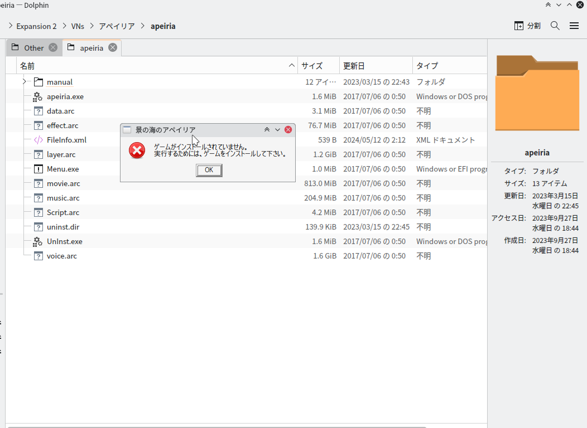  
	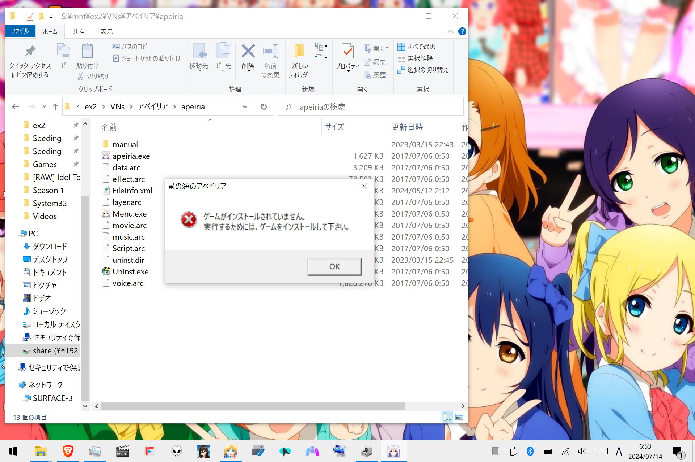


	### Weird scaling / stretched / mouse input not followed correctly.

	Try putting the game into windowed mode and relaunching it.  


<h3>Found this useful? Consider supporting me on Patreon!</h3>  

[:fontawesome-brands-patreon: Support me on Patreon](https://www.patreon.com/shoui){: .md-button }

