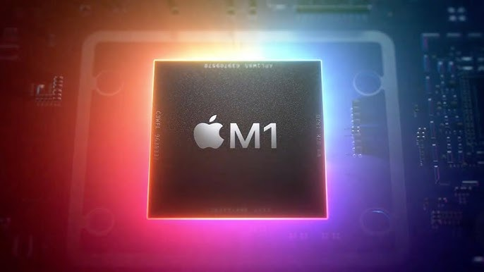
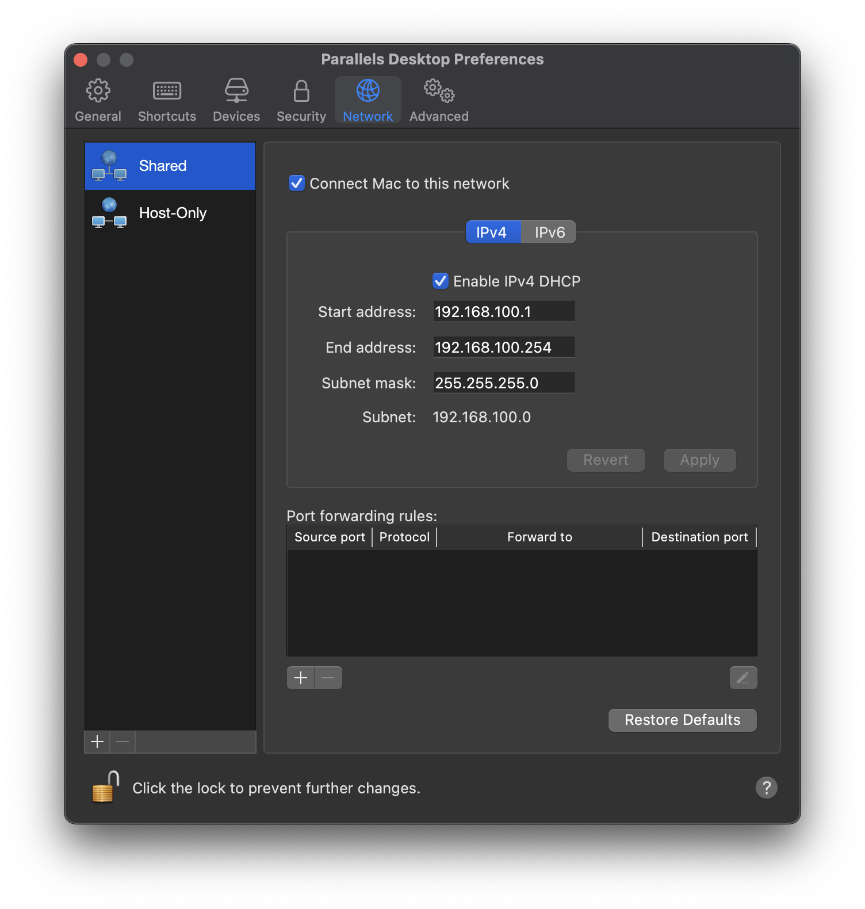
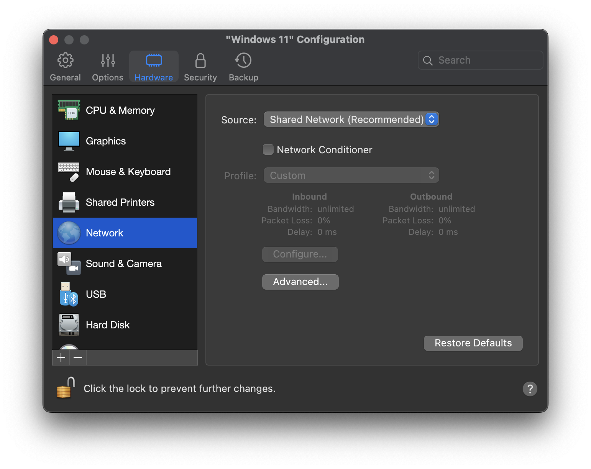
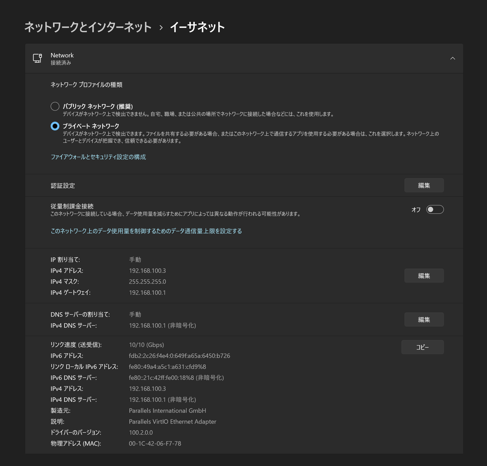
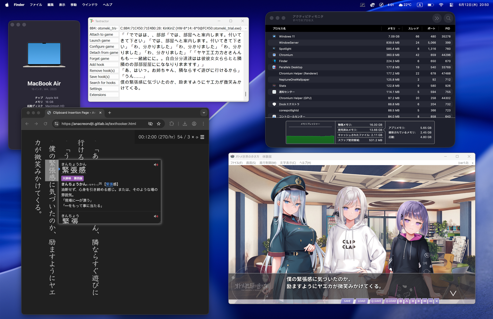
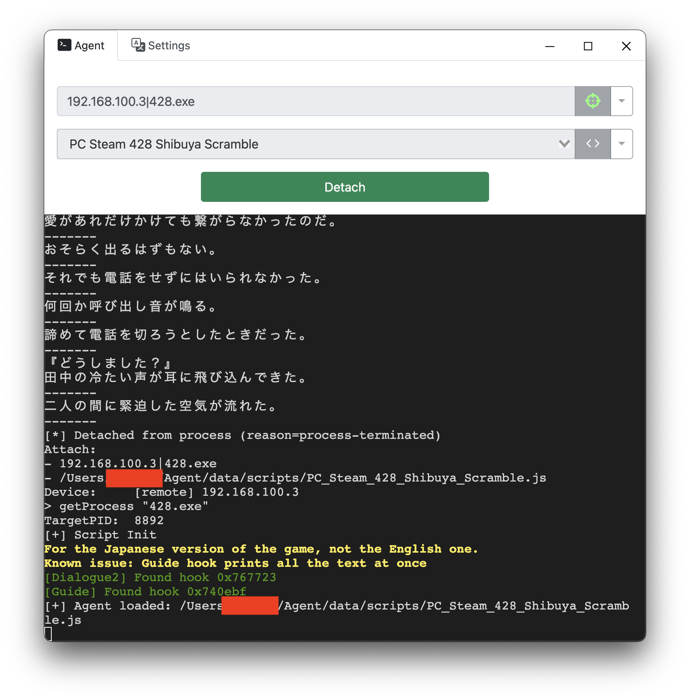

# Visual novels on macOS (Apple Silicon)
  

With major macOS updates getting released every year, and Apple fully completing the transition to Apple Silicon, it is getting harder and harder to use translation layers (such as Wine, Game Porting Toolkit 2, CrossOver etc.) to run Windows games on macOS.  
The only solution that works with the best compatibility, ease-of-use, and accuracy is running a **Windows 11 for Arm virtual machine under Parallels Desktop**.

Caveats: **8GB RAM Macs are not recommended.** You may need a Mac with at least 16GB of RAM for a smooth experience.  

## Running visual novels on your Mac

Here is a checklist of things you should do to run visual novels on your Mac:

- Install Parallels Desktop on your Mac. A tested working version is available [here](https://mega.nz/file/beABBBQB#jOjUrYHZbJY2umbvqYA3MRHFKeUNh5QhL3vgP5wwPcw). Download the .dmg, *don't open it yet*, open the Terminal, type: "sudo xattr -r -d com.apple.quarantine " (note the extra space at the end), drag the dmg on top of the Terminal, press Enter. Enter your password and press enter again. Now you can open the dmg and run the installer normally.
- Install Windows 11 for Arm in Parallels. The automatic installer in Parallels works fine for this.
- Set the Windows locale to Japanese. (see the [Windows guide](/vn-win) for instructions.)  
- Check the Parallels network settings (Preferences -> Network) and make sure they look like this:

- Check the VM network settings (cogwheel next to the VM name -> Hardware -> Network) and make sure they look like this:

- In Windows settings, go to Ethernet. Make sure the profile type is set to "Private network" (this makes Windows Firewall less annoying). Also make sure the IP/IPV4/DNS settings look like this

- Disable Windows Defender in Windows to avoid issues with text hookers (it *will* remove text hookers automatically, without warning).
- Set up the files to play your visual novel. (see the [Windows guide](/vn-win) for instructions.)  
- Enable Coherence Mode in Parallels for a seamless experience.
- You are now ready to play visual novels on your Mac! Follow the [learning Japanese with VNs guide](/vn) for info on how to look up words.  

As far as text hooking goes, I find a general rule of thumb goes like:
- Try Agent first (only works for games that are directly supported, but when it does it works it works exceptionally well)
- If it fails, use LunaHook or Chen's Textractor fork.

- To use Agent, you can use the macOS version and run [frida-server](https://mega.nz/file/W0xxFCST#c2606h631XCd6TcLLeUInY9ZfxSoS0q6kdif_WyhsaQ) in the Windows VM (use the frida64.bat file). After running the game, check the file name for the game .exe file and configure Agent like this (note how 192.168.100.3 matches the IP we set up in the Windows settings)

You have now a websocket running that you can access with a text hooker page like [Renji's page](https://renji-xd.github.io/texthooker-ui/) (configure it like ws://localhost:9001)
- To use LunaHook download the LunaHook_readytouse.zip file from https://github.com/AuroraWright/LunaTranslator/releases/tag/LunaHook . If Windows Firewall asks for permission, allow it. You have now a websocket running that you can access with a text hooker page like [Renji's page](https://renji-xd.github.io/texthooker-ui/) (configure it like ws://192.168.100.3:6677 - note how 192.168.100.3 matches the IP we set up in the Windows settings)
- Chen Textractor Fork setup is similar, you need to download it [here](https://github.com/Chenx221/Textractor/releases/tag/dev) and manually add the [websocket plugin](https://github.com/AuroraWright/textractor-websocket/releases). It will then work the same as LunaHook.

Alternatively, as an OCR option you can try [owocr](https://github.com/AuroraWright/owocr/releases) (download the .dmg file for Apple Silicon). The websocket port for Renji's page is ws://localhost:7331 .

## Tips for 8GB Mac users

### Limit the virtual machine to 4GB RAM
This is the minimum officially supported by Windows 11.
### Close out all applications you are not currently using
++cmd++++q++ quit applications you are not currently using so your system has more free memory to use.
### Use a bloat-free version of Windows 11
There is an official bloat-free version of Windows 11 for Arm known as **Windows 11 IoT Enterprise LTSC (Arm64)** and it is ideal for low resource usage.

## Legacy macOS with Intel Processors

You can still run VNs without a virtual machine with varying degrees of success on Intel Macs with Catalina or earlier by using Gcenx's Wine builds and installing packages within the Wine prefix to get DirectX 9 working.  
This method is free but does not have the same compatibility as using a virtual machine, so you should consider also using Parallels on your Intel Mac, the plus side is that you can use any Windows version you want, including Windows 7, which does not need that much RAM at all.