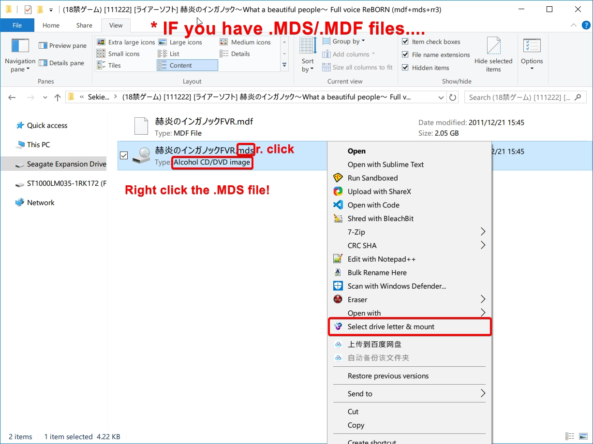

# Visuals novels on Windows

Visual novels are usually always made for Windows. If you have a Windows PC, you will always be able to run visual novels as long as your visual novel supports the Windows version you are running. The basic system requirements to run visual novels on your PC are as follows:

- Windows Vista or later
- DirectX 9 compatible display adapter  
- Japanese locale set on your PC.

## Step 1. Japanese Locale

Japanese locale is the minimum requirement for running Japanese games on your Windows PC. Japanese visual novels will not function correctly without Japanese locale. Note that locale does not mean system language, region or time/date format, but rather the administrative locale setting for non-Unicode programs. 

### Why?
Since visual novel engines are using antiquated technology that has not been updated since ~2006, they are not aware that English characters, Japanese characters and all other characters that can be represented on a computer can all use the same encoding technology. Instead they assume the entire world runs on the Shift-JIS encoding, used in Japan. This is pretty standard for older programs, but the majority of the world has moved on.  
To maintain backwards compatibility with these older programs, Windows has a setting for what encoding to use for non-Unicode programs. This is probably some form of Western/English encoding for you.  
So if the game tries to read a file with Japanese characters in it, or the game's code has strings with Japanese characters in it, your system will think it has to interpret it in an English encoding, causing the game to malfunction.

<h3>🔥 Follow the steps below to set Japanese locale on your Windows PC. 👇</h3>  

!!! abstract "Setting Japanese locale"
	1. Open the Run dialog box by pressing ++windows+r++
	2. Type `intl.cpl` and press ++enter++
	3. Click on the *Administrative* tab, go to *Change system locale...* and select **Japanese (Japan)** and click OK.	
	4. Reboot your PC to apply the changes.  

<video style="width: 100%; height: auto;" controls>
  <source src="/img/vnwin-locale.mp4" type="video/mp4">
  Your browser does not support the video tag.
</video>

??? question "FAQ: What about "Use Unicode UTF-8 for worldwide language support"?"
	**Keep it disabled**. This is intended for *highly-specific* dev scenarios. We do not need it for VNs, it is unrelated, and may cause random problems around your system.   
	If you're curious: It sets codepage 65001, overriding codepage 932 (Japanese locale), we do not want this.  

??? tip "Advanced Users: Powershell"
	Japanese locale can also be enabled using **Windows Powershell (Administrator)**:
	```powershell
	Set-WinSystemLocale -SystemLocale ja-JP; Restart-Computer
	```  
	This will restart your PC.

## Step 2. Mounting the setup files  

=== "Non-pirated"

	If you have bought your game on an optical disc, please insert the disc into your DVD drive. A new volume will appear on the Explorer sidebar, click on it and run the setup to proceed.  

	

	If you bought your game as digital download, it will come in a `.zip` file, extract it with [7-Zip](https://www.7-zip.org/)  
	In some cases there will be no need for installation, in other cases you may need to install the game by running the setup and register with the DRM.  

	  

=== "Pirated"

	If you have not bought the game, it will likely become archived in a `.rar`, `.7z` or `.zip` format, and within it may be disc image files. Follow the instructions below to extract and mount the setup files.

	Requirements:  
	[Get 7-Zip](https://www.7-zip.org/)  
	[Get WinCDEmu](https://wincdemu.sysprogs.org/download/)  

	**7-Zip**, which is a tool for making and extracting archives such as `.zip` , `.tar` and `.7z` files, and **WinCDEmu**,  which allows us to mount image files such as `.mds/.mdf`, `.iso`.  
	
	If you have downloaded a visual novel, and it came in a .rar/.zip/.7z archive, you must extract it before you can mount the installation files. You can use 7-Zip for this. 

	> Right click the archive > 7-Zip > Extract to %folder%

	

	Above is an example of extracting the archive using 7-Zip.  

	After the archive has been extracted, we will now use WinCDEmu to mount the image that has been extracted from it.  

	> Right click the image > Select drive letter & mount > OK

	  

	After that,

	  

	The disc image is now mounted. You should see a new volume appear on your Explorer sidebar.

	  

	!!! info ".MDS/.MDF files"
		It is a little different if you have .MDS/.MDF files, see below.  

	

## Step 3. Installing the VN and applying patch

Click on the new volume that appeared on your sidebar and run the installer. See below for details.  

  

Proceed with the installation, you may want to take note of where you installed the game. I installed Angel Beats! into `D:\Games\KEY\AngelBeats!`


If your visual novel came with a crack, you will need to apply this crack before you are able to launch the game. Cracks often come in the form of a .exe/.dll file found in folders/archives called "AlphaROM" or  "NoDVD" or simply just "Patch" or "Crack", whatever it may be, copy these files into the installation directory of the game.  
Please note that you will not need to do this if you have bought the game.  

You can find an example below.  

  

After that, you should just be able to launch the game! 

Now go back to [Visual Novel Guide](https://learnjapanese.moe/vn/#playing-visual-novels-to-learn-japanese) to learn how to use Textractor with Yomichan.

## Steam Games

If you obtained your visual novel from Steam, first check if "Japanese" is listed as a supported Interface and Subtitles language on the store page first. You can then set Japanese language within the Steam client itself.  

1. Open your Steam Library.
2. From a game's library page, select Manage > Properties.
3. Go to the General tab.
3. Under "Language", select Japanese from the drop-down menu.

In other cases, the game language can be set within the game itself.  

If you did not purchase the **Steam game** from Steam (i.e. a cracked game) you can edit the Steam emu configuration file (e.g. `steam_api.ini`) within the game's installation directory.  
```txt
language=japanese
```

## Windows: Troubleshooting

!!! info "Please insert original disc オリジナルディスクを入れてください"
	Make sure you have applied the crack/patch. Some VNs require the original disc inserted at least once before it will launch. In that case, use WinCDEmu to mount the .ISO or .MDS as a DVD drive. If the problem persists, try restarting your PC.
!!! tip "No Crack?"
	If there is no crack available for your VN, and your VN does not launch, use [AlphaROMdiE](https://drive.proton.me/urls/48JPY1NPCR#EMdWSfVBBG1V). See pictures within .rar file for instructions. Just drag the actual (installed) executable over the AlphaRomdiE window when running and it will insert a NoDvD crack, and make a shortcut in the directory too.
!!! info "Direct3D/DirectX, MSVC/Visual C++ Related Issues" 
	This can be easily fixed by installing DirectX [here](https://www.microsoft.com/en-gb/download/details.aspx?id=8109) and all the Visual C++ Redistributable Runtimes [here](https://github.com/abbodi1406/vcredist/releases).  
!!! info "Garbled Text (文字化け)"  
	Solution 1: Check [Japanese locale](#step-1-setting-japanese-locale) and restart your PC.  
	Solution 2: Install Japanese fonts. ++win+i++ to open **Settings** > **System** > **Optional features** > **Add a feature** > Search **"Japanese supplemental fonts"** and **Install**   
!!! info "Japan Time Zone Required"
	Check Japanese locale and make sure all patch(es)/crack(s) are applied. If the problem persists, you wil need to use a [locale emulator](https://xupefei.github.io/Locale-Emulator/) as this also emulates Japanese time zone too.
!!! info "This Game is Japan Only!"
	Check Japanese locale and ensure a crack/patch is applied, if there is no crack available try using [AlphaROMdiE](https://archive.org/details/alpha-romdi-e-build-20140214). Or even, the Rewrite Gaijin Check Patcher, you can get that [here](https://cdn.discordapp.com/attachments/813105334763126814/825474730797563914/Rewrite_Oka-ken_Gaijin-check_Patcher.exe). It's made for KEY's Rewrite but I've had success with it on other VNs too. You may also have luck using a [locale emulator](https://xupefei.github.io/Locale-Emulator/), as this also emulates Japanese time zone too.
!!! info "Cutscenes and video not working"
	First, check if you are not using an N or KN edition of Windows. You can do that buy pressing ++windows+r++ and typing `winver` and press ++enter++. There you will see your Windows version and edition. If you *are* using an N edition, then you need to get the Media Feature Pack from Microsoft [here](https://www.microsoft.com/en-gb/download/details.aspx?id=48231). Or you could be missing Media Features that the game expects. Install them by going in **Programs & Features** (appwiz.cpl) > **Turn Windows features on or off** > **Media Features** and restart your PC.  
	If you are not using a N or KN edition of Windows, then make sure the game files are installed correctly, try reinstalling the game. If the problem persists, maybe try installing [ffdshow](https://sourceforge.net/projects/ffdshow-tryout/files/SVN%20builds%20by%20clsid/generic%20builds/ffdshow_rev4532_20140717_clsid.exe/download) and [LAVFilters](https://github.com/Nevcairiel/LAVFilters/releases/download/0.74.1/LAVFilters-0.74.1-Installer.exe)  
!!! info "Legacy Visual Novels"
	If your visual novel is particularly old and does not work with recent versions of Windows, you can try using a [Windows XP Virtual Machine](/vn-winxp)  

<h3>Found this useful? Consider supporting me on Patreon!</h3>   

[:fontawesome-brands-patreon: Support me on Patreon](https://www.patreon.com/shoui){: .md-button }
