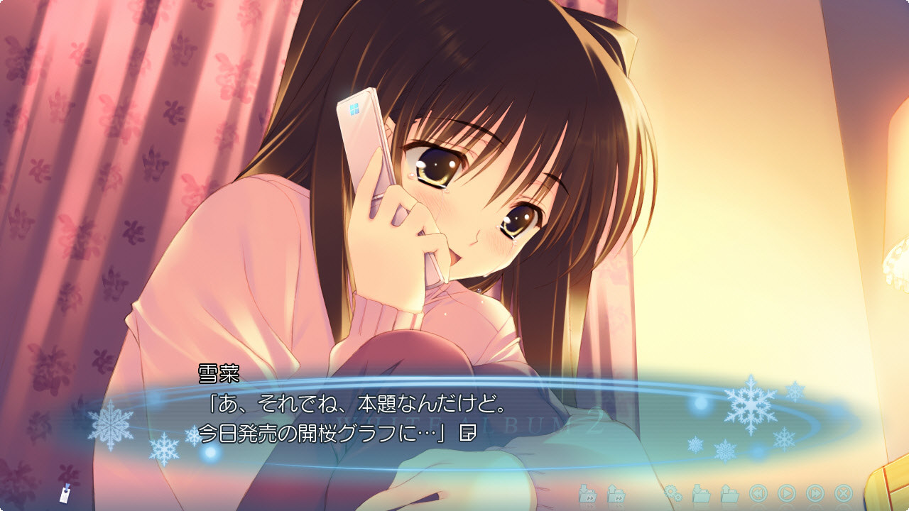

# Visual Novel Guide 

### What are Visual Novels?

Visual Novels (often abbreviated as **VN**) can be described as sort of a mix of a novel and a game, they feature a text-based storyline and only little interaction from the player. Most VNs have anime-like visuals, and are usually accompanied by voice acting, background music and sound effects. Throughout the game, the player may be given choices, which will affect how the story will play out, so if you play it a second time, with different choices, you may get an entirely different plot.

### Why Visual Novels?
Reading Japanese is extremely important, but not everyone loves reading books, you may feel fatigued after a while reading a standard, text-only novel but oddly enough you may be able to read VNs for hours without feeling fatigued. VNs have a mix of literary prose and conversational Japanese, so it is perfect for reading immersion.
For the people that probably don't enjoy reading, and even find manga boring, VNs might just be perfect for you.

### Playing visual novels to learn Japanese

This guide will go over how to play visual novels in Japanese and learn Japanese from them, this guide assumes you already have a Japanese visual novel set up and working, if not, check out [Cross Platform VN Setup](/vn-setup).

??? question "Clipboard Inserter"
	Google Chrome has removed support for Manifest V2 extensions. This means extensions such as Clipboard Inserter and uBlock Origin no longer work.  
	Therefore, users who wish to continue using these browsers must use websockets instead.   
	If you are using a browser with support for manifest V2 extensions, such as Microsoft Edge, Brave or Firefox, you can continue using Clipboard Inserter instead.   

Requirements:

[(DOWNLOAD) Textractor](https://github.com/Artikash/Textractor/releases/download/v5.2.0/Textractor-5.2.0-Zip-Version-English-Only.zip)  
[(DOWNLOAD) Textractor Websocket Extension](https://github.com/kuroahna/textractor_websocket/releases/tag/0.2.0)   
[(GUIDE) Yomitan](/yomichan)  
[(WEBPAGE) Texthooker UI](https://renji-xd.github.io/texthooker-ui/)    

**Step 1: Launch Textractor**  

- First, extract the `.zip` file for Textractor.  
- Then, find click on `Textractor.exe` file in the `x86` folder to launch Textractor.  
(The `x64` one is for 64-bit VNs, which are uncommon. Most VNs need the x86 version.)

**Step 2: Remove bad Textractor extensions**  

- Click on the "Extensions" button on the left sidebar.  
- Remove these extensions by right clicking on them and clicking "Remove extension"  
	- Remove Repeated Characters  
	- Google Translate  
	- Extra Window  
	- Extra Newlines  
	- Copy to Clipboard

**Step 3. Add the Websocket extension**  

- Download the Websocket extension for your Textractor version. (textractor_websocket_x86.zip)
- Extract the `.zip` file to get the `.dll` file. (`textractor_websocket_x86.dll`)  
- Copy this file to the Textractor folder. (`Textractor-5.2.0-Zip-Version-English-Only\Textractor\x86\`)  
- In Textractor, go to the Extensions menu ("Extensions" button on the left sidebar), then right click and choose "Add Extension"  
- Next, in the file picker window, make sure "Libraries (.dll)" are selected in the **bottom right** drop down menu instead of "Extensions (.xdll)"  
- Choose the `textractor_websocket_x86.dll` file.   
- Allow Windows Firewall connection if prompted.    

**Step 4. Hook the visual novel.**  

- Open the visual novel and start the game. (Get out of the main menu and into the game.)  
- Open Textractor, and click "Attach to game" (If you don't see your game, relaunch Textractor as Administrator.  
- After the game is hooked, advance through the text in the visual novel. (Click through the game to get about 2-3 lines after hooking)  
- **Find the right hook.** In Textractor, click an option from the drop down list on the top. Then use the arrow keys ++down++ / ++up++ to find the hook that matches the text from your game.

**Step 5: Texthooker UI webpage**   

!!! failure "Brave Browser"
	Disable Brave Shields for this webpage because it blocks the local websocket connection for some reason.  

- Access [Renji-XD's Texthooker UI](https://renji-xd.github.io/texthooker-ui/).  
- Click on the start ▶️ button on the top right.  **← IMPORTANT!!**  
- With the appropriate hook chosen in Textractor, advance the text in the VN.
- The text should appear in the Texthooker UI.
- With Yomitan installed, hold ++shift++ to look up a word.  

### Need a walkthrough?
If you are not used to visual novels, or games that make you make choices that decide the fate of the story, you may want to use a walkthrough. After all, you wouldn't want to get a bad ending.  
You can find walkthroughs by searching “[vn name] 攻略” e.g. “Angel Beats! -1st Beat- 攻略”.  

If you insist on not using a walkthrough, it is a wise decision to create a save file everytime you are faced with a choice. VN's often have 99+ save data slots, because they assume you'll be populating them with every decision point in the game.  

### Unsure what to play?

Have a look at visual novel lists below

[jamal's list](https://anacreondjt.gitlab.io/vn-chart/)  
[This infamous list](https://docs.google.com/document/u/1/d/1KnyyDt7jimEz-dgeMSKymRaT2r3QKBPm9AzqZ6oUWAs/pub)  
[Dinuz's list](/dinuzlist)  
[Chronopolize's list](https://docs.google.com/spreadsheets/d/18vCgQHhBNBeRJdcTcyUi2Atq-nAapQW--33qrwl5Yfw)  
[The best visual novels ever made (according to VNDB rankings)](https://vndb.org/v?f=022gja3gja&s=34w)  

Have fun reading!

Consider joining our **VN Club** in the [Discord](https://discord.gg/nhqjydaR8j)!

### Bonus: Using Textractor for PPSSPP Visual Novels
Hooking PPSSPP Visual Novels require you to use the x86 (32-bit) version of PPSSPP along with the x86 version of Textractor.  
 
1. Launch PPSSPP (32-bit)  
2. Launch the Visual Novel.  
3. Attach Textractor (x86) to PPSSPP (32-bit)  
4. Advance the text in the VN (O button)  
5. Using the "Search for hooks" feature, select "search for specific text"  
6. Search for the specific text that is on the PPSSPP VN. It needs to be **exact.**  
7. It will take a while to search for the hook, your emulator may start to lag for a while.  
8. If Textractor asks, (keep an eye on the Console) frantically advance the text (O button) on the PPSSPP VN.  
9. Now it will have found the hook.  
10. Advance the text once more (O button)  
11. Cycle through the hooks to see which hook has the newly advanced text.   
12. That's it! :tada: You could save the hook to make the process more convenient later.  

Proof of texthooking working with PPSSPP:  
  
  
