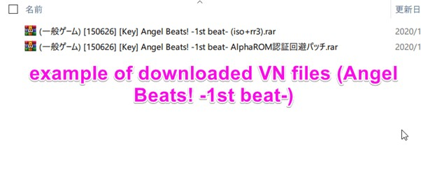
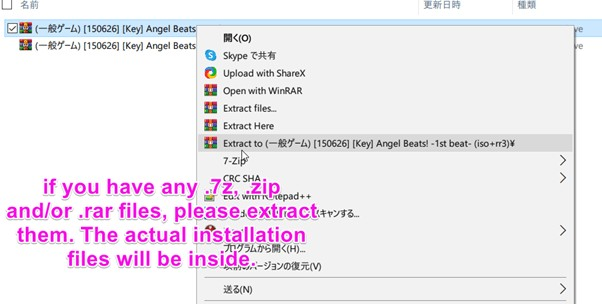
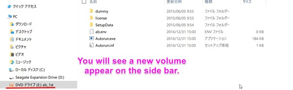
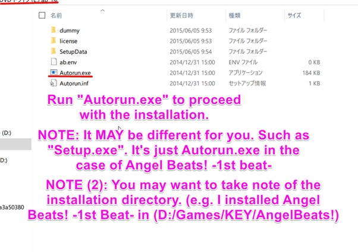
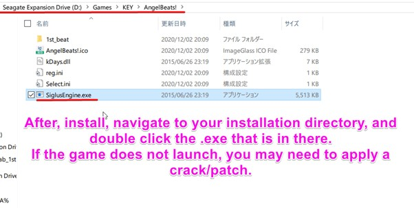
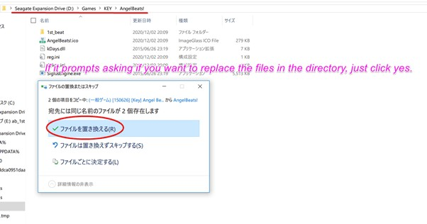
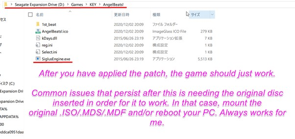
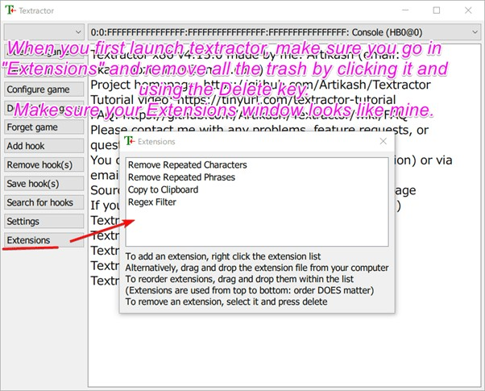

# Visual Novel Guide 

###What are Visual Novels?

Visual Novels (often abbreviated as **VN**) can be described as sort of a mix of a novel and a game, they feature a text-based storyline and only little interaction of the player. Most VNs have anime-like sprites and visuals, and are usually accompanied by voice acting, background music and sound effects. Throughout the game, the player may be given choices, which will have an effect on how the story will play out, so if you play it a second time, with different choices, you may get an entirely different plot.


###Why Visual Novels?
Reading Japanese is extremely important, but not everyone loves reading books, I am definitely one of them. I hate reading books, it’s way too often I get bored when reading a regular, text-only novel. I’m not much of a reader in English either. Oddly enough, I can read visual novels for hours without feeling fatigued. VNs have a mix of literary prose and conversational Japanese, so it’s perfect for reading immersion.
For the people that hate reading, and even find manga boring, VNs might just be perfect for you.


[*Click here to view image.*](img/vnbased1.jpg)

###Finding and downloading VNs (Windows)

Getting Japanese visual novels legally isn't as easy as it seems, DLSite is inaccessible in many countries and publishers often choose to omit Japanese from their Steam releases, and even if you are able to get the visual novel legally in Japanese, the import cost and time just isn't worth it.  
So in the [Resources](/resources) you can find where to get visual novels for free.  

### Installing VNs (Windows)  
*If you have a Linux or macOS computer, then refer to [Linux guide](#bonus-3-visual-novels-on-linux-wine) and [macOS guide](#bonus-4-visual-novels-on-macos)*  

Most of the time, the VN you downloaded would be in .ISO format, if not, then it’s in .MDS/.MDF format. To mount an .ISO, just double click it, and run the setup files (usually Setup.exe, or Autorun.exe) to proceed with the installation. .MDS/.MDF format VNs require something called WinCDEmu, you can get that [here](https://wincdemu.sysprogs.org/download/)

After you have installed WinCDEmu, you should be able to mount it.

### Setting Japanese locale (Windows)
Most VNs will not work without Japanese locale. This does NOT mean language and/or region.

Follow the steps below to change the locale of your Windows system to Japanese.

1. Open the Run dialog box using *Windows Key+R*
2. Type “intl.cpl” and hit enter.
3. Under the Administrative tab, go to Change System Locale and select Japanese (Japan)
4. Reboot your PC to apply the changes.

Now, take time and follow the picture instructions I made for you. This will give you a general guide on how to install most visual novels.  

### Sample VN Install (Windows)











### VNs on mobile
#### Android
There are a couple of native Android Visual Novels but these are usually spin-offs/gacha cash-grabs.  

The best option is to use [PPSSPP](https://play.google.com/store/apps/details?id=org.ppsspp.ppsspp&hl=ja&gl=US) emulator and download PSP ROMs.

  

#### iOS (Non-jailbreak)

Again, there *are* in fact native iOS visual novels, but I feel like emulating PSP visual novels is a better idea.

It is a little more tricky to get PPSSPP working on iOS without a jailbreak, but it is definitely possible.  
You will need:  
[AltStore](https://altstore.io/) - check the [FAQ](https://altstore.io/faq/) on the website for instructions  
[PPSSPP IPA](https://build.ppsspp.org/builds/iOS/ppssppbuildbot-org.ppsspp.ppsspp-dev-working-ios.ipa)

#### iOS (Jailbreak)

PPSSPP can be installed via Cydia package by adding the repository: `https://cydia.ppsspp.org/`.

### Looking up words in VNs using Yomichan and Textractor

Requirements:

[Download Textractor (preferably the zip version)](https://github.com/Artikash/Textractor/releases)  
[Get Yomichan](https://foosoft.net/projects/yomichan/)  
[Get Clipboard Inserter](https://github.com/kmltml/clipboard-inserter)  
[Texthooking Page](https://learnjapanese.moe/texthooker.html)  
[Texthooking Page No Erase](https://learnjapanese.moe/texthooker_no_erase.html)  

A detailed Yomichan setup tutorial can be found [here](/yomichan)

For most applications, use the x86 executable of Textractor.



Launch a VN and attach Textractor to it using the “Attach to game” function.

Advance the text (click) in the visual novel, and cycle through the hooks until you find the one that matches the text in the game.


Navigate to the *Texthooking page*, and toggle the clipboard inserter.


Now that you have it all set up, enjoy the reading!!

You can keep track of how many characters you read using the indicator in the top-right of the Texthooking page. Bookmark the Texthooking page for good measure!

### Use a walkthrough!
Playing a VN with a walkthrough is usually better than playing without one, because we wouldn’t want to get a bad ending.

You can find walkthroughs by searching “[vn name] 攻略” e.g. “Angel Beats! -1st Beat- 攻略”.

### Unsure what to play?

Have a look at visual novel lists below

[jamal's list](https://anacreondjt.gitlab.io/vn-chart/)  
[This infamous list](https://docs.google.com/document/u/1/d/1KnyyDt7jimEz-dgeMSKymRaT2r3QKBPm9AzqZ6oUWAs/pub)  
[Dinuz's list](/dinuzlist)  

Have fun reading!

Consider joining our **VN Club** in the [Discord](https://discord.gg/nhqjydaR8j)!

### Bonus: Using Textractor for PPSSPP Visual Novels
Hooking PPSSPP Visual Novels require you to use the x86 (32-bit) version of PPSSPP along with the x86 version of Textractor.  
 
1. Launch PPSSPP (32-bit)  
2. Launch the Visual Novel.  
3. Attach Textractor (x86) to PPSSPP (32-bit)  
4. Advance the text in the VN (O button)  
5. Using the "Search for hooks" feature, select "search for specific text"  
6. Search for the specific text that is on the PPSSPP VN. It needs to be **exact.**  
7. It will take a while to search for the hook, your emulator may start to lag for a while.  
8. If Textractor asks, (keep an eye on the Console) frantically advance the text (O button) on the PPSSPP VN.  
9. Now it will have found the hook.  
10. Advance the text once more (O button)  
11. Cycle through the hooks to see which hook has the newly advanced text.   
12. That's it! :tada: You could save the hook to make the process more convenient later.  

Proof of texthooking working with PPSSPP:  
  
  

### Bonus #2: Visuals Novels on a Windows XP virtual machine
#### Why?

Some legacy visual novels won't run on newer versions of Windows even with compatibility settings, and thus you need to use Windows XP to play them.  Windows XP does not run on modern hardware, so you will need to make use of [Virtual Machines](https://en.wikipedia.org/wiki/Virtual_machine)


#### Requirements
	
Oracle VM VirtualBox [(Link)](https://www.virtualbox.org/wiki/Downloads)  

Windows XP Professional SP3 Disc Image (.ISO) (Will not be provided here due to copyright, contact me at the Discord)  

At least 4GB RAM (Recommended)  

At least 30GB free disk space. (Recommended) 

Virtualization technology enabled in your BIOS. (Highly Recommended, you can search on Google how to do this for your computer.)  


#### Full Setup

Here I'll walk you through the entire process. From installing Windows XP to getting a VN hooked and working.

1. Install Oracle VM VirtualBox  
2. Acquire a disc image for Windows XP Professional SP3  
3. Open Oracle VM Virtual Box, at the top, click the blue "New" button.  
4. You can set any name you wish.  
5. Make the "Type" `Microsoft Windows` and the "Version" `Windows XP (32-bit)`. Click next.   
6. For the memory size, make it at least `768` MB. Click next.  
7. Keep on clicking next until you reach the "File location and size". Over here you'd want to set the size of the virtual hard disk to `30.00 GB`. Now click Create.  
8. Now double click the virtual machine that has now appeared in the left menu to run the virtual machine.    
9. In the "Select start-up disk" dialog box, click the little folder icon, and then click "Add".  
10. Navigate to the disc image (.ISO) for Windows XP Professional SP3, open it and then click "Choose".  
11. Now click "Start" and wait for Windows XP to boot into the installation.  
12. You will be greeted with a blue installation screen. Don't worry. Just keep hitting the `Enter ⏎` key.  
13. When the initial setup is complete, Windows XP will boot into another installation screen. Wait it out.  
14. Before installation finishes, it will ask for your name, computer name, password. Just do whatever. I put "shoui" for every field. You will be asked to set a time zone too, do Tokyo because some VNs actually check for Japanese time zone.
15. Once it finishes installation and reboots, you will be greeted with Windows XP setup. Enjoy the music!  
16. Click Next, then Yes, then Next, then No, then Next, then No, then put your name, then Finish.  
17. Wait until Windows XP boots into the desktop. Nostalgic isn't it?  
18. Turn off your Windows XP virtual machine. (Alt F4 > Turn Off)  
19. We will now increase the specs of your VM. Click on the VM on the left menu, then click the orange "Settings" button.  
20. Go in System > Processor, and increase the CPU core count to whatever is on the green bar. For me it's `2` CPUs. I don't really understand what PAE/NX is but enable that anyway.  
21. Now go in Display and enable 3D acceleration and set video memory to `128 MB`
22. Now launch your VM again by double clicking it in the left menu.
23. Once you are in the XP desktop. On the VirtualBox window, click "Devices" and then click on "Insert Guest Addons CD Image"  
24. It will now automatically run VBox Guest Additions setup, install it and reboot your VM. Go in Devices again and set Drag and Drop to Bidirectional. This will allow us to drag and drop files from our actual PC to our VM.  
25. Now we will enable Japanese locale. Again in "Devices", click on Optical Drives > select the disc image you used to install Windows XP. Exit setup when prompted.  
26. Now open a Run dialog box, by doing `Win+R`, and enter `intl.cpl`. Go in the `Languages` tab and check "Install files for East Asian languages" now hit Apply. Do not reboot yet.   
27. Go in the Regional Options tab and set format to Japanese and location to Japan. Hit Apply.  
28. Now go in the Advanced tab and set "Language for non-Unicode programs" to Japanese. Hit Apply. Now reboot your VM when prompted.  
29. Now go and install some software. I recommend you download these on your actual PC and just drag and drop it into your VM.  
		[7-Zip (32 bit)](https://www.7-zip.org/a/7z1900.exe)  	
		[Mozilla Firefox 52.9.0 ESR](https://ftp.mozilla.org/pub/firefox/releases/52.9.0esr/win32/en-US/Firefox%20Setup%2052.9.0esr.exe)  - Most recent browser that supports XP.  
		[ITHVNR](https://cdn.discordapp.com/attachments/715225470798659667/799731133683728404/ITHVNR-3.4524.1-win32.7z) - because Textractor is not supported on XP. Install vcredist_x86 to make it work.  
		[MacType](https://github.com/snowie2000/mactype/releases/download/2019.1-beta6/MacTypeInstaller_2019.1-beta6.exe) - Fix pixelated CJK font. Also recommend on Win10. Use registry mode. :slight_smile:  
30. In "Devices" enable bidirectional clipboard.
31. Download your visual novel of choice and drag and drop it to your VM. If it needs to be installed, then install it.
32. Open ITHVNR and your VN. In ITHVNR, go in "Process", find the process of the VN, then click "Attach" and "OK"
33. Advance some text in the VN. Now cycle through the hooks in ITHVNR and find the right hook.
34. ITHVNR will automatically copy text to your clipboard, which is shared with your actual PC. I recommend you use [Yomichan](/yomichan)'s clipboard monitor :)
35. Phew, that's pretty much it, have fun!

  
*from actual pc*

:smirk_cat:

### Bonus #3: Visual Novels on Linux (Wine)

Follow the steps below to run VNs on Linux. This is based on kamui-7's VN guide, so credit to him. 

### Install Dependencies

#### Arch

You will need to enable multilib before running this command. To do this, uncomment the `[multilib]` section in `/etc/pacman.conf`.

```bash
sudo pacman -S wine winetricks giflib lib32-giflib libpng lib32-libpng libldap lib32-libldap gnutls lib32-gnutls mpg123 lib32-mpg123 openal lib32-openal v4l-utils lib32-v4l-utils libpulse lib32-libpulse libgpg-error lib32-libgpg-error alsa-plugins lib32-alsa-plugins alsa-lib lib32-alsa-lib libjpeg-turbo lib32-libjpeg-turbo sqlite lib32-sqlite libxcomposite lib32-libxcomposite libxinerama lib32-libgcrypt libgcrypt lib32-libxinerama ncurses lib32-ncurses opencl-icd-loader lib32-opencl-icd-loader libxslt lib32-libxslt libva lib32-libva gst-plugins-base-libs lib32-gst-plugins-base-libs lutris cdemu-client cdemu-daemon
```

!!! info "Custom Kernels"
	If you are using a custom kernel such as Xanmod, install `vhba-module-dkms`. Otherwise, install `vhba-module`.  

You can then enable the CDEmu daemon by running:

```bash
sudo systemctl enable --now cdemu-daemon
```
#### Debian/Ubuntu

!!! info "Ubuntu 20.10"
	If you are on Ubuntu 20.10 you must do `sudo add-apt-repository 'deb https://dl.winehq.org/wine-builds/ubuntu/ groovy main' -y` instead. 

First you will need to enable 32-bit architecture.  
```bash
sudo dpkg --add-architecture i386
```  
Download the WineHQ repository key:  
```bash
wget -nc https://dl.winehq.org/wine-builds/winehq.key
```  
Now add the WineHQ repository key:  
```bash
sudo apt-key add winehq.key
```  
Add the repository:  
```bash
sudo add-apt-repository 'deb https://dl.winehq.org/wine-builds/ubuntu/ focal main' -y
```
Add PPA's for Lutris:  
```bash
sudo add-apt-repository ppa:lutris-team/lutris -y
```
Add PPA's for CDEmu:  
```bash
sudo add-apt-repository ppa:cdemu/ppa -y
```
Update packages:  
```bash
sudo apt update
```
Now install the stable version of Wine:  
```bash
sudo apt-get install --install-recommends winehq-stable -y
```
Now install Lutris, CDEmu and some needed libraries:  
```bash
sudo apt-get install lutris gcdemu cdemu-client libgnutls30:i386 libldap-2.4-2:i386 libgpg-error0:i386 libxml2:i386 libasound2-plugins:i386 libsdl2-2.0-0:i386 libfreetype6:i386 libdbus-1-3:i386 libsqlite3-0:i386 libgstreamer-plugins-good1.0-0:1386 ocl-icd-dev:i386 -y
```
Now we need to install `winetricks` manually because the one on the repository already is outdated and causes errors.  
First, wget the binary:  
```bash
wget https://raw.githubusercontent.com/Winetricks/winetricks/master/src/winetricks
```
Use `chmod` to make it into an executable:  
```bash
chmod +x winetricks
```
Now copy it to your `/usr/bin` so it can be used in a command line.  
```bash
sudo cp winetricks /usr/bin
```  
All done!  

#### Gentoo

Make sure your kernel is compiled with the following options enabled:

1. `CONFIG_BLK_DEV_SR`
2. `CONFIG_ISO9660_FS`
3. `CONFIG_UDF_FS`

It is recommended to have the following global use flags in your `make.conf`:

1. `X`
2. `pulseaudio`
3. `jpeg`
4. `png`

```bash
sudo emerge -av virtual/wine games-util/lutris app-cdr/cdemu app-emulation/winetricks
sudo modprobe vhba
```

Edit your `/etc/conf.d/modules` file and add this:

```toml
modules="vhba"
```

In order for the CDEmu daemon to be started automatically on boot, you will need to have dbus enabled. You can enable it by running:

```bash
sudo rc-update add dbus default
```

### Wine Setup

First we need to create a 32 bit Wine prefix, this has the best compatibility and 64 bit is unnecessary for VNs.

```bash
WINEARCH=win32 wineboot
```
Now we need to install the common redistributables such as DirectX, Visual C++ Runtimes and .NET Framework 3.5 and other things that make video cutscenes work.   
```bash
winetricks ffdshow quartz wmp10 lavfilters d3dx9 dxvk dotnet35 vcrun2003 vcrun2005 vcrun2008 vcrun2010 vcrun2012 vcrun2013 vcrun2015
```
Then, run this command to disable DLL overrides:

```bash
winetricks settings alldlls=default
```

You need to install Japanese fonts to Wine now. Please download the pack below.  
[[Google Drive]](https://drive.google.com/file/d/1OiBgAmt3vPRu08gPpxFfzrtDgarBGszK/view?usp=drivesdk)  
Unzip the file and move the font files to your `Fonts` folder in `~/.wine/drive_c/Windows/Fonts`    

!!! question "Why not install `cjkfonts` in winetricks?"
	Because it doesn't work properly for VNs.

If your Wine Windows version was set to XP, set it back to 7 using:  

```bash
winecfg -v win7
```  
It is useful to know that changing the Windows version in Wine does not change the way Wine behaves, rather, it only changes what it reports to the application, since 99% of VNs recommend Windows 7, we will be using that.  

Once thats done, we can setup Lutris.

Open Lutris, and click the plus icon in the top left corner, and click Install runners.


Scroll down to the bottom and find "Wine" and click the cog icon next to it.  

  

Now go to System options and set the environment variables as shown below and click Save.  

  

### Example installation of a visual novel

I will be using 古色迷宮輪舞曲～HISTOIRE DE DESTIN～ for this demonstration. Visual Novels usually come in .ISO files and if not, an .MDS/.MDF file which can be converted to an .ISO using tools such as mdf2iso.  
In the case of 古色迷宮輪舞曲～HISTOIRE DE DESTIN～, the install files came in an .ISO, so we got lucky here.  

Navigate to the path of the .ISO  

```bash
cd /path/to/visualnovelfolder
```

Load the .ISO file with CDEmu
```bash
cdemu load 0 file.ISO
```

Create a mount point for the ISO file.

```bash
sudo mkdir -p /media/cdrom0
```
Now we can mount our ISO to our mount point.  

```bash
sudo mount -o loop file.ISO /media/cdrom0
```  

If all went well, you will be able to see the ISO contents like:  


Next, we will run the setup file using `wine`:

```bash
LC_ALL="ja_JP.UTF-8" TZ="Asia/Tokyo" wine launcher.exe
```

Proceed with the installation. The game may be installed in `~/.wine/drive_c/Program Files` or wherever you chose to install it.

Now we can add the game to Lutris so we can launch it quickly.  

Back in Lutris, click the plus icon in the corner, add the name of the VN, choose Wine as the runner and under "Game Options" navigate to the game's executable. You should also change the prefix architecture to 32-bit.

  

  

!!! warning "Vulkan Unsupported Systems"
	If your system does not support Vulkan, you must disable DXVK in "Runner options". DXVK is also a better implementation of DirectX 9 so we will be keeping it on even though VNs don't use 3D graphics.  

Now you can just launch it in Lutris!  

  

and viola!  


!!! question "Why do you use *that* distro?"
	I don't. I only used it in a virtual machine for this tutorial.

### Texthooking

Textractor works perfectly on Linux. Please refer to [Looking up words in VNs using Yomichan and Textractor](#looking-up-words-in-vns-using-yomichan-and-textractor).  

### Mining 
Use [ames](https://github.com/Ajatt-Tools/ames) by Ajatt Tools to mine effectively on Linux.  

### Bonus #4: Visual Novels on macOS 

#### Virtual Machine Method (macOS 10.11 - 11.2)

It is usually best to use a VM of Microsoft Windows 7, as it works on newer Macs and does not have a tedious hacky setup like Wine. Why not Windows 10? Simply because 10 is not necessary for Visual Novels and is also bloated.  

Search on Google for how to run a Windows virtual machine on your Mac using Parallels (paid) or VirtualBox (free)  
Contact me on Discord if you need help with getting either a Windows XP, 7 or 10 ISO.  

#### Dual Boot using Boot Camp Method (All Intel-based Macs)

All Intel-based Macs are able to run Microsoft Windows, with the exception of Macs that predate 2007.   
If your Mac supports it, I recommend you run Windows 7 instead of Windows 10.  

**Macs that support Windows 7:**  

Any Intel-based Mac that predates 2014. (With the exception of 2013 Mac Pro)

**Macs that support Windows 10:**

Intel-based MacBook introduced in 2015 or later   
Intel-based MacBook Air introduced in 2012 or later  
Intel-based MacBook Pro introduced in 2012 or later   
Intel-based Mac mini introduced in 2012 or later   
Intel-based iMac introduced in 2012 or later  
Intel-based iMac Pro (all models)    
Intel-based Mac Pro introduced in 2013 or later     

Search on Google for how to use Boot Camp on your Mac.
Contact me on Discord if you need help with getting either a Windows 7 or 10 ISO.  

#### HIGHLY EXPERIMENTAL: Wine Method (macOS 10.8 - 10.14)  

!!! info "macOS Catalina"
	Only CrossOver-19 and later will run on macOS Catalina.  

!!! warning "Compatibility Issues"
	macOS has poor compatibility, therefore this guide may not work for everyone. 
	The best version to use if you want to run VNs with Wine is **macOS Mojave 10.14.6**. 

Wine, in layman's terms, allows you to run Microsoft Windows programs on your Mac.
 
####**Step 1. Installing Japanese fonts on your Mac.**

You can download all Japanese fonts needed from [this archive](https://drive.google.com/file/d/1gOv5Y4eDMtZTFJIXFWY62nFqkmeeBMkD/view?usp=sharing). Next you need to double click on the archive in Finder, it will extract it into the folder "macOS Japanese Fonts [learnjapanese.moe]"  
Now press `⌘+Space` to bring up Spotlight Search and search for *Font Book.* Now click the + button in Font Book, and select the folder *macOS Japanese Fonts [learnjapanese.moe]* and click *Open* to install the required fonts.

####**Step 2. Using the Terminal and installing Brew**

!!! warning "macOS High Sierra or older"
	Brew no longer supports any version older than Mojave, it may take considerably long to install Brew, or fail entirely on anything older than High Sierra.  
To make this tutorial easier, we will be using the terminal to install a lot of things. We will need `brew` which allows you to install things from the terminal.  
Open Spotlight Search using `⌘+Space` and search for "Terminal" and open it.  
First we need to make sure we can install non App Store verified apps. Type the following command below and hit Return.
```bash
sudo spctl --master-disable
```  
Authenticate with the admin password. You can now go in **System Preferences** > **Security & Privacy** > click the **Lock** at the bottom left > choose **Anywhere**.  

Now go back in the terminal, we will now install `brew`.  
!!! warning "macOS Mojave"
	Mojave users need to run `gcc` in the terminal and install Xcode from there before you run the command below.  

Copy and paste this command and hit Return:  
```bash
/bin/bash -c "$(curl -fsSL https://raw.githubusercontent.com/Homebrew/install/HEAD/install.sh)"
```  
It will ask for your password because it is an administrative action. Hit Return when asked, and install Xcode when prompted.  
When the Xcode installation is complete, press any key. Now we will need to enter our password again to complete the installation of Brew.  


####**Step 3. Installing Wine and other dependencies**  

First, we need to make sure **XQuartz 2.7.7** or above is installed. We can install it with `brew`

```bash
brew install --cask xquartz
```  

Now we can install Wine-Staging, which is the best for macOS as it has all the patches. 
First add the casks,  
```bash
brew tap homebrew/cask-versions
brew tap gcenx/wine
```

!!! info "macOS Catalina"  
	You need to do `brew install --cask --no-quarantine wine-crossover` instead.  

Now:  
```bash
brew install --cask --no-quarantine gcenx-wine-staging
```  

We will now create a **32-bit** Wine prefix, this has the best compatibility and stability.  

```bash
WINEARCH=win32 wineboot
```  

Now we can install `winetricks` which helps us configure Wine and install software along with `zenity` which gives us a graphical interface.  


```bash
brew install winetricks zenity
```

Now we need to use XQuartz as our display driver. Note that this may already be set, but do this just in case anyway.  

```bash
winetricks macdriver=x11
```
!!! question "Having issues?"  
	You can set the display driver back to the native Mac driver using `winetricks macdriver=mac`  

Now let's install the needed dependencies to run visual novels as well as some components to make video cutscenes work.  

!!! tip "Optional: Font smoothing"
	You can do `winetricks fontsmooth=rgb` because without it, the font is simply awful.  

!!! tip "Optional: GUI Improvments"
	You can open the Registry Editor using `wine regedit` and import [this .reg file](https://cdn.discordapp.com/attachments/813105334763126814/813105422285799464/wine_breeze_colors.reg), the GUI should look nice and clean then.  

```bash
winetricks quartz ffdshow lavfilters wmp10 d3dx9 dotnet35 vcrun2003 vcrun2005 vcrun2008 vcrun2010 vcrun2012 vcrun2013 vcrun2015
```  
Graphical installers will show up, this is very similar to .pkg installers on macOS, so you should be pretty familiar already. 

You need to install Japanese fonts to Wine now. Please download the pack below.  
[[Google Drive]](https://drive.google.com/file/d/1OiBgAmt3vPRu08gPpxFfzrtDgarBGszK/view?usp=drivesdk)  
Unzip the file and move the font files to your `Fonts` folder in `~/.wine/drive_c/Windows/Fonts`    

!!! tip "Spotlight Search"
	If you cannot find the `.wine` folder or have no idea what `~` is, just copy and paste that into Spotlight Search and it will open the directory for you. 


!!! question "Why not install `cjkfonts` in winetricks?"
	Because it doesn't work properly for VNs.


####**Step 4. Running the installer.**

If your VN comes in an .ISO file, you must double click on it to mount it, I will be using Angel Beats! ~1st beat~ for this tutorial. The .ISO file is `ab_1st.iso`.  
  

Now you must find the mount point by using `diskutil`, you can do that below.  
```bash
diskutil list
```
Look at the output for the mounted iso, for me it is `/dev/disk3`. Now we need to find the mount point. 

```bash
diskutil info /dev/your_disk_here | grep 'Mount Point'
```
The mount point for my .iso is `/Volumes/ab_1st`. I can now `cd` into that directory.  

  

You can then run:  
```bash
LC_ALL="ja_JP.UTF-8" TZ="Asia/Tokyo" wine Autorun.exe
```
!!! info "Executable Filenames"
	Filenames for executables will not always be the same for every visual novel, please run whatever you have.  
	It is `Autorun.exe` for me but it may be `setup.exe` for you, for example.  

Proceed with the installation. You can reference [Sample VN Install (Windows)](https://learnjapanese.moe/vn/#sample-vn-install-windows) if you need help.  

I installed the game into `~/.wine/drive_c/Program Files/KEY/AngelBeats!`, and have applied the patch.  
I can run it in Wine by first using `cd` into that directory, then running the .exe file with the command below.  
```bash
LC_ALL="ja_JP.UTF-8" TZ="Asia/Tokyo" wine SiglusEngine.exe
```
!!! question "cd not working, directory not found?"
	Because `Program Files` has a space, you must put the path in quotation marks. 
	Example: `"~/.wine/drive_c/Program Files"`  
!!! question "DirectX (Direct3D) not working?"  
	Set it up in the visual novel installer if possible.  
	

####**Step 5. CD Emulation**  
Some VNs have a form of DRM (Digital Rights Management) that require you to have the original disc inserted in order for it to run.  
If the VN you downloaded does not come with a crack, CD emulation needs to be done in order to launch the game, that is done using a tool called CDEmu on Linux and WinCDEmu on Windows, however, there is no macOS version, so you can just mount the .ISO file normally and use [AlphaROMdiE](https://cdn.discordapp.com/attachments/813105334763126814/813105570567159898/AlphaROMdiE-Build20140214.zip) to trick the VN executable into thinking that the original disc is insterted. To use, drag the VN executable onto the AlphaROM GUI.  

####**Step 6. Texthooking**

Refer to *[Looking up words in VNs using Yomichan and Textractor](https://learnjapanese.moe/vn/#looking-up-words-in-vns-using-yomichan-and-textractor)*.

