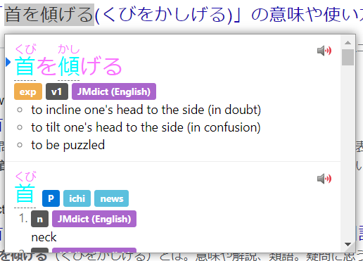
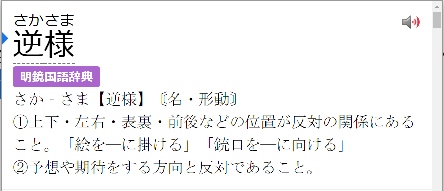
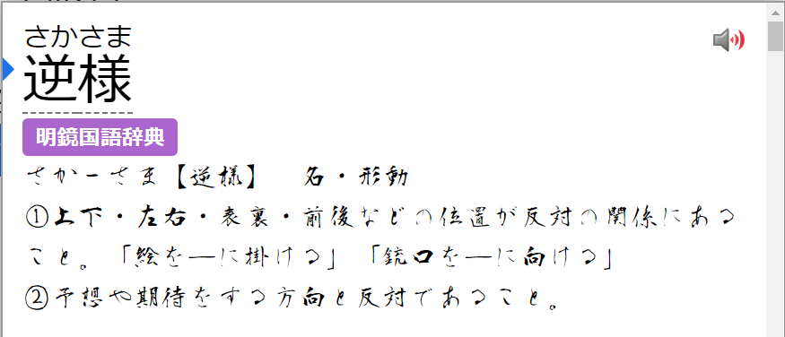
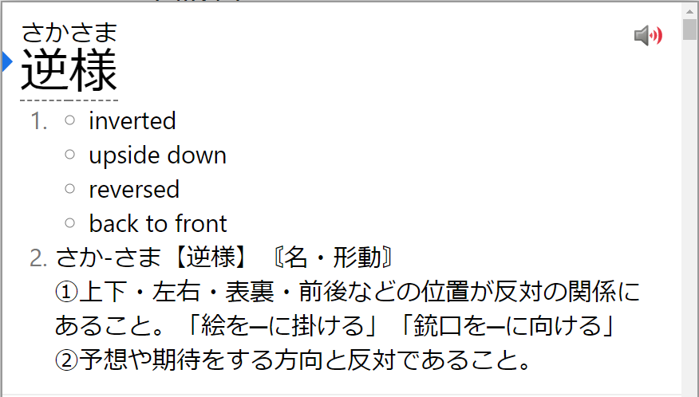
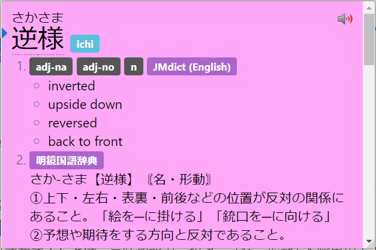
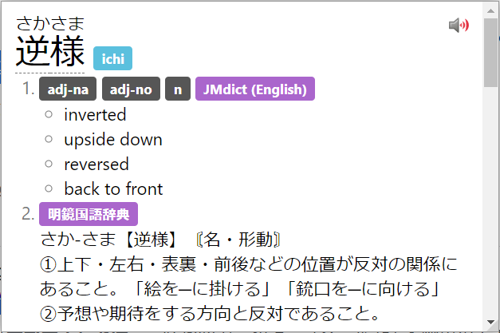
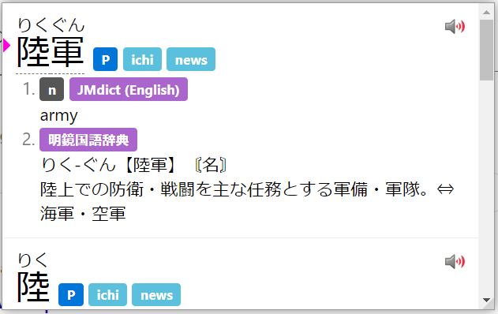
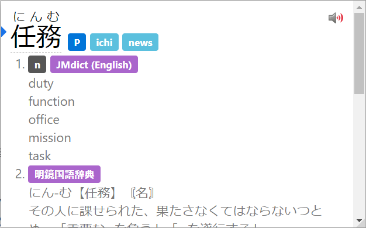

# Yomichan Setup Tutorial

## What is Yomichan?
Yomichan is a browser extension that allows you to look up Japanese words with both the meaning and the reading on web pages with ease. As you can see, I made a dedicated tutorial for it, even though the process is simple and there are already guides out there, only so I can stress how it is a very important tool when it comes to learning Japanese. Yomichan also has extra features such as Anki flashcard creation, which makes it a powerful learning tool.

## Getting Started 
Yomichan is available for both Chromium and Firefox based browsers. You can find the respective versions below.  
[Chrome Web Store](https://chrome.google.com/webstore/detail/yomichan/ogmnaimimemjmbakcfefmnahgdfhfami)  
[Firefox Add-Ons](https://addons.mozilla.org/en-US/firefox/addon/yomichan/)  
Once installed, it will open a new tab page, just close it for now so we don't confuse each other.  

## Acquiring Dictionaries
When you first install Yomichan, you need to load dictionaries into it in order to use it.  
These come in `.zip` extension and **are not to be extracted by the user.**

Download my pack of Yomichan dictionaries below. This will have everything you need and (probably) don't need. :slight_smile:  
[NEW Version 4 Google Drive](https://drive.google.com/file/d/1E1y4ry1Q0jF-5SKT7r8jdkhlKhfcyyxj/view?usp=sharing)  

Once downloaded, extract the .7z to any location on your computer. You can use [7-Zip](http://7zip.org/) for this.  
**Do not touch the .zip files inside.**

## Installing Dictionaries and basic usage
*Updated for the "new" settings page.*  
  
1. Click on the  icon in the browser toolbar.  
2. Click on the  icon to access the settings page.  
3. On the left sidebar, click on "Dictionaries" and then click on "Configure installed and enabled dictionaries…"  
4. Click the "Import" button on the bottom.  
5. Here's where you select the dictionaries to import. Please only import the following. Do not import every dictionary if you don't need to.
	- `[Bilingual] JMdict (English).zip`
	- `[Bilingual] KireiCake.zip`
	- `[Bilingual] 研究社　新和英大辞典　第５版.zip`
	- `[Kanji] KANJIDIC (English).zip`
6. Please wait for the dictionaries to import. This could take a while if you are using a mechanical hard drive.  
7. Once complete, you can test Yomichan by holding down the `⇧ Shift` key and hovering over Japanese text. Here is a sample: 日本語. It will display a pop up box displaying the definitions separated by dictionary.  
Click anywhere outside of the box or use the `Esc` key to dismiss. Click on an individual kanji in the headword to view kanji information (only functional with KANJIDIC installed).
8. You can click the  button to hear the word being pronounced by a native speaker.

  

Pop up box size and color can be edited with advanced settings enabled.  

JMDict is the dictionary hosted on Jisho.org. Jisho.org is not its own dictionary, rather it's a portal that accesses JMDict. This is the most common Japanese to English dictionary.  

KireiCake is based on an older version of JMDict but includes extra entries for slang. You may often see duplicate entries when used in tandem with JMDict, but for the entries that are exclusive to KireiCake, you should keep it.

研究社　新和英大辞典　第５版 (Kenkyuusha New Japanese-English Dictionary, 5th Edition) is a Japanese-English dictionary intended for Japanese people. It has many example sentences which can prove to be very useful for Japanese learners. A variation of this with example sentences stripped called is `[Bilingual] 新和英.zip` can also be found in my dictionary pack (not recommended).  

KANJIDIC is a kanji dictionary, it allows you to view information of individual kanji.

You can use the  icon to access Yomichan Search. Where you can use Yomichan as a standalone Japanese to English dictionary, however, Yomichan does not support any advanced dictionary features.

## Allowing access to file URLs

Enabling this allows you to use Yomichan on local files such as .PDF and .HTML files.  

Chromium:  
	- Right click the   
	- Click "Manage Extensions"  
	- Enable "Allow access to file URLs"  

Firefox:  
	- Enabled by default.  

## Anki Setup

Due to there being an already wonderful Anki guide with Yomichan written on the internet. I will not write about that here.

See [AnimeCards Site](https://animecards.site/)

## Bonus: Custom CSS

The appearance of the Yomichan pop-up window can be modified with custom [CSS](https://en.wikipedia.org/wiki/CSS) found in the settings.  

In the v2 settings page, it can be accessed by going into "Appearance" then "Configure custom CSS" and "Popup other CSS"  

There are many, many advanced modifications you can make with custom CSS, however, I will only go through examples I consider important. 

### Headword

The headword can be modified with the classes below:  
```css
/* For kanji */
.kanji-link {

}

/* For kana & alphanumeric characters */
.source-text {

}
```   
For furigana, it can be modified with the selector below:  
```css
ruby {

}
```  

!!! info "Furigana Color"
	If no `color` is specified for the `ruby` selector, it will be overridden by the `source-text` class.

#### Example: changing font size and color of the headword

With the following CSS:  
```css
.kanji-link {
	font-size: 25px;
	color: #00FBFF;

}

.source-text {
	font-size: 25px;
	color: #FA73FF;
}
```
The result:  
  

This demonstrates differing font colors for kanji and kana. You may edit this to your heart's content.

### Definition

The definition can be modified with the class below:  

```css
.term-glossary {

}
```

#### Example: changing font of definitions

!!! info "System Fonts"
	To use a certain font in Yomichan, the font must be installed on your system. You can find installed fonts in:  
	Windows: `C:/Windows/Fonts`  
	Linux: `/usr/share/fonts` or `/usr/share/local/fonts` or `$HOME/.fonts`  
	macOS: `/System/Library/Fonts` or `$HOME/Library/Fonts`  
	Newly installed fonts may require a system restart to be detected by Yomichan.  

With the following CSS:  
```css
.term-glossary {
	font-family: MS Mincho /* Japanese serif font provided in Windows */
}
```  
The result:
  

This demonstrates the changing of font for definitions to MS Mincho. Linux users may be able to use `Noto Serif CJK JP` as an alternative. 

#### Example: Using DJT's quiz font (funny)

With the following CSS:
```css
/* You must have 衡山毛筆フォント行書 installed on your system for this to work. */
.term-glossary {
	   font-family: 衡山毛筆フォント行書;

}
```  
The result:
  

You may edit this to your heart's content.  

### Tags

Tags can be modified with the classes below:  

```css
.tag {

}

.tag-inner {

}

.term-special-tags {

}

.tag-list {

}

.term-definition-tag-list {

}
```


#### Example: Removing all tags

With the following CSS:  
```css
.tag {
    display: none;
{
```

The result:    
   

You may edit this to your heart's content.  


### Background

Background can be edited with the selector below:  

```css
body {

}
```

#### Example: Changing background color

With the following CSS:  
```css
body {
    background: #FFA8F8;
}
```

The result:


You may edit this to your heart's content.  

### Miscellaneous 

Some misc. modifications you can do which I found cool.  

#### Removing current entry indicator

Since Yomichan was updated, a blue indicator has been added. Which has been an annoyance for many long time Yomichan users.

With the following CSS:  
```css
.term-expression-current-indicator {
	display: none;

}
```

The result:
  

#### Removing progress bar

Since Yomichan was updated, a blue progress bar when loading audio has been added. Which has been an annoyance for many long time Yomichan users.  

With the following CSS:  
```css
.top-progress-bar-container {
	display: none;
}
```

#### Indicator and progress bar colors

Alternatively, if you don't like the current color of the indicator and bar, you can change it rather than removing it.  
You can add the psuedo-class selector and custom property below:  

```css
:root {
--accent-color: #FF00DD; /* Change color to a pink */
--progress-bar-track-color: #00F7FF; /* Change bar track color to a blue */

}
```
The result:  
 

#### Removing Edict markers

In Edict dictionaries such as JMdict and KireiCake, there are markers that look like ○ which can be annoying for some.  
You can remove it by using the CSS below:  

```css
.term-glossary-list {
  padding: 0;
  list-style-type: none;

} 
```

The result:  

