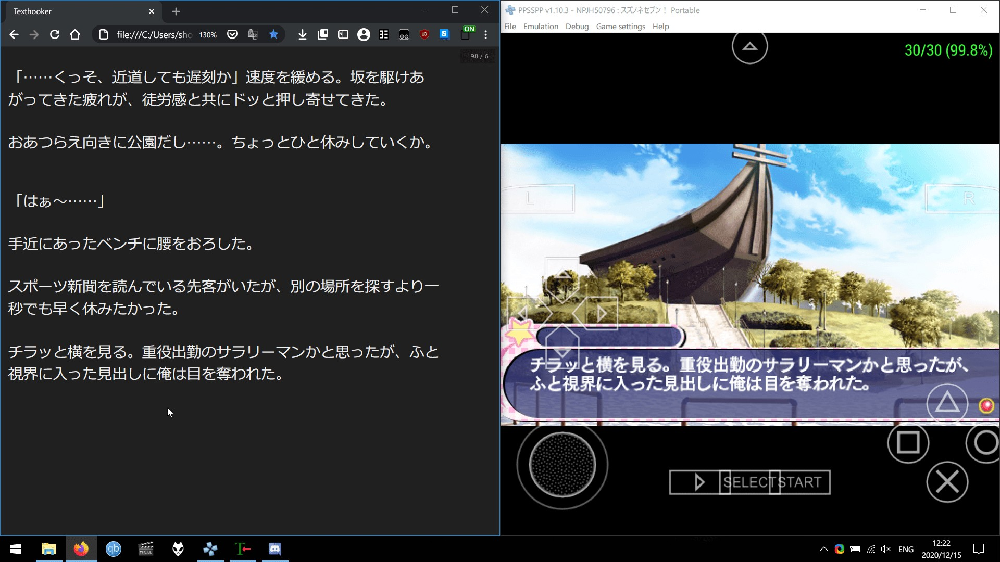

### Visual Novel là gì?

Visual Novel (thường được viết tắt là **VN**) là sự kết hợp giữa tiểu thuyết và trò chơi, chúng chỉ có rất ít sự tương tác từ người chơi. Hầu hết các VN đều có hoạt họa giống anime và thường có lồng tiếng, nhạc nền với hiệu ứng âm thanh. Trong suốt trò chơi, người chơi có thể được đưa ra các lựa chọn, điều này sẽ ảnh hưởng đến cách câu chuyện sẽ diễn ra, vì vậy nếu bạn chơi lần thứ hai, với các lựa chọn khác nhau, bạn có thể sẽ trải nghiệm một cốt truyện hoàn toàn khác.

### Tại sao lại chọn Visual Novel?

Việc đọc Tiếng Nhật cực kỳ quan trọng nhưng không phải ai cũng thích đọc sách, sau một thời gian đọc một cuốn tiểu thuyết toàn là chữ, bạn có thể cảm thấy mệt mỏi nhưng có thể bạn sẽ chơi VN hàng giờ mà không cảm thấy chán. VN có sự kết hợp giữa Tiếng Nhật viết và Tiếng Nhật hội thoại, vì vậy đây là một nguồn tài nguyên hoàn hảo để thực hiện Immersion đọc. 

Đối với những người không thích đọc sách và Manga thì có thể chọn VN. 

### Chơi Visual Novel để học Tiếng Nhật

Hướng dẫn này sẽ trình bày cách chơi Visual Novel bằng Tiếng Nhật và học Tiếng Nhật từ đó, hướng dẫn này giả định rằng bạn đã tải Visual Novel Tiếng Nhật, nếu chưa, hãy đọc hướng dẫn [cài đặt VN đa nền tảng](https://learnjapanese.moe/vn-setup).

Yêu cầu:

[Textractor](https://github.com/Artikash/Textractor/releases)  
[Yomichan](https://foosoft.net/projectsyomichan.md/)  
[Clipboard Inserter](https://github.com/kmltml/clipboard-inserter) ([Firefox Version Here](https://addons.mozilla.org/en-US/firefox/addon/lap-clipboard-inserter/))  
[Texthooking Page](https://learnjapanese.moe/texthooker.html) 

Đọc thêm về hướng dẫn cài Yomichan chi tiết [tại đây](https://learnjapanese.moeyomichan.md)

Đối với hầu hết các ứng dụng, hãy sử dụng tệp x86 của Textractor.

!!! info "Steins;Gate"
	If you wish to hook Steins;Gate and Steins;Gate 0, please check out [Steins;Gate Textractor](https://github.com/shiiion/steinsgate_textractor)

Khởi chạy VN và Textractor của bạn. Đầu tiên, hãy xóa tất cả các tiện ích mở rộng không cần thiết bằng cách bấm phím ++delete++.

Xóa những thứ dưới đây:

- Bing Translate
- Các "Translate" khác
- Extra Window
- Extra Newlines
- Styler 

 

!!! warning "Order of extensions" 
	Thứ tự sắp xếp Extensions rất quan trọng, dưới đây là gợi ý của mình: 
	- Remove Repeated Characters (Xóa những kí tự được lặp lại)
	- Remove Repeated Phrases (Xóa những mẫu câu lặp lại) 
	- Regex Filter (optional, but needs to be above clipboard) - Bộ lọc Regex (Tùy chọn, nhưng phải xếp trên "Clipboard)  
	- Copy to Clipboard (Sao chép vào bộ nhớ tạm)

Bây giờ chúng ta cần phải *thêm* Textractor vào VN của bạn.

  

Bây giờ hãy mở trình duyệt và truy cập trang [texthooking page](https://learnjapanese.moe/texthooker.html) kiểm tra xem **Clipboard Inserter** đã được cài đặt và kích hoạt rồi tiến hành văn bản ở VN một lần nữa.

 

Sau đó chỉ cần nhấn ++shift++ sử dụng Yomichan.

 

All done! Enjoy the reading!! :smirk_cat:

Bạn có thể theo dõi số lượng ký tự bạn đã đọc bằng cách sử dụng chỉ báo ở góc trên bên phải của trang texthooking. Bạn có thể chọn giữ lại văn bản khi làm mới trang hoặc chỉ đếm ký tự hoặc tự động clean trang.

Trang texthooking có "số ký tự chính xác", nghĩa là nó không tính các ký tự đặc biệt và dấu câu như 。 「」 trong số đếm.

!!! info "Can't hook?"
	Try referring to the [H-Code list @ Visual Novel Texthooking Wiki](https://vn-hooking.fandom.com/wiki/H-Code)  
	Little Busters! players, use the Ecstasy version and see [this](https://cdn.discordapp.com/attachments/813105334763126814/1047252417735036988/little_busters.png)  

### Không biết nên chơi gì?

Xem danh sách Visual Novel dưới đây

[jamal's list](https://anacreondjt.gitlab.io/vn-chart/)  
[This infamous list](https://docs.google.com/document/u/1/d/1KnyyDt7jimEz-dgeMSKymRaT2r3QKBPm9AzqZ6oUWAs/pub)  
[Dinuz's list](dinuzlist.md)  
[Chronopolize's list](https://docs.google.com/spreadsheets/d/18vCgQHhBNBeRJdcTcyUi2Atq-nAapQW--33qrwl5Yfw)  
[The best visual novels ever made (according to VNDB rankings)](https://vndb.org/v?f=022gja3gja&s=34w)  

Chúc bạn đọc vui vẻ!

Nhớ tham gia **VN Club** trong [Discord](https://discord.gg/nhqjydaR8j)!

### Thêm: Sử dụng Textractor cho Visual Novel PPSSPP

Việc kết nối Visual Novel PPSSPP yêu cầu bạn sử dụng phiên bản x86 (32-bit) của PPSSPP cùng với phiên bản x86 của Textractor.

1.  Khởi chạy PPSSPP (32-bit)
2.  Khởi chạy Visual Novel.
3.  Thêm Textractor (x86) vào PPSSPP (32-bit)
4.  Nâng cao văn bản ở VN (nút O)
5.  Sử dụng tính năng "Search for hooks", chọn "search for specific text" 
6.  Tìm kiếm văn bản cụ thể có trên PPSSPP VN. Nó cần phải **chính xác như vậy.**
7.  Sẽ mất một lúc để tìm, trình giả lập (Emulator) có thể bắt đầu bị lag một lúc.
8.  Nếu Textractor yêu cầu (keep an eye on the Console) hãy nhanh chóng chuyển văn bản (nút O) trên PPSSPP VN.
9.  Bây giờ nó sẽ tìm hooks.
10. Chuyển tiếp văn bản một lần nữa (nút O)
11. Duyệt qua các hooks để xem hook nào có văn bản mới nâng cao.
12. Xong! :tada: Bạn có thể lưu lại hook cho tiện.

Hình đây, texthooking với PPSSPP:  

  