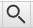

# Hướng dẫn cài đặt Yomitan

**Cập nhật chút: Yomichan không còn được hỗ trợ. Yomitan là bản phát triển kế tiếp của Yomichan.**

## Yomitan là gì?
Yomitan là một extension (tiện ích mở rộng) trên trình duyệt (Chrome, Chromium-based hoặc Firefox) cho phép bạn tra cứu các từ Tiếng Nhật cả nghĩa lẫn cách đọc trên trang web một cách dễ dàng.

## Bắt đầu
Yomitan có thể tải ở trên cả Chromium và Firefox.

Tải tại đây:

- [Chrome Web Store](https://chromewebstore.google.com/detail/yomitan/likgccmbimhjbgkjambclfkhldnlhbnn) - Cho các trình duyệt như Chrome, Chromium, Brave, Edge hoặc bất kì trình duyệt nào dựa trên nhân Chromium
- [Firefox](https://addons.mozilla.org/en-GB/firefox/addon/yomitan/) - Cho Firefox hay các trình duyệt dựa trên Firefox như Librewolf hoặc Waterfox.

Sau khi cài xong nó sẽ mở một tab mới, bạn đóng trang đó lại và tìm Yomitan trong phần "Tiện ích mở rộng" trong trình duyệt (Hoặc Addons cho Firefox).

## Tải từ điển

Khi bạn mới cài Yomitan lần đầu, bạn sẽ cần cài từ điển để có thể sử dụng nó.

Những tệp này sử dụng phần mở rộng `.zip` (file extension) và **bạn không được giải nén nó ra.**
  
### Từ điển Nhật - Anh

Gợi ý từ người dịch: Bạn nên tải cả bộ Nhật - Anh ở dưới để bao quát lượng từ hơn và có thêm nhiều cái hay nữa.

Bạn có thể tải bộ từ điển từ tác giả gốc của bài viết này: [Bộ sưu tập từ điển Yomitan của Shoui](https://learnjapanese.link/dictionaries)

Tải từ điển trong các thư mục tương ứng (Bilingual - Từ điển song ngữ Nhật - Anh, Kanji, Grammar .etc.) 

Bạn nên cài đặt các từ điển sau (theo shoui):

- `Bilingual/[Bilingual] Jitendex (Recommended).zip`  
- `Bilingual/[Bilingual] 新和英.zip`  
- `Kanji/[Kanji] KANJIDIC (English).zip`  
- `Grammar/Dictionary of Japanese Grammar.zip`  
- `Pitch Accent/アクセント辞典v2 (Recommended).zip`

## Cài đặt từ điển và sử dụng cơ bản
  
1. Bấm vào  icon trên thanh công cụ của trình duyệt.  
2. Bấm vào  icon để mở cài đặt.  
3. Chọn "Dictionaries" ở thanh sidebar bên trái rồi chọn "Configure installed and enabled dictionaries…"  
4. Bấm vào nút "Import" ở bên dưới.  
5. Here's where you select the dictionaries to import. Please only import the following. 

    - `Bilingual/[Bilingual] Jitendex (Recommended).zip`  
    - `Bilingual/[Bilingual] 新和英.zip`  
    - `Kanji/[Kanji] KANJIDIC (English).zip`  
    - `Grammar/Dictionary of Japanese Grammar.zip` 
    - `Pitch Accent/アクセント辞典v2 (Recommended).zip`

6. Đợi các từ điển được thêm vào. Sẽ mất một lúc (Mình làm trên Firefox thấy lâu hơn so với bên Chromium)
7. Sau khi hoàn tất, bạn có thể kiểm tra Yomitan bằng cách giữ phím ++shift++ và di chuột qua văn bản Tiếng Nhật. Thử di chuột vào cái này xem: 日本語. Nó sẽ hiện một pop-up box hiển thị các định nghĩa được chia theo từ điển.
 

Bấm ra chỗ khác trên màn hình hoặc phím Esc để ẩn hộp thoại của Yomitan đi

Nếu bạn cần đọc Kanji riêng cho từng từ thì bấm vào Kanji đó (Phải tải KANJIDIC hoặc KanjiDictVN)

Bạn có thể bấm vào nút  để nghe phát âm từ.

Trên thanh công cụ trình duyệt, nếu bạn chọn biểu tượng Yomitan, sau đó chọn biểu tượng  hoặc dùng tổ hợp phím tắt `Alt+ Insert`, bạn có thể truy cập vào "Yomitan Search" - bạn có thể sử dụng Yomitan như một từ điển Tiếng Nhật riêng (Hoàn toàn Offline).
 

Pop up box size can be edited with advanced settings enabled.  
A full dark mode can be enabled in the settings too.  

**Jitendex** is a free and openly licensed Japanese-to-English dictionary. Jitendex is built upon data provided by multiple free and open projects. Most notably the JMdict project, which is used on many Japanese dictionary projects such as Jisho.org, Akebi, Shirabe Jisho, Takoboto etc. 

**新和英** (Shinwaei) is a Japanese-English dictionary intended for Japanese people. It has many example sentences which can prove to be very useful for Japanese learners. A variation of this with even more example sentences is called `[Bilingual] 研究社　新和英大辞典　第５版.zip` can also be found in my dictionaries collection.  

**KANJIDIC** Từ điển Kanji.

**Dictionary of Japanese Grammar**, or 日本語文法辞典(全集) - từ điển ngữ pháp

**アクセント辞典v2** Tra thông tin Pitch Accent

## Từ điển đo độ phổ biến của từ 

Yomitan supports the use of frequency dictionaries that tell you how common a word is.  

**JPDB** - A frequency list made from jpdb.io, which is a site that has analyzed many light novels, visual novels, Anime and j-drama. In turn, this is a frequency list from Japanese fictional media.  

**CC100** - Frequency list of corpus data from Japanese internet. Formal words will appear more common in this frequency list . Example: 審議会 (council) is 9733 frequency on CC100 and 58730 on JPDB.  

**What is a common word?**  

Rất phổ biến: 1-10,000  
Phổ biến: 10,001-20,000    
Tương đối phổ biến: 20,001-30,000   
Chắc là phổ biến: 30,001-40,000  
Không phổ biến: 40,001-50,000  
Hàng hiếm: 50,001-80,000  
Người-bản-ngữ-chắc-cũng-không-biết: 80,000+  

## Allowing access to file URLs

Enabling this allows you to use Yomitan on local files such as .HTML files.  

!!! failure "PDF Files"
    On Chrome, you need to use [PDF.js](https://mozilla.github.io/pdf.js/web/viewer.html). Click on the diagonal up arrow thingy to load a pdf.  

Chromium:  
	- Right click the   
	- Click "Manage Extensions"  
	- Enable "Allow access to file URLs"  

Firefox:  
	- Mặc định.  

## Bonus: Adding Forvo extra audio source  

You may encounter missing audio with the default Yomitan audio sources, adding [Forvo](https://ja.forvo.com/) will help fill in the gaps.  

Thanks to [jamesnicholas](https://github.com/jamesnicolas/yomichan-forvo-server) for this wonderful add-on!

This requires you to have Anki (2.1 and newer) installed and open on your computer to work.  

1. Copy this code `580654285`
2. In Anki, in the menu at the top, click on **Tools**, then **Add-ons**.
3. In the new window, click **Get Add-ons...** and paste the code `580654285` into the text box and click **OK**
4. Restart Anki by closing it and opening it back up again.
5. In the Yomitan settings page , click **Audio** on the left, and then click on **Configure audio playback sources...**
6. Click **Add** and then select **Custom** from the drop down menu. 
7. Now where it says **Custom audio source (?)**, select the type **JSON** from the drop down menu.
8. In the URL text box, enter this `http://localhost:8770/?expression={expression}&reading={reading}`

## Thêm: Sử dụng trên Android với Kiwi Browser

Kiwi Browser là trình duyệt Chromium hỗ trợ tiện ích mở rộng, bao gồm Yomichan. Bấm vào đường dẫn bên dưới để tải xuống.  
[Google Play](https://play.google.com/store/apps/details?id=com.kiwibrowser.browser)  
 
You can access the Yomichan settings page by going in :material-dots-vertical: > Yomichan	 > Settings.  

Please see above for link to download the extension, link to the dictionaries collection and recommended starter dictionaries.  
Importing a dictionary is a very processor intensive process and will take a long time depending on your phone. Please be patient.  

Tap on a word to look it up. In the case that it is not working, you may need to turn off the modifier key.  

  

## Cài đặt Anki

Đọc trên trang của [kuri](https://donkuri.github.io/learn-japanese/setup/#anki-setup).

## Server audio ngoại tuyến (Nhiều audio hơn mặc định)

[Đọc hướng dẫn tại đây](https://github.com/themoeway/local-audio-yomichan)  

### Thấy có ích không? Có gì nhớ donate qua Patreon nhá.
[:fontawesome-brands-patreon: Support me on Patreon](https://www.patreon.com/shoui){: .md-button }
